:::::::::::::::::::::::::::::::::::::: questions

- ¿Qué es el software de código abierto y qué principios orientan su desarrollo?
- ¿Cómo puede planificarse la gestión del software a lo largo de un proyecto de investigación?
- ¿Qué herramientas y prácticas facilitan el intercambio, la documentación, la reutilización y la citación de código abierto?

::::::::::::::::::::::::::::::::::::::::::::::::

:::::::::::::::::::::::::::::::::::: objectives

Al finalizar este episodio, quienes participan podrán:

- Definir qué es el software de código abierto.
- Reconocer los principios y beneficios asociados con la apertura del código.
- Describir los componentes principales de un Plan de Gestión de Software.
- Identificar herramientas para gestionar versiones, documentar y compartir código.
- Analizar cómo evaluar, reutilizar y citar código abierto.

::::::::::::::::::::::::::::::::::::::::::::::::

# Herramientas de Ciencia Abierta - Encuentro 3

## Código Abierto

Jesica Formoso, Laura Ación, Irene Vazano, Julián Buede, Nicolás Palopoli, Paz Míguez

Puedes descargar la presentación aquí:  
[https://doi.org/10.5281/zenodo.18894415](https://doi.org/10.5281/zenodo.18894415)

:::::::::::::::::::::::::::::::::::::::::::::::: instructor

Bienvenida. Antes de arrancar les quiero recordar que este encuentro va a ser grabado y que si bien nos encanta que estén con las camaras prendidas para poder interactuar de forma más fluida, si prefieren no aparecen en el video puede apagarlas. [Equipo de apoyo] va a estar iniciando la grabación ahora.

::::::::::::::::::::::::::::::::::::::::::::::::::::::::::

## Antes de empezar

Pautas para un espacio amable para todas las personas:

- Para participar: pide la palabra o usa el chat.
- Micrófonos: siléncialo al terminar de hablar
- Pide permiso antes de tomar registros de personas de este encuentro
- [Pautas de Convivencia](https://doi.org/10.5281/zenodo.12534195)

:::::::::::::::::::::::::::::::::::::::::::::::: instructor

También quiero recordarles que todos los espacios de MetaDocencia se rigen por nuestras Pautas de Convivencia, que les compartiremos en el chat. En resumen, buscamos que este sea un espacio seguro, respetuoso e inclusivo, donde podamos intercambiar ideas con empatía, escuchar distintas perspectivas y tratarnos con amabilidad. Y, por supuesto, evitar cualquier tipo de acoso, destrato o comentarios que puedan incomodar a otras personas.

Finalmente, para que la interacción no sea caótica, les pedimos que pidan la palabra levantando una mano virtual o por medio del chat, y que una vez que hayan terminado de hablar, se vuelvan a mutear para evitar sonidos de fondo.

Compartir en el chat: [https://doi.org/10.5281/zenodo.12534195](https://doi.org/10.5281/zenodo.12534195)

::::::::::::::::::::::::::::::::::::::::::::::::::::::::::

## Nos presentamos

- **Jesica Formoso:** Coordinadora del área de Medición de Impacto
- **María Nanton:** Colaboradora
- **Irene Vazano:** Coordinadora del área de Infraestructura
- **Julián Buede:** Equipo de comunicación

:::::::::::::::::::::::::::::::::::::::::::::::: instructor

Quienes guían se presentan y mencionan a quiénes conforman el equipo de apoyo ese día

::::::::::::::::::::::::::::::::::::::::::::::::::::::::::

## Herramientas de Ciencia Abierta

| Encuentro | Tema |
|---|---|
| **Encuentro 1** | Qué, por qué y cómo de la Ciencia Abierta |
| **Encuentro 2** | Cómo usar, crear y compartir Datos Abiertos |
| **Encuentro 3** | Cómo usar, crear y compartir Código Abierto |
| **Encuentro 4** | Cómo usar, crear y compartir Resultados Abiertos |

:::::::::::::::::::::::::::::::::::::::::::::::: instructor

En el encuentro de hoy vamos a hablar sobre código y software abierto, específicamente sobre distintas herramientas para planificar e implementar la apertura de nuestro código de investigación de forma que cumpla con los principios FAIR: que sea fácil de usar, accesible, interoperable y reutilizable.

::::::::::::::::::::::::::::::::::::::::::::::::::::::::::

## Código y software abierto

:::::::::::::::::::::::::::::::::::::::::::::::: instructor

¿A qué nos referimos cuando hablamos de código y software abiertos?

::::::::::::::::::::::::::::::::::::::::::::::::::::::::::

## ¿Qué es el software de código abierto?

Quienes hacemos ciencia escribimos código en un lenguaje de programación para:

- Recopilar y analizar datos
- Modelar observaciones
- Desarrollar herramientas científicas

Llamamos Software a muchos fragmentos de código empaquetados junto a otro tipo de información.

<!-- 🟨🟨🟨 FIGURA PENDIENTE: cargar `software-codigo-abierto.jpg` en `episodes/fig/` 🟨🟨🟨 -->

{alt='Ilustración que representa el intercambio, la colaboración y el registro de cambios.'}

*Fuente: The Turing Way Community & Scriberia. (2024). [*Illustrations from The Turing Way: Shared under CC-BY 4.0 for reuse*](https://doi.org/10.5281/zenodo.3332807). Zenodo.*

:::::::::::::::::::::::::::::::::::::::::::::::: instructor

Quienes hacemos ciencia frecuentemente usamos código de programación en lenguajes como R, Python o C++, para analizar datos, crear modelos, recopilar información y automatizar tareas, entre otras cosas.

Cuando el resultado final incluye muchos fragmentos de código empaquetados junto a otro tipo de información, como por ejemplo conjuntos de datos, documentación, ejemplos de uso o scripts auxiliares, lo llamamos software.

En este sentido, el software no es solo el código en sí, sino también la estructura que permite que ese código sea utilizado, comprendido y aplicado por otras personas.

::::::::::::::::::::::::::::::::::::::::::::::::::::::::::

## ¿Qué es el software de código abierto?

Software de código abierto (open source):

- Su código fuente está almacenado en un repositorio abierto y accesible.
- Se distribuye sin costo
- Permite que otras personas lo usen, modifiquen y distribuyan

<!-- 🟨🟨🟨 FIGURA PENDIENTE: cargar `software-codigo-abierto.jpg` en `episodes/fig/` 🟨🟨🟨 -->

{alt='Ilustración que representa el intercambio, la colaboración y el registro de cambios.'}

*Fuente: The Turing Way Community, & Scriberia. (2024). [*Illustrations from The Turing Way: Shared under CC-BY 4.0 for reuse*](https://doi.org/10.5281/zenodo.3332807). Zenodo.*

:::::::::::::::::::::::::::::::::::::::::::::::: instructor

Cuando ese software está almacenado en un repositorio abierto y accesible, exponiendo su base de código, decimos que es de código abierto  (u Open Source, por su uso en inglés).

Frecuentemente se distribuye sin costo (gratis) junto con licencias que permiten a cualquier persona ver, usar, modificar o redistribuir el código fuente. En este encuentro vamos a usar código abierto y software abierto como sinónimos porque, si bien hay una diferencia técnica (ver diapositiva anterior), ambos comparten los mismos principios de acceso, uso, modificación y distribución

Un ejemplo común de software de código abierto en investigación son los paquetes de R o las librerías de Python, que suelen publicarse en repositorios abiertos y pueden ser descargados, utilizados y modificados por la comunidad. Este tipo de herramientas constituyen una parte fundamental del ecosistema de ciencia abierta, ya que facilitan compartir métodos y resultados de manera más clara y reproducible.

::::::::::::::::::::::::::::::::::::::::::::::::::::::::::

## Principios

- Transparencia

<!-- 🟨🟨🟨 FIGURA PENDIENTE: cargar `principios-codigo-abierto.jpg` en `episodes/fig/` 🟨🟨🟨 -->

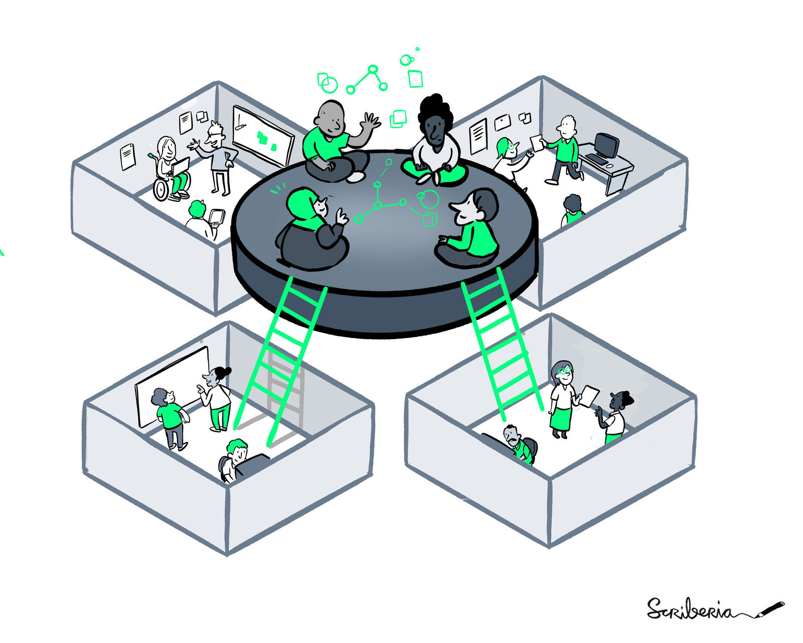{alt='Ilustración de distintas personas trabajando colaborativamente.'}

*Fuente: The Turing Way Community, & Scriberia. (2022). [*Illustrations from The Turing Way: Shared under CC-BY 4.0 for reuse*](https://doi.org/10.5281/zenodo.3332807). Zenodo.*

:::::::::::::::::::::::::::::::::::::::::::::::: instructor

En el contexto del movimiento de Ciencia Abierta, el abrir nuestro código sigue ciertos principios:

En primer lugar, buscamos que el código sea transparente para:

- Permitir que otros revisen, repliquen y mejoren el trabajo existente.
- Facilitar la verificación independiente y se minimizan los errores.
- Evitar la duplicación de esfuerzos y acelera el proceso científico.

::::::::::::::::::::::::::::::::::::::::::::::::::::::::::

## Principios

- Transparencia
- Compartir pronto y con frecuencia

<!-- 🟨🟨🟨 FIGURA PENDIENTE: cargar `principios-codigo-abierto.jpg` en `episodes/fig/` 🟨🟨🟨 -->

{alt='Ilustración de distintas personas trabajando colaborativamente.'}

*Fuente: The Turing Way Community, & Scriberia. (2022). [*Illustrations from The Turing Way: Shared under CC-BY 4.0 for reuse*](https://doi.org/10.5281/zenodo.3332807). Zenodo.*

:::::::::::::::::::::::::::::::::::::::::::::::: instructor

En segundo lugar, se promueve el compartir temprano y compartir seguido. Esto implica compartir el código lo antes posible y de manera regular para recibir comentarios y sugerencias de otras personas. Esta retroalimentación ayuda a detectar problemas rápidamente, así como mejorar el código y probar nuevas ideas. Así, el desarrollo es más rápido y es más probable lograr buenas soluciones.

::::::::::::::::::::::::::::::::::::::::::::::::::::::::::

## Principios

- Transparencia
- Compartir pronto y con frecuencia
- Colaboración, inclusividad y comunidad

<!-- 🟨🟨🟨 FIGURA PENDIENTE: cargar `principios-codigo-abierto.jpg` en `episodes/fig/` 🟨🟨🟨 -->

{alt='Ilustración de distintas personas trabajando colaborativamente.'}

*Fuente: The Turing Way Community & Scriberia. (2022). [*Illustrations from The Turing Way: Shared under CC-BY 4.0 for reuse*](https://doi.org/10.5281/zenodo.3332807). Zenodo.*

:::::::::::::::::::::::::::::::::::::::::::::::: instructor

En tercer lugar, tenemos los principios de colaboración, inclusividad y comunidad:

La idea central es que los proyectos pueden mejorarse más rápidamente cuando muchas personas contribuyen y colaboran. También, al basarse en la colaboración, se pueden resolver problemas que requieren más recursos humanos y económicos de los que un grupo individual tiene.

Un buen ejemplo de este principio es LatamGPT, una iniciativa regional para desarrollar un modelo de lenguaje entrenado con datos y conocimiento de América Latina. A diferencia de proyectos cerrados desarrollados por una sola empresa, LatamGPT se construye a partir de la colaboración entre universidades, centros de investigación, gobiernos y comunidades tecnológicas de distintos países de la región. Esta colaboración permite reunir recursos, datos y conocimientos diversos, mejorar el modelo más rápidamente y asegurar que refleje mejor la diversidad lingüística, cultural y social de América Latina. En este momento, es algo que no hubiese podido lograr cualquiera de estos centros trabajando de forma aislada. Además, al involucrar a múltiples actores, se fortalece la sostenibilidad y continuidad del proyecto en el tiempo.

En este sentido, el principio de colaboración e inclusión también implica valorar y aprovechar la diversidad de experiencias, habilidades y puntos de vista que diferentes personas pueden aportar y, por lo tanto, eliminar barreras a la participación y asegurar que todas las voces sean escuchadas y respetadas.

Aunque, en general, no se opera por consenso (no se realizan votaciones en las que participen todas las personas que contribuyeron al proyecto), el trabajo exitoso y las mejores ideas naturalmente tienden a ganar el apoyo de la comunidad. A su vez, esto lleva a que los proyectos que mejor reflejen las necesidades de la comunidad, sean los que más atención y más recursos reciban.

Finalmente, las comunidades sólidas y comprometidas pueden mantener la continuidad de los proyectos de código abierto a lo largo del tiempo. El mantenimiento compartido entre varias personas hace que sea más sostenible.

::::::::::::::::::::::::::::::::::::::::::::::::::::::::::

## ¿Por qué es importante abrir nuestro código?

- Facilita la reproducción y validación de los resultados
- Reduce recursos necesarios para replicar experimentos
- Abre nuevas oportunidades de colaboración
- Aumenta la visibilidad de quien lo desarrolla

<!-- 🟨🟨🟨 FIGURA PENDIENTE: cargar `beneficios-codigo-abierto.jpg` en `episodes/fig/` 🟨🟨🟨 -->

{alt='Ilustración de Scriberia. Por un lado, una cara sonriendo junto a una caja abierta de la cual sale una mano con el pulgar para arriba. Por otro lado, una cara enojada junto a una caja cerrada.'}

*Fuente: The Turing Way Community, & Scriberia. (2022). [*Illustrations from The Turing Way: Shared under CC-BY 4.0 for reuse*](https://doi.org/10.5281/zenodo.3332807). Zenodo.*

:::::::::::::::::::::::::::::::::::::::::::::::: instructor

¿Por qué es importante compartir nuestro código? Venimos diciendo que la ciencia avanza más rápido cuando la comunidad científica puede:

- Trabajar junta para corregir errores
- Construir sobre los resultados de las demás personas
- Compartir recursos

Compartir el código es una parte clave de este proceso, en tanto:

Facilita que otras personas reproduzcan nuestros resultados, lo que contribuye a validar cualquier hallazgo que hayamos obtenido y a reducir los recursos necesarios para replicar los experimentos.

Además, esta práctica puede abrir nuevas oportunidades de colaboración con otras personas o equipos.

Finalmente, aumenta la visibilidad y mejora las oportunidades laborales y profesionales de los desarrolladores.

::::::::::::::::::::::::::::::::::::::::::::::::::::::::::

:::::::::::::::::::::::::::::::::::::::::::::::: challenge

## Ejercicio 1: Responde la encuesta de Zoom

**Duración: 3 minutos**

¿Cuál es la definición que aplica a software de Código Abierto?

- Se distribuye con su código fuente, permitiendo su uso, modificación y distribución, aunque con costo.
- Se distribuye con su código fuente de forma gratuita, permitiendo su uso, modificación y distribución con los mismos derechos originales.
- Se distribuye sin su código fuente, pero sin costo alguno, permitiendo que otros lo utilicen libremente.

::::::::::::::::::::::::::::::::::::::::::::::::::::::::::

## Plan de gestión de software

::::::::::::::::::::::::::::::::::::::::::::: instructor

En el encuentro anterior hablamos del Plan de Ciencia Abierta en general y, más en profundidad, del PGD o Plan de Gestión de Datos. Hoy vamos a ver un poco más en detalle el plan de gestión de software.

::::::::::::::::::::::::::::::::::::::::::::::::::::::::::

## Plan de gestión de software (PGS)

Documento que detalla cómo se va a desarrollar, gestionar, preservar, licenciar, publicar y mantener el software creado en el contexto de un proyecto de investigación.

<!-- 🟨🟨🟨 FIGURA PENDIENTE: cargar `plan-gestion-software.jpg` en `episodes/fig/` 🟨🟨🟨 -->

{alt='Tres personas trabajan colaborativamente alrededor de distintos elementos, documentos y dispositivos vinculados con el desarrollo de software.'}

*Fuente: The Turing Way Community, & Scriberia. (2022). [*Illustrations from The Turing Way: Shared under CC-BY 4.0 for reuse*](https://doi.org/10.5281/zenodo.3332807). Zenodo.*

::::::::::::::::::::::::::::::::::::::::::::: instructor

Un Plan de Gestión de Software en investigación es un documento que detalla cómo se va a desarrollar, gestionar, preservar, licenciar y compartir el software creado en el contexto de un proyecto de investigación. Este plan sirve como guía para el equipo que se encarga de desarrollar el software y además contribuye a asegurar la calidad, la eficiencia y la reproducibilidad de los resultados, al establecer pautas claras sobre el desarrollo, el versionado, la colaboración y el mantenimiento del código.

::::::::::::::::::::::::::::::::::::::::::::::::::::::::::

## Plan de gestión de software (PGS)

- ¿Qué?
- ¿Cuándo?
- ¿Dónde?
- ¿Cómo?
- ¿Quiénes?

<!-- 🟨🟨🟨 FIGURA PENDIENTE: cargar `plan-gestion-software.jpg` en `episodes/fig/` 🟨🟨🟨 -->

{alt='Tres personas trabajan colaborativamente alrededor de distintos elementos, documentos y dispositivos vinculados con el desarrollo de software.'}

*Fuente: The Turing Way Community, & Scriberia. (2022). [*Illustrations from The Turing Way: Shared under CC-BY 4.0 for reuse*](https://doi.org/10.5281/zenodo.3332807). Zenodo.*

::::::::::::::::::::::::::::::::::::::::::::: instructor

Como mínimo, un plan de gestión de software tiene que detallar:

- Qué hace nuestro software, cuales son sus objetivos, su alcance, a qué tipo de usuarios está destinado.
- Cuándo vamos a completar las distintas tareas vinculadas con el desarrollo y apertura del código: El cronograma para compartir y archivar el software.
- Dónde vamos a publicar y compartir el software mientras estemos trabajando en él y la plataforma donde se archivará a largo plazo.
- Cómo lo vamos a compartir para facilitar su reutilización (por ejemplo, mediante la asignación de un doi, una licencia, con buena documentación y pautas de contribución entre otros).
- Quiénes van a encargarse de las distintas tareas vinculadas al código: los roles y responsabilidades de las personas que integran el equipo.

A medida que nuestra investigación comience a generar y compartir código, el PGS proporcionará un manual o guía para los participantes del proyecto.

::::::::::::::::::::::::::::::::::::::::::::::::::::::::::

## Plan de gestión de software (PGS)

### ¿Qué compartir?

- ¿Hay que considerar políticas del financiador o regulaciones locales?
- ¿Hay problemas de seguridad relacionados con el código?
- ¿Cuál es la finalidad de compartir?

<!-- 🟨🟨🟨 FIGURA PENDIENTE: cargar `plan-gestion-software.jpg` en `episodes/fig/` 🟨🟨🟨 -->

{alt='Tres personas trabajan colaborativamente alrededor de distintos elementos, documentos y dispositivos vinculados con el desarrollo de software.'}

*Fuente: The Turing Way Community, & Scriberia. (2022). [*Illustrations from The Turing Way: Shared under CC-BY 4.0 for reuse*](https://doi.org/10.5281/zenodo.3332807). Zenodo.*

::::::::::::::::::::::::::::::::::::::::::::: instructor

¿Cómo decidimos qué compartir?

Es importante considerar si compartir nuestro código es consistente o no con las políticas de la agencia de financiamiento o con las regulaciones locales.

También hay que considerar que hay situaciones donde no es recomendable compartir el código de forma abierta, por ejemplo cuando hay potenciales problemas de seguridad relacionados con el código. En el caso de sistemas informáticos críticos que necesitan estar resguardados es posible que no sea buena idea compartir el código de forma abierta ya que podría dar información acerca de cómo adjuntar código malicioso al software en un intento de infiltración.

Otra consideración importante a tener en cuenta es cuál es el objetivo de compartir nuestro código de forma abierta. En general hay dos finalidades principales:

- Queremos compartir con la intención de desarrollar código entre varias personas de un mismo equipo o para abrir el código a sugerencias y contribuciones de personas externas.
- O queremos proporcionar un registro a largo plazo de una versión estática del mismo. Por ejemplo, para compartir en un artículo académico el código utilizado para analizar los datos.

Definir la finalidad de abrir nuestro código, va a ayudarnos a decidir cuándo abrirlo y dónde publicarlo.

::::::::::::::::::::::::::::::::::::::::::::::::::::::::::

## Plan de gestión de software (PGS)

### ¿Qué compartir?

No compartir cuando el código:

- Incluya secretos militares de un país
- Esté restringido por políticas institucionales o regulaciones organizacionales
- Incorpore propiedad intelectual

<!-- 🟨🟨🟨 FIGURA PENDIENTE: cargar `plan-gestion-software.jpg` en `episodes/fig/` 🟨🟨🟨 -->

{alt='Tres personas trabajan colaborativamente alrededor de distintos elementos, documentos y dispositivos vinculados con el desarrollo de software.'}

*Fuente: The Turing Way Community, & Scriberia. (2022). [*Illustrations from The Turing Way: Shared under CC-BY 4.0 for reuse*](https://doi.org/10.5281/zenodo.3332807). Zenodo.*

::::::::::::::::::::::::::::::::::::::::::::: instructor

Hay ocasiones en donde NO es recomendable compartir código, ya sea por consideraciones legales y de seguridad:

Algunas razones válidas que restringen a un científico/científica a compartir su código completo o parcial, pueden incluir:

- O que las políticas institucionales o regulaciones locales no permitan el intercambio de código.
- Que el código incorpore propiedad intelectual, datos e incluso información patentada. Recordemos que si no tiene una licencia abierta que permita que lo reusemos, está protegido por los derechos de autor.
- Que el código incorpore secretos militares de un país o su difusión viole los intereses nacionales o políticas de seguridad.

Siempre debemos pensar en lo que estamos compartiendo y las implicaciones de hacerlo.

::::::::::::::::::::::::::::::::::::::::::::::::::::::::::

## Plan de gestión de software (PGS)

### ¿Cuándo compartir?

Planifica compartir tu código desde el inicio.

<!-- 🟨🟨🟨 FIGURA PENDIENTE: cargar `plan-gestion-software.jpg` en `episodes/fig/` 🟨🟨🟨 -->

{alt='Tres personas trabajan colaborativamente alrededor de distintos elementos, documentos y dispositivos vinculados con el desarrollo de software.'}

*Fuente: The Turing Way Community, & Scriberia. (2022). [*Illustrations from The Turing Way: Shared under CC-BY 4.0 for reuse*](https://doi.org/10.5281/zenodo.3332807). Zenodo.*

::::::::::::::::::::::::::::::::::::::::::::: instructor

¿Cuál es el momento adecuado para compartir nuestro código?

Depende del objetivo:

Si compartiremos código para que otros puedan reproducir nuestros resultados, es una buena idea compartirlo al final del desarrollo. En cambio, si el desarrollo es innovador y realizaremos entregas parciales del software, es una buena opción publicar código al final de cada iteración.

Depende también de los requisitos del financiador o de la editorial académica (si es que adjuntamos el código a un artículo de una revista de acceso abierto).

::::::::::::::::::::::::::::::::::::::::::::::::::::::::::

## Plan de gestión de software (PGS)

### ¿Dónde compartir?

#### Repositorio

- Espacio dinámico y colaborativo de trabajo.
- El código puede cambiar.

#### Archivo

- Almacenamiento estático, a largo plazo, para versiones estables de software.

<!-- 🟨🟨🟨 FIGURA PENDIENTE: cargar `repositorio-archivo-software.png` en `episodes/fig/` 🟨🟨🟨 -->

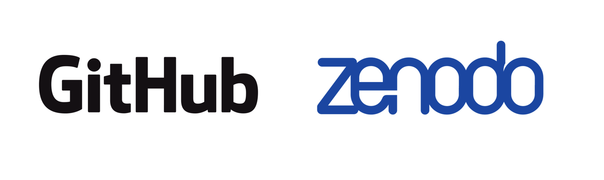{alt='Comparación entre GitHub como repositorio dinámico y colaborativo y Zenodo como archivo estático para preservar versiones estables de software.'}

::::::::::::::::::::::::::::::::::::::::::::: instructor

Dependiendo la finalidad, el lugar en que almacenaremos el código puede variar.

Si bien venimos hablando de repositorios para el almacenamiento de datos, cuando hablamos de código podemos distinguir dos tipos distintos de almacenamiento: el repositorio y el archivo.

Un repositorio de software es un espacio dinámico y colaborativo de trabajo donde almacenamos código sobre el que estamos trabajando o que es activamente mantenido, lo que alienta la colaboración y su mejora constante. Para eso usamos plataformas como GitHub o GitLab que tienen control de versiones (en unas diapositivas más vamos a ver qué es).

Alternativamente, un archivo de software es una forma de almacenamiento estático donde se almacenan lanzamientos de software estables ya testeados o proyectos ya cerrados. La idea es alojar ahí versiones terminadas de un software, para las que el proceso de colaboración hasta un producto final ya haya finalizado, al menos hasta esa versión. Un ejemplo de archivo es Zenodo.

::::::::::::::::::::::::::::::::::::::::::::::::::::::::::

## Plan de gestión de software (PGS)

### ¿Dónde compartir?

#### Otras alternativas

- Revistas de acceso abierto dedicadas al software.
- Repositorios de software para paquetes o librerías.
- Comunidades con revisión por pares.

<!-- 🟨🟨🟨 FIGURA PENDIENTE: cargar `alternativas-compartir-software.png` en `episodes/fig/` 🟨🟨🟨 -->

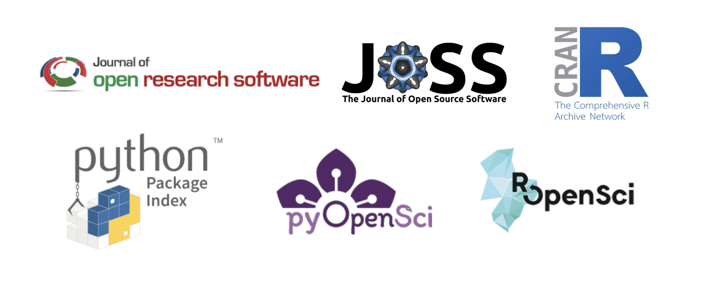{alt='Logotipos de Journal of Open Research Software, Journal of Open Source Software, CRAN, Python Package Index, pyOpenSci y rOpenSci.'}

::::::::::::::::::::::::::::::::::::::::::::: instructor

Otra opción para almacenar y compartir código son las revistas de acceso abierto dedicada al software abierto, que permiten archivar una versión estática del código junto a un artículo (por ejemplo, journal of open source software y el journal of open research software).

Si desarrollamos un paquete puede ser publicado en un repositorio de software utilizado comúnmente por administradores de paquetes tales, como CRAN (repositorio de paquetes desarrollados en R) y PyPI (repositorio de paquetes desarrollados en python). En general, esta práctica hace que sea más fácil para los usuarios instalar el software, e incluso reutilizarlo.

Además, existen comunidades que realizan revisión por pares de software, donde desarrolladores y revisores evalúan aspectos como la calidad del código, la documentación, las pruebas y la utilidad del paquete. Por ejemplo, pyOpenSci revisa paquetes desarrollados en Python, mientras que rOpenSci realiza revisiones para paquetes del ecosistema de R. Estos procesos no solo ayudan a mejorar el software antes de su publicación, sino que también promueven buenas prácticas de desarrollo, documentación clara y mayor confiabilidad para quienes reutilizan ese código. Una vez aceptados, los paquetes pasan a formar parte del ecosistema recomendado por estas organizaciones, lo que facilita su descubrimiento, reutilización y mantenimiento.

::::::::::::::::::::::::::::::::::::::::::::::::::::::::::

## Intercambio en salas de grupo

### ¿Cómo vamos a trabajar?

1. Cada grupo elige una persona para moderar la conversación, optimizar tiempos y socializar la palabra.
2. Cada grupo elige una persona representante para sintetizar y compartir el intercambio en la sala principal.

::::::::::::::::::::::::::::::::::::::::::::: instructor

Al igual que en los encuentros anteriores vamos a tener una actividad en salas de grupos. Recuerden que para esta dinámica cada grupo elige una persona para moderar la conversación, y otra persona que represente al grupo en la sala principal y nos cuente brevemente qué temas surgieron.

::::::::::::::::::::::::::::::::::::::::::::::::::::::::::

::::::::::::::::::::::::::::::::::::::::::::: challenge

## Ejercicio 2: Sala de grupos

**Duración: 10 minutos**

Piensen en su experiencia con código y conversen:

- ¿Has reusado código de otras personas?
- ¿Escribes código propio?
- ¿Lo compartes?
- ¿Qué plataformas usas?
- ¿Qué dificultades has encontrado?

::::::::::::::::::::::::::::::::::::::::::::::::::::::::::

## Pausa

**Volvemos en 10 minutos**

No te desconectes pero sí aléjate de las pantallas.

::::::::::::::::::::::::::::::::::::::::::::: instructor

### Música

- Caetano Veloso (Brasil) — Canciones del disco *Fina Estampa*

::::::::::::::::::::::::::::::::::::::::::::::::::::::::::

## Control de versiones

Práctica estándar de controlar y gestionar cambios hechos al código.

Facilita:

- Seguimiento de cambios
- Seguimiento de las contribuciones
- Revertir cambios no deseados o errores

<!-- 🟨🟨🟨 FIGURA PENDIENTE: cargar `control-de-versiones.jpg` en `episodes/fig/` 🟨🟨🟨 -->

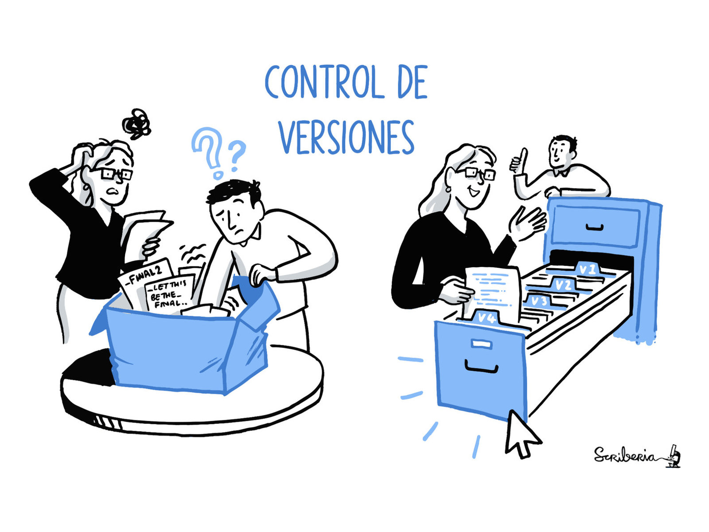{alt='Ilustración que muestra la diferencia entre gestionar versiones de un documento de forma manual y utilizar un sistema de control de versiones como Git.'}

*Fuente: The Turing Way Community, & Scriberia. (2022). [*Illustrations from The Turing Way: Shared under CC-BY 4.0 for reuse*](https://doi.org/10.5281/zenodo.3332807). Zenodo.*

::::::::::::::::::::::::::::::::::::::::::::: instructor

A menudo las personas que trabajan en investigación no tienen formación de base técnica en términos de desarrollo de software, no obstante necesitan adquirir habilidades en programación y gestión de código para desarrollarse en sus carreras. Lo que vamos a ver a continuación es esencial para sus proyectos de investigación actuales y potenciales.

Mencionamos que algunos repositorios usan control de versiones. ¿Qué es el control de versiones?

Un ejemplo seguramente más cercano es el control de cambios en herramientas como Microsoft Word o google docs. Esto nos permite rastrear y gestionar los cambios en un documento. Pero no sería lo más apropiado para trabajar con código.

Necesitamos herramientas específicas que permitan rastrear los cambios en el código y maneras ágiles de trabajar de manera colaborativa en los equipos de trabajo.

El control de versiones:

- Ayuda a seguir los cambios en todos los archivos vinculados a un proyecto de código, a lo largo de toda su evolución.
- Permite hacer un seguimiento de las contribuciones realizadas por distintas personas.
- Los cambios no deseados, como aquellos que lleven a errores o fallos, pueden revertirse en cualquier momento.

::::::::::::::::::::::::::::::::::::::::::::::::::::::::::

## Control de versiones

Herramienta más utilizada para control de versiones en proyectos de software y ciencia de datos.

<!-- 🟨🟨🟨 FIGURA PENDIENTE: cargar `git-logo.png` en `episodes/fig/` 🟨🟨🟨 -->

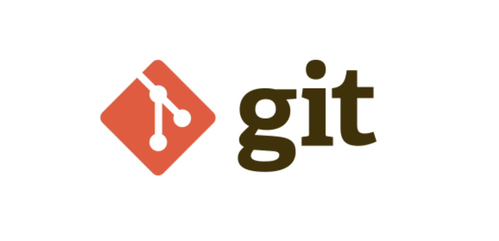{alt='Logo de la herramienta Git para el control de versiones.'}

::::::::::::::::::::::::::::::::::::::::::::: instructor

La herramienta más utilizada para control de versiones en proyectos de software y ciencia de datos es Git.

Git es un sistema de control de versiones diseñado para registrar los cambios que se realizan en archivos a lo largo del tiempo.

A diferencia de herramientas de edición de documentos como Word o Google Docs, Git está pensado específicamente para trabajar con archivos de código y proyectos completos. Esto significa que no solo registra cambios en un documento aislado, sino en todo el conjunto de archivos que forman un proyecto.

Fue creado originalmente para el desarrollo de software, pero hoy se usa en proyectos colaborativos de todo tipo, incluyendo cuando solo incluyen texto pero con muchos archivos en simultáneo.

::::::::::::::::::::::::::::::::::::::::::::::::::::::::::

## Control de versiones

<!-- 🟨🟨🟨 FIGURA PENDIENTE: cargar `historial-control-versiones.png` en `episodes/fig/` 🟨🟨🟨 -->

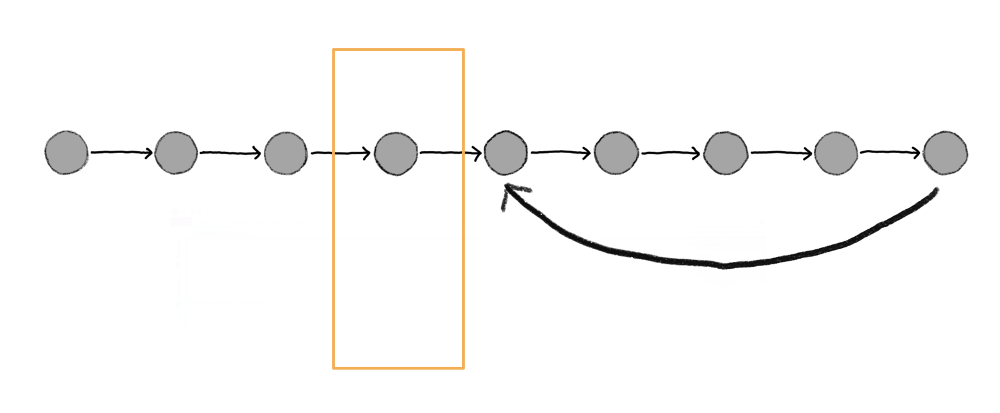{alt='Línea temporal formada por distintos puntos que representan versiones guardadas de un proyecto. Uno de los puntos aparece destacado como una fotografía del estado del proyecto en ese momento.'}

*Fuente: The Turing Way Community. (2025). [*The Turing Way handbook for reproducible, ethical and collaborative research*](https://doi.org/10.5281/zenodo.3233853). Zenodo.*

::::::::::::::::::::::::::::::::::::::::::::: instructor

¿Cómo funciona en términos simplificados?

Durante el desarrollo de un proyecto, el control de versiones va guardando distintos puntos en el tiempo y cada uno de estos puntos representa una foto del estado del código en ese momento. Cada vez que hacemos un cambio y lo guardamos en el sistema de control de versiones, se crea y guarda una nueva foto junto con un mensaje que describe los cambios que se hicieron.

De esta forma podemos:

- Ver la historia completa del proyecto
- Saber quién hizo cada cambio
- Recuperar versiones anteriores si algo deja de funcionar
- Probar modificaciones sin romper la versión principal del proyecto

::::::::::::::::::::::::::::::::::::::::::::::::::::::::::

## Control de versiones

<!-- 🟨🟨🟨 FIGURA PENDIENTE: cargar `ramas-control-versiones.png` en `episodes/fig/` 🟨🟨🟨 -->

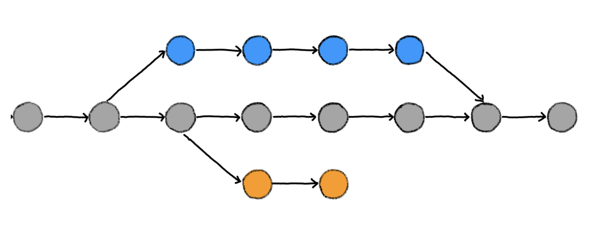{alt='Línea principal gris de un proyecto acompañada por ramas alternativas de color azul y naranja que luego se integran nuevamente en la rama principal.'}

*Fuente: The Turing Way Community. (2025). [*The Turing Way handbook for reproducible, ethical and collaborative research*](https://doi.org/10.5281/zenodo.3233853). Zenodo.*

::::::::::::::::::::::::::::::::::::::::::::: instructor

Además de guardar puntos en el tiempo, el control de versiones nos permite trabajar en paralelo.

Así podemos probar nuevas funciones, nuevas ideas, generando versiones alternativas como las líneas azul y naranja (las vamos a llamar ramas), sin afectar la versión principal del código (en este caso la línea gris) que ya sabemos que funciona correctamente.

Cuando el código nuevo está listo y estamos conformes con el resultado, podemos integrarlo nuevamente en la rama principal.

Otra ventaja importante es la colaboración.

Git permite que varias personas trabajen sobre el mismo proyecto al mismo tiempo. Cada persona puede trabajar en su propia copia del proyecto y luego combinar sus cambios con los del resto del equipo.

Y, al igual que antes, si algo sale mal, siempre podemos deshacer los cambios y volver a una versión estable del código.

::::::::::::::::::::::::::::::::::::::::::::::::::::::::::

## Plataformas de control de versiones

<!-- 🟨🟨🟨 FIGURA PENDIENTE: cargar `plataformas-control-versiones.png` en `episodes/fig/` 🟨🟨🟨 -->

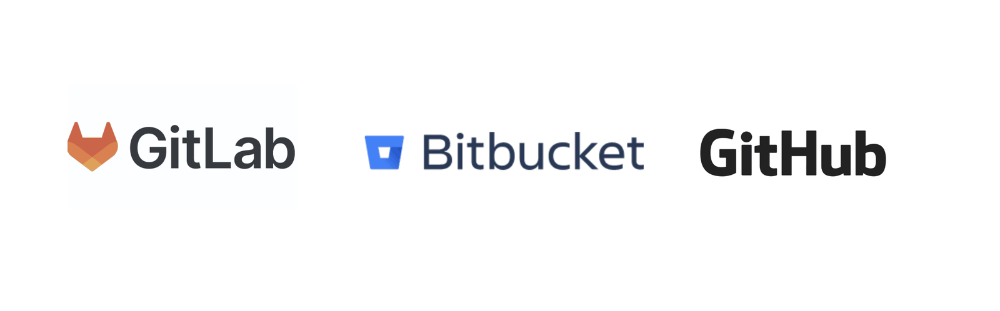{alt='Logotipos de tres plataformas en línea para alojar repositorios con control de versiones: GitLab, Bitbucket y GitHub.'}

::::::::::::::::::::::::::::::::::::::::::::: instructor

Aunque podemos usar Git localmente, en nuestra computadora, normalmente se combina con plataformas en línea que alojan repositorios de código, como GitHub, GitLab o Bitbucket. Estas plataformas online de control de versiones nos permite:

- Almacenar en la ube nuestro código junto con todo el historial de cambios
- Colaborar con otras personas, que pueden ver el código, proponer cambios y contribuir al proyecto.

GitHub es una de las plataformas más populares y la mayoría de los proyectos de software de código abierto, es decir, proyectos públicos en los que cualquiera puede colaborar, están alojados en esta plataforma.

En el chat les vamos a compartir algunos videos que armamos para otra capacitación donde explicamos como clonar un repositorio en github, como dejar comentarios y sugerencias usando issues, y como colaborar en proyectos abiertos.

Para pegar en el chat:

- [Cómo clonar un repositorio](https://youtu.be/RZpZzHYdfVo?si=ptlYOHntl_dwHjZq)
- [Cómo generar un issue](https://youtu.be/U8Q2KnCYFHw?si=cDi7yyXhx7Yv3Nhj)
- [Cómo colaborar en proyectos abiertos con github](https://youtu.be/Rh7f4Jdnoe8?si=S5ubaFKv4QsAWxCh)

::::::::::::::::::::::::::::::::::::::::::::::::::::::::::

## Integraciones útiles

<!-- 🟨🟨🟨 FIGURA PENDIENTE: cargar `integracion-github-zenodo-orcid.png` en `episodes/fig/` 🟨🟨🟨 -->

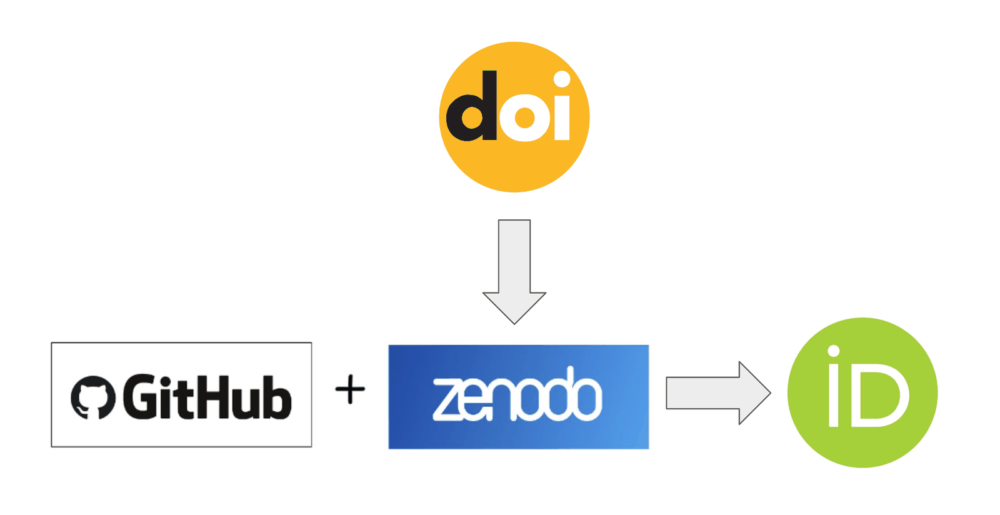{alt='Diagrama que muestra la integración de un repositorio de GitHub con Zenodo para obtener un DOI y vincular el resultado con un perfil de ORCID.'}

::::::::::::::::::::::::::::::::::::::::::::: instructor

Ahora bien, ¿si subimos nuestro código a un repositorio de GitHub podemos decir que lo almacenamos de forma permanente? No. El contenido del repositorio puede ir cambiando.

Para que nuestro trabajo sea realmetne reproducible, tenemos que eventualmente archivarlo en una plataforma de almacenamiento a largo plazo como zenodo. Una gran ventaja de GitHub es que podemos integrarlo con Zenodo y, no solo ir archivando versiones estáticas de nuestro código, sino que podemos además usarlo para asignarle un DOI y citarlo con esa herramienta.

Y otra cuestión interesante es que podemos vincular zenodo con la plataforma de ORCID, y que nuestro código o software aparezca en nuestro perfil de ORCID vinculado a nuestra producción académica.

::::::::::::::::::::::::::::::::::::::::::::::::::::::::::

<!-- 🟨🟨🟨 FIGURA PENDIENTE: cargar `github-release.png` en `episodes/fig/` 🟨🟨🟨 -->

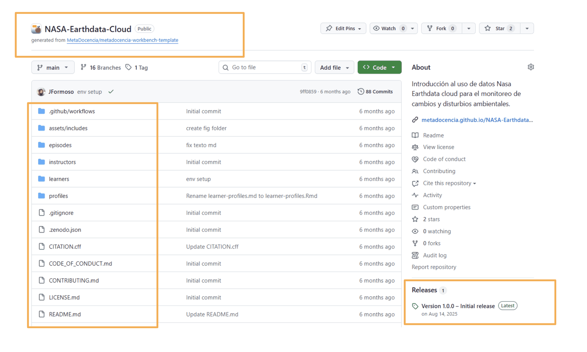{alt='Captura del repositorio NASA-Earthdata-Cloud en GitHub. Se destacan el nombre del repositorio, sus archivos y la sección Releases.'}

::::::::::::::::::::::::::::::::::::::::::::: instructor

Acá tenemos un repositorio de Github, el código ya está almacenado en el repositorio con control de versiones. Ya es abierto, colaborativo, transparente. Vamos a hablar de como mejorar la manera de compartirlo aprovechando la integración de GitHub + Zenodo.

El nombre del repositorio es NASA-Earthdata-Cloud, y debajo podemos ver todos los archivos almacenados allí. Debajo a la derecha vemos que hicimos un “Release”. Un release en GitHub es una versión específica del repositorio que el autor decide publicar como una versión oficial o estable, que otras personas puedan usar o citar.

Cada release:

- Está asociado a un punto exacto en el historial de cambios del repositorio
- Tiene un nombre y un número de versión, por ejemplo: versión 1.0.0

::::::::::::::::::::::::::::::::::::::::::::::::::::::::::

<!-- 🟨🟨🟨 FIGURA PENDIENTE: cargar `zenodo-conectar-github.png` en `episodes/fig/` 🟨🟨🟨 -->

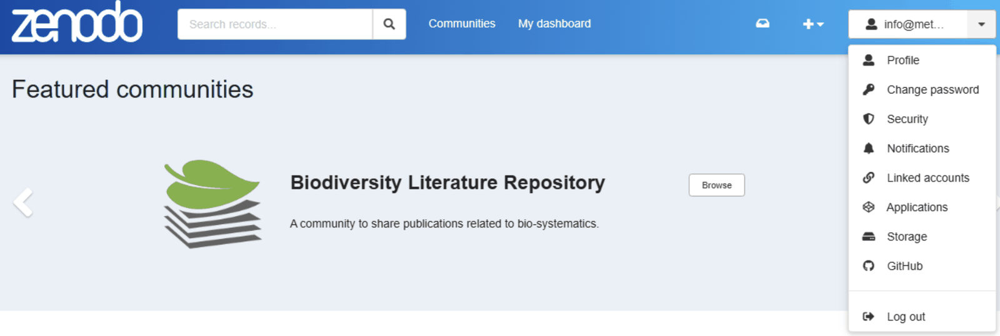{alt='Captura de la plataforma Zenodo con el menú de usuario desplegado y la opción GitHub resaltada.'}

::::::::::::::::::::::::::::::::::::::::::::: instructor

Esta es la plataforma Zenodo, y a la derecha, en el desplegable asociado a nuestro usuario, podemos ingresar a la sección que nos permite conectar nuestra cuenta de Zenodo con nuestra cuenta de GitHub.

::::::::::::::::::::::::::::::::::::::::::::::::::::::::::

<!-- 🟨🟨🟨 FIGURA PENDIENTE: cargar `zenodo-activar-repositorio-github.png` en `episodes/fig/` 🟨🟨🟨 -->

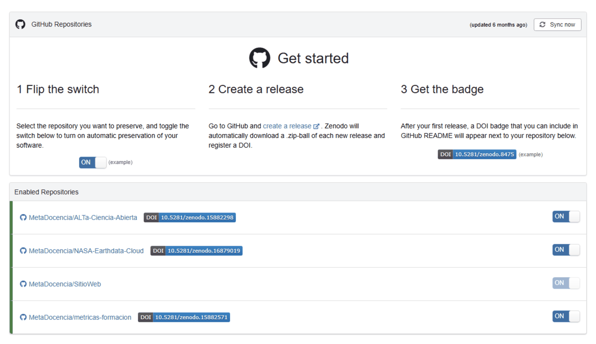{alt='Captura de la sección GitHub de Zenodo. Se destacan los pasos para conectar una cuenta y el interruptor que habilita el archivado de un repositorio.'}

::::::::::::::::::::::::::::::::::::::::::::: instructor

Una vez que las cuentas están vinculadas, en Zenodo nos van a aparecer listados nuestros repositorios de GitHub. Ubicamos el que nos interesa archivar en zenodo y dejamos el interruptor que está a la derecha en ON.

De esa forma le decimos a Zenodo que cada vez que hagamos un release de ese repositorio en github, zenodo lo archive.

El segundo paso es justamente crear el release en GitHub, que es lo que les mostré antes..

En ese momento, automáticamente Zenodo:

- Hace una copia completa del repositorio
- Lo almacena
- Y le asigna un DOI

Este DOI es lo que transforma el repositorio en un objeto citable académicamente. Es decir, ahora este software o estos materiales se pueden citar igual que un paper o un dataset.

::::::::::::::::::::::::::::::::::::::::::::::::::::::::::

<!-- 🟨🟨🟨 FIGURA PENDIENTE: cargar `zenodo-doi-badge-github.png` en `episodes/fig/` 🟨🟨🟨 -->

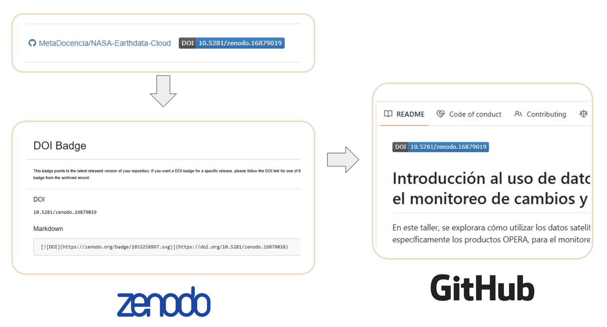{alt='Secuencia de capturas que muestra el DOI Badge generado por Zenodo, su incorporación en el archivo README y el distintivo del DOI visible en el repositorio de GitHub.'}

::::::::::::::::::::::::::::::::::::::::::::: instructor

El tercer paso es que Zenodo nos da un badge (el recuadro azul), que podemos poner en el repositorio de GitHub, en general en un archivo específico que se llama README. Ese badge muestra el DOI y permite que otras personas accedan fácilmente a la versión archivada haciendo click sobre el rectángulo azul.

La idea importante para llevarse de esta diapositiva es:

- GitHub sirve para trabajar y desarrollar el proyecto,
- pero Zenodo sirve para preservarlo y hacerlo citable.
- GitHub es dinámico.
- Zenodo es el archivo permanente.

::::::::::::::::::::::::::::::::::::::::::::::::::::::::::

::::::::::::::::::::::::::::::::::::::::::::: challenge

## Ejercicio 3: Responde la encuesta de Zoom

**Duración: 3 minutos**

¿Cuál es una de las principales razones para usar control de versiones en proyectos de Código Abierto?

- Aumenta la velocidad de ejecución del código.
- Resuelve automáticamente todos los conflictos que surgen de ediciones simultáneas de código que contribuyen distintas personas.
- Permite hacer un seguimiento de los cambios en el código y la documentación de un proyecto a lo largo de su evolución.

::::::::::::::::::::::::::::::::::::::::::::::::::::::::::

## Plan de gestión de software (PGS)

### ¿Cómo compartir?

#### Archivo `README.md`

- Nombre y breve descripción
- Instrucciones de instalación o ejecución
- Dependencias
- Ejemplos de uso

<!-- 🟨🟨🟨 FIGURA PENDIENTE: cargar `documentacion-software.jpg` en `episodes/fig/` 🟨🟨🟨 -->

{alt='Tres personas trabajan alrededor de distintos documentos y elementos vinculados con la documentación de un proyecto.'}

*Fuente: The Turing Way Community, & Scriberia. (2022). [*Illustrations from The Turing Way: Shared under CC-BY 4.0 for reuse*](https://doi.org/10.5281/zenodo.3332807). Zenodo.*

::::::::::::::::::::::::::::::::::::::::::::: instructor

¿Cómo nos aseguramos de que nuestro código sea reutilizable cuando lo compartimos?

Primero, podemos asignarle un DOI, como vimos en las diapositivas anteriores.

Además, tenemos que agregar un archivo `README.md` al repositorio de GitHub. Este archivo es la primera parada para cualquier persona que se acerca a un proyecto nuevo. Contiene información orientativa que permite comprender su propósito y reúne aquello que consideramos importante para poder utilizarlo.

Como mínimo, un `README.md` debe incluir el nombre del proyecto y una descripción breve, escrita en lenguaje sencillo, que explique qué hace el código o el programa.

También es útil agregar:

- Instrucciones para instalar y ejecutar el software.
- Una lista de las dependencias necesarias.
- Ejemplos de uso.
- Información sobre cómo nos gustaría que citaran nuestro trabajo.

::::::::::::::::::::::::::::::::::::::::::::::::::::::::::

## Plan de gestión de software (PGS)

### ¿Cómo compartir?

- Archivo `LICENSE.md`
- Información sobre cómo citar:
  - `CITATION.cff`
- Guía para colaboraciones:
  - `CONTRIBUTING.md`
  - `CODE_OF_CONDUCT.md`

<!-- 🟨🟨🟨 FIGURA PENDIENTE: cargar `documentacion-software.jpg` en `episodes/fig/` 🟨🟨🟨 -->

{alt='Tres personas trabajan alrededor de distintos documentos y elementos vinculados con la documentación de un proyecto.'}

*Fuente: The Turing Way Community, & Scriberia. (2022). [*Illustrations from The Turing Way: Shared under CC-BY 4.0 for reuse*](https://doi.org/10.5281/zenodo.3332807). Zenodo.*

::::::::::::::::::::::::::::::::::::::::::::: instructor

También se recomienda que el repositorio incluya:

- Una licencia apropiada, para que otras personas sepan cómo pueden usar el código. Al crear un repositorio en GitHub podemos seleccionar una de las licencias disponibles. Esta se almacenará en un archivo llamado `LICENSE.md`. Si queremos usar una licencia que no aparece en la lista, podemos crear el archivo y agregar el texto completo o un enlace al texto de la licencia.
- Un archivo `CITATION.cff`, con información estandarizada sobre cómo citar el código. Vamos a verlo con más detalle en la próxima diapositiva.
- Una guía para colaboraciones. Si esperamos que la comunidad contribuya al desarrollo del software, es una buena práctica incluir un archivo `CONTRIBUTING.md` que explique cómo aportar al proyecto.
- Un código de conducta, almacenado en un archivo `CODE_OF_CONDUCT.md`, que describa las expectativas para las interacciones entre las personas que participan en el proyecto.

::::::::::::::::::::::::::::::::::::::::::::::::::::::::::

<!-- 🟨🟨🟨 FIGURA PENDIENTE: cargar `documentacion-repositorio-github.png` en `episodes/fig/` 🟨🟨🟨 -->

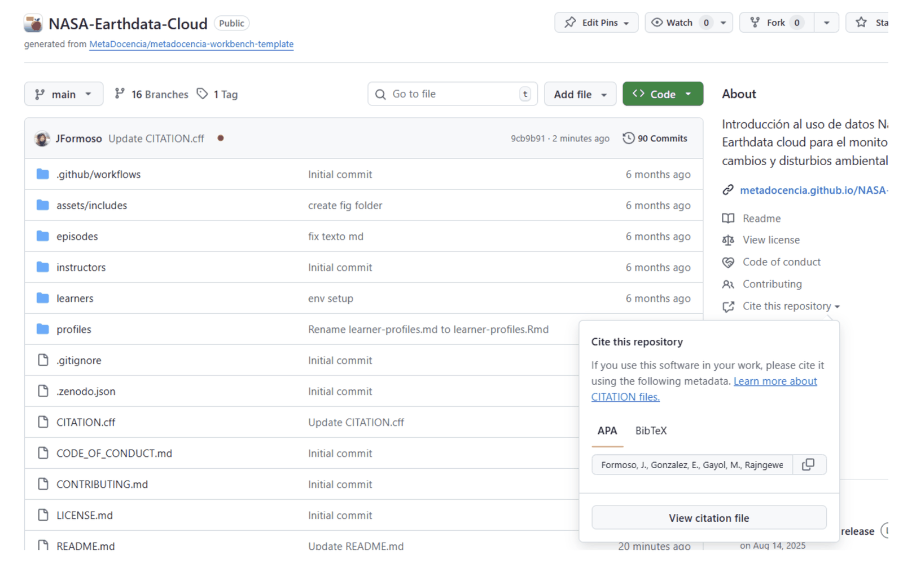{alt='Captura del repositorio NASA-Earthdata-Cloud en GitHub. Se destacan los archivos CITATION.cff, CODE_OF_CONDUCT.md, CONTRIBUTING.md, LICENSE.md y README.md, además de la opción para copiar la cita del repositorio en formato APA o BibTeX.'}

::::::::::::::::::::::::::::::::::::::::::::: instructor

Cuando un repositorio incluye los archivos `CITATION.cff`, `CODE_OF_CONDUCT.md`, `CONTRIBUTING.md`, `LICENSE.md` y `README.md`, GitHub los reconoce y los muestra también en la sección derecha de la página.

Si el archivo `CITATION.cff` está creado correctamente, GitHub ofrece la opción de copiar directamente la cita del repositorio en formato APA o BibTeX.

Podemos usar el siguiente recurso para generar este archivo paso a paso, descargarlo y subirlo al repositorio:

[Generador de archivos CITATION.cff](https://citation-file-format.github.io/cff-initializer-javascript/#/)

::::::::::::::::::::::::::::::::::::::::::::::::::::::::::

## Plan de gestión de software (PGS)

### ¿Cómo compartir?

Los cuadernos computacionales o *notebooks* son entornos virtuales e interactivos que permiten combinar texto, código y los resultados de su ejecución, como tablas y visualizaciones.

<!-- 🟨🟨🟨 FIGURA PENDIENTE: cargar `documentacion-software.jpg` en `episodes/fig/` 🟨🟨🟨 -->

{alt='Tres personas trabajan alrededor de distintos documentos y elementos vinculados con la documentación de un proyecto.'}

*Fuente: The Turing Way Community, & Scriberia. (2022). [*Illustrations from The Turing Way: Shared under CC-BY 4.0 for reuse*](https://doi.org/10.5281/zenodo.3332807). Zenodo.*

::::::::::::::::::::::::::::::::::::::::::::: instructor

Otra cuestión importante es cómo presentamos el código que queremos compartir.

En algunos casos, especialmente cuando queremos obtener un resultado reproducible para un proyecto de investigación, podemos presentar el código mediante cuadernos computacionales o *notebooks*, en lugar de compartirlo únicamente como archivos de texto plano, como podría ser un script de R.

Los cuadernos computacionales son entornos virtuales e interactivos que permiten combinar texto, código y los resultados de su ejecución —por ejemplo, tablas y visualizaciones— en un mismo documento.

::::::::::::::::::::::::::::::::::::::::::::::::::::::::::

## Ejemplo: Jupyter Notebooks

Combinación de **texto enriquecido**, **código** y **resultados de su ejecución**.

<!-- 🟨🟨🟨 FIGURA PENDIENTE: cargar `jupyter-notebook.png` en `episodes/fig/` 🟨🟨🟨 -->

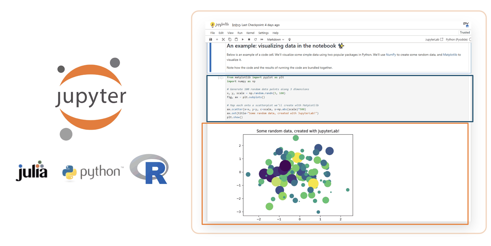{alt='Ejemplo de un cuaderno de Jupyter que combina un bloque de texto enriquecido, una celda de código en Python y una visualización producida al ejecutar ese código. También aparecen los logotipos de Julia, Python y R.'}

*Fuente: Project Jupyter.*

::::::::::::::::::::::::::::::::::::::::::::: instructor

Un ejemplo son los Jupyter Notebooks, un formato que puede utilizarse con distintos lenguajes de programación y que permite combinar texto, código y resultados o salidas.

Otros formatos utilizados con frecuencia son Quarto y R Markdown.

::::::::::::::::::::::::::::::::::::::::::::::::::::::::::

## Plan de gestión de software (PGS)

### ¿Quiénes?

Comprende los roles y las responsabilidades necesarios para compartir y, si corresponde, mantener el código.

<!-- 🟨🟨🟨 FIGURA PENDIENTE: cargar `roles-gestion-software.jpg` en `episodes/fig/` 🟨🟨🟨 -->

{alt='Varias personas realizan distintas tareas conectadas entre sí alrededor de un documento central, representando la distribución de roles y responsabilidades.'}

*Fuente: The Turing Way Community, & Scriberia. (2022). [*Illustrations from The Turing Way: Shared under CC-BY 4.0 for reuse*](https://doi.org/10.5281/zenodo.3332807). Zenodo.*

::::::::::::::::::::::::::::::::::::::::::::: instructor

Al redactar un Plan de Gestión de Software es importante definir los roles y las responsabilidades necesarios para compartir y, si corresponde, mantener el código del proyecto.

Tenemos que definir:

- Quién agregará el código a un repositorio público y le asignará una licencia.
- Quién se encargará de documentarlo.
- Quiénes ayudarán a otras personas a reutilizarlo.
- Quién tendrá la responsabilidad de mantener el software.
- Quién responderá los comentarios y las contribuciones de la comunidad.

Es importante que las responsabilidades estén claramente asignadas entre las personas que integran el equipo.

::::::::::::::::::::::::::::::::::::::::::::::::::::::::::

## Reusar Código Abierto

::::::::::::::::::::::::::::::::::::::::::::: instructor

Todo lo que vimos hasta ahora se aplica al código que desarrollamos. Pero, si alguna vez escribieron código para cualquier tipo de actividad, probablemente sepan que muchas soluciones ya existen y que no siempre necesitamos reinventar la rueda.

Hay una gran cantidad de paquetes y bibliotecas que incluyen las funciones que necesitamos. También existen personas y equipos que ya desarrollaron maneras de resolver parte de los problemas que podemos encontrar.

Por eso, gran parte del trabajo con código consiste en reutilizar Código Abierto creado por otras personas.

::::::::::::::::::::::::::::::::::::::::::::::::::::::::::

## ¿Cómo buscar Código Abierto?

- Definir un propósito claro.
- Determinar qué tareas esperamos que lleve a cabo el código.
- Usar palabras clave relacionadas con el propósito de programación.
- Identificar dónde buscar: foros, literatura científica, repositorios abiertos y colegas con experiencia.

::::::::::::::::::::::::::::::::::::::::::::: instructor

Para buscar Código Abierto, primero tenemos que definir nuestro propósito:

- ¿Qué tarea específica necesitamos realizar?
- ¿Qué lenguaje de programación es adecuado para esa tarea?
- ¿Existen proyectos de Código Abierto que resuelvan un problema similar?

También necesitamos familiarizarnos con la terminología que utilizan quienes desarrollan código con propósitos parecidos al nuestro. Esto nos ayudará a seleccionar mejores palabras clave.

Podemos buscar:

- En artículos científicos.
- En repositorios abiertos.
- En foros y comunidades.
- Consultando a colegas con experiencia.

::::::::::::::::::::::::::::::::::::::::::::::::::::::::::

## ¿Cómo evaluar Código Abierto?

- **Funcionalidad:** ¿será útil para el problema científico?
- **Interoperabilidad:** ¿se integra fácilmente con otros programas o archivos que usamos?
- **Seguridad:** ¿es seguro? ¿Su uso podría crear un riesgo de seguridad?
- **Licencias y restricciones:** ¿es legal usar este código en nuestro proyecto?

Más información: [Open Worldwide Application Security Project (OWASP)](https://owasp.org/)

::::::::::::::::::::::::::::::::::::::::::::: instructor

Una vez que encontramos código potencialmente útil, necesitamos evaluarlo desde distintas perspectivas.

**Funcionalidad:** ¿será útil para nuestro problema científico? Podemos revisar la documentación y consultar a colegas que tengan experiencia utilizando ese código o software.

**Interoperabilidad:** ¿es compatible con los sistemas que ya usamos? ¿Puede importar o exportar datos en formatos estándar? ¿Se integra con otras aplicaciones sin requerir adaptaciones complejas?

**Seguridad:** ¿es seguro? ¿Su uso podría crear un riesgo para nuestro proyecto o nuestra institución?

Para evaluar este punto podemos:

- Consultar las políticas institucionales sobre software abierto y al equipo de tecnologías de la información.
- Utilizar fuentes autorizadas y de buena reputación.
- Emplear herramientas para identificar vulnerabilidades.

Un recurso útil es OWASP, una fundación sin fines de lucro dedicada a mejorar la seguridad del software. Sus recursos son desarrollados por una comunidad de personas voluntarias y están disponibles de manera abierta.

**Licencias y restricciones:** ¿podemos usar legalmente ese código en nuestro proyecto? Para responder esta pregunta necesitamos conocer y revisar su licencia.

Para compartir en el chat: [https://owasp.org/](https://owasp.org/)

::::::::::::::::::::::::::::::::::::::::::::::::::::::::::

## ¿Cuándo citar Código Abierto?

- Cuando cumple un rol crítico en la investigación.
- Cuando constituye una contribución novedosa.
- Cuando su licencia requiere atribución.

::::::::::::::::::::::::::::::::::::::::::::: instructor

¿Cuándo tenemos que citar el código?

**Cuando cumple un rol crítico en la investigación:** si el código fue fundamental para desarrollar el trabajo o producir los resultados, debemos citarlo.

**Cuando constituye una contribución novedosa:** si el código aportó una solución que no podríamos haber desarrollado por nuestra cuenta, también corresponde citarlo.

Algunos ejemplos son:

- Un programa, paquete o biblioteca utilizado para modelar fenómenos, analizar datos o realizar simulaciones numéricas.
- Un programa, paquete o biblioteca utilizado para tareas como el procesamiento de imágenes o el reconocimiento óptico de caracteres.
- Cualquier software cuya licencia requiera atribución.

::::::::::::::::::::::::::::::::::::::::::::::::::::::::::

## ¿Cómo citar Código Abierto?

- Es recomendable usar y citar código archivado en un repositorio a largo plazo con un DOI permanente.
- Sigue el formato de citación indicado en el archivo `README` o `CITATION`.
- Haz referencia explícita a la versión utilizada.

::::::::::::::::::::::::::::::::::::::::::::: instructor

¿Cómo citamos el código?

En primer lugar, podemos consultar las indicaciones de la revista o publicación, ya que algunas tienen requisitos específicos para citar software.

Es recomendable usar y citar código archivado en un repositorio a largo plazo que cuente con un DOI permanente. Esto contribuye a garantizar la reproducibilidad del trabajo.

Las páginas web y los repositorios activos, como GitHub, pueden cambiar con el tiempo. Podemos citarlos si no existe otra alternativa, pero siempre es preferible utilizar una versión archivada y estable.

También debemos seguir el formato de citación recomendado en el archivo `README`, `CITATION` o en la documentación del software, e indicar de manera explícita qué versión utilizamos.

::::::::::::::::::::::::::::::::::::::::::::::::::::::::::

::::::::::::::::::::::::::::::::::::::::::::: challenge

## Ejercicio 4: Responde la encuesta de Zoom

**Duración: 3 minutos**

¿Cuándo es necesario citar el uso de software abierto en tu investigación?

**Elige 2 opciones:**

- Cuando el software desempeñó un papel fundamental en tu investigación.
- Cuando el software se utilizó para enviar y recibir correos electrónicos sobre la investigación.
- Cuando la licencia del software requiere atribución.

::::::::::::::::::::::::::::::::::::::::::::::::::::::::::

## Recapitulando

- Escribe el Plan de Gestión de Software antes de iniciar el proyecto.
- ¡Usa control de versiones! Permite hacer un seguimiento de los cambios en el código y la documentación de un proyecto.
- Siempre agrega un archivo `README.md` descriptivo.
- No olvides citar todo el código que reutilizas.

## Lecturas útiles

- [NASA OS101 - Módulo 2](https://github.com/MetaDocencia/IntroALaCienciaAbierta_NASAOpenScience101/blob/main/Module_2/M2_readme_es.md)
- [NASA OS101 - Módulo 3](https://github.com/MetaDocencia/IntroALaCienciaAbierta_NASAOpenScience101/blob/main/Module_3/M3_readme_es.md)

> 🚨 **¡Aviso!** Te invitamos a que, si encuentras errores o tienes sugerencias, los publiques como un *issue* en GitHub. Dar una devolución abierta es una excelente manera de contribuir a un proyecto.

## Próximos pasos

- Encuesta de valoración
- Evaluación para la certificación
- Próximo encuentro

## Crítica constructiva

Una crítica constructiva:

1. Es positiva.
2. Es específica.
3. Sugiere próximos pasos.

:::::::::::::::::::::::::::::::::::::::::::: instructor

Antes de presentar la encuesta, recuerda que es esencial ofrecer críticas constructivas. Una crítica constructiva tiene tres características principales: es positiva, es específica y sugiere un próximo paso.

La nota original utiliza una escena de Mafalda para contrastar una opinión general y negativa sobre la sopa con una devolución más constructiva: reconocer primero algo valioso y luego sugerir un cambio concreto, como reemplazar las verduras por fideos de letras.

::::::::::::::::::::::::::::::::::::::::::::::::::::::::::

:::::::::::::::::::::::::::::::::::::::::::: challenge

## Valoramos tu opinión: completa nuestra encuesta anónima

**Duración: 5 minutos**

[Accede a la encuesta de valoración](http://tinyurl.com/HCA-Encuesta3).

Cuando termines, avísanos por el chat.

::::::::::::::::::::::::::::::::::::::::::::::::::::::::::

:::::::::::::::::::::::::::::::::::::::::::: instructor

Invita al grupo a practicar lo conversado mediante una breve devolución que ayude a mejorar la formación.

Aclara que no es necesario dedicar mucho tiempo a la encuesta, pero que sus respuestas son fundamentales para aprender del proceso. Todas las sugerencias se leen y se tienen en cuenta: algunas permiten introducir cambios inmediatos y otras orientan mejoras a más largo plazo.

### Música

- Juana Molina (Argentina) — *Paraguaya*

::::::::::::::::::::::::::::::::::::::::::::::::::::::::::

:::::::::::::::::::::::::::::::::::::::::::: challenge

## Certificación NASA: evaluación del módulo

**Duración: 15 minutos**

[Accede a la evaluación del módulo](http://tinyurl.com/HCA-Eval3).

¿Tienes dudas? Puedes consultar levantando la mano o escribiendo en el chat.

¿Terminaste? Puedes salir de la reunión. ¡Hasta la próxima!

::::::::::::::::::::::::::::::::::::::::::::::::::::::::::

:::::::::::::::::::::::::::::::::::::::::::: instructor

Dedicaremos entre 10 y 15 minutos a completar el formulario de 10 preguntas. Explica que esta evaluación permite revisar los aprendizajes del encuentro y avanzar en la certificación de NASA Open Science 101.

### Música

- Hermeto Pascoal (Brasil) — *Bebê*
- Hermeto Pascoal (Brasil) — *O susto*

::::::::::::::::::::::::::::::::::::::::::::::::::::::::::

## Herramientas de Ciencia Abierta

| Encuentro | Tema |
|---|---|
| **Encuentro 1** | Qué, por qué y cómo de la Ciencia Abierta |
| **Encuentro 2** | Cómo usar, crear y compartir Datos Abiertos |
| **Encuentro 3** | Cómo usar, crear y compartir Código Abierto |
| **Encuentro 4** | Cómo usar, crear y compartir Resultados Abiertos |

## ¡Muchas gracias!

Este encuentro fue posible gracias a:

- NASA Open Science
- Code for Science & Society (CS&S)

**Referencia sugerida:**  
[https://doi.org/10.5281/zenodo.18894415](https://doi.org/10.5281/zenodo.18894415)

Puedes encontrar a MetaDocencia como **@metadocencia** en:

- [Instagram](https://www.instagram.com/metadocencia/)
- [LinkedIn](https://www.linkedin.com/company/metadocencia/)
- [GitHub](https://github.com/MetaDocencia)
- [YouTube](https://www.youtube.com/metadocencia)
- [Mastodon](https://floss.social/@MetaDocencia)
- [Bluesky](https://bsky.app/profile/metadocencia.org)
- [Facebook](https://www.facebook.com/metadocencia)
- [X/Twitter](https://twitter.com/metadocencia)

:::::::::::::::::::::::::::::::::::::::::::: instructor

¡Muchas gracias! Este encuentro fue posible gracias a NASA Open Science y Code for Science & Society (CS&S).

::::::::::::::::::::::::::::::::::::::::::::::::::::::::::
