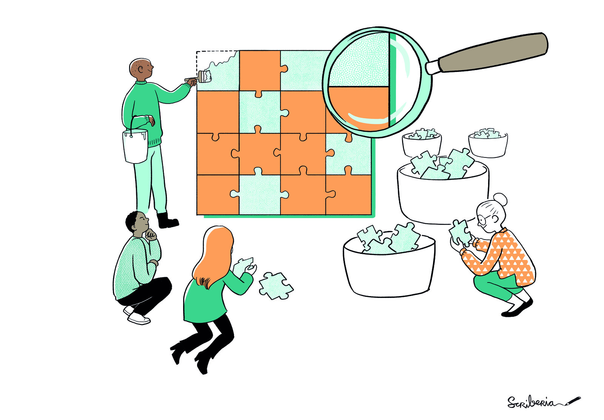
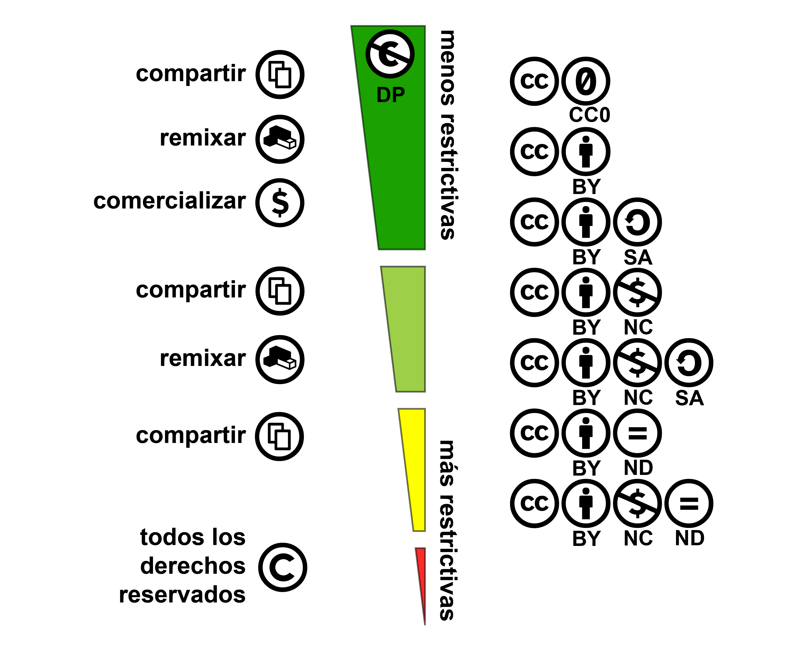
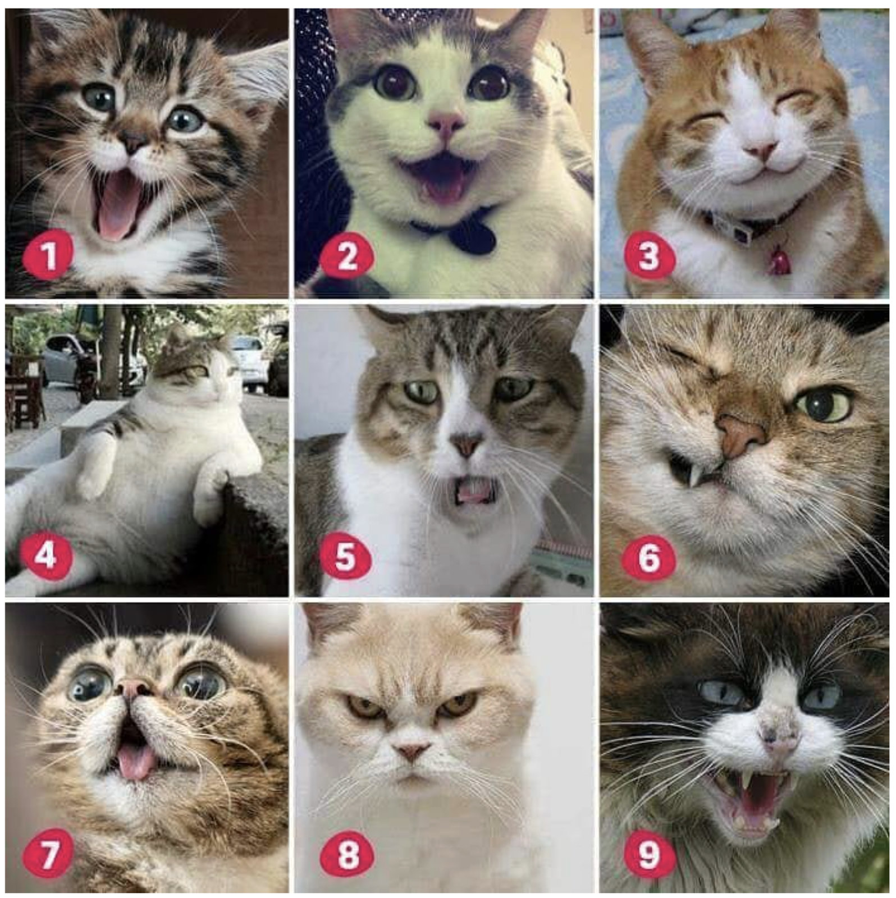
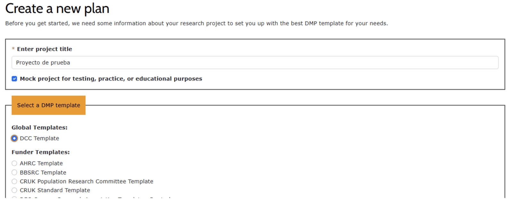
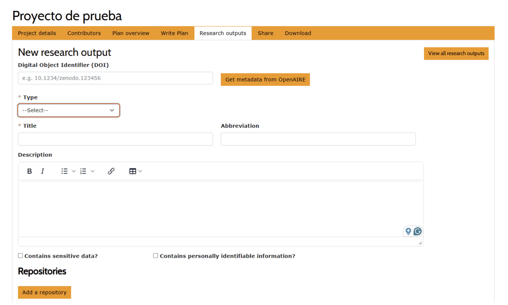
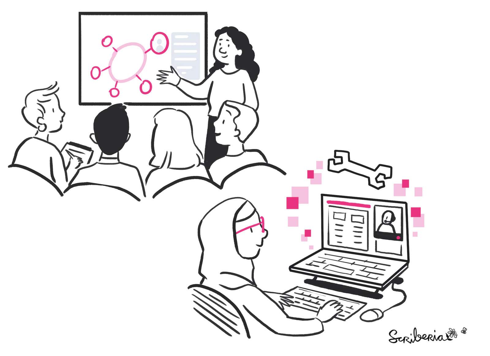
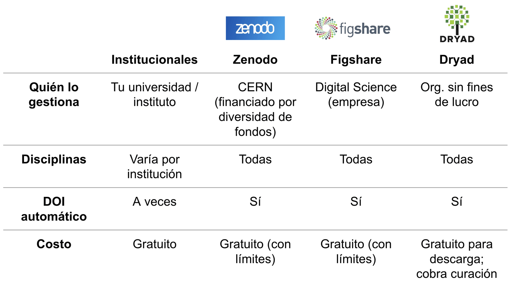
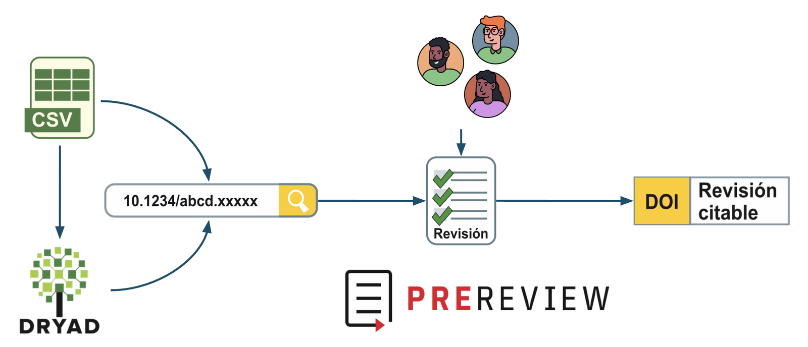

:::::::::::::::::::::::::::::::::::::: questions

::::::::::::::::::::::::::::::::::::::::::::::::

:::::::::::::::::::::::::::::::::::: objectives

Al finalizar este episodio, quienes participan podrán:

::::::::::::::::::::::::::::::::::::::::::::::::

# Herramientas de Ciencia Abierta - Encuentro 2

## Datos Abiertos

:::::::::::::::::::::::::::::::::::::::::::::::: instructor

### Orientaciones para facilitar

Bienvenida. Antes de arrancar les quiero recordar que este encuentro va a ser grabado y que si bien nos encanta que estén con las camaras prendidas para poder interactuar de forma más fluida, si prefieren no aparecer en el video puede apagarlas. [Equipo de apoyo] va a estar iniciando la grabación ahora.

::::::::::::::::::::::::::::::::::::::::::::::::::::::::::

## Antes de empezar

Pautas para un espacio amable para todas las personas:

- Para participar: pide la palabra o usa el chat.
- Micrófonos: siléncialo al terminar de hablar.
- Pide permiso antes de tomar registros de personas de este encuentro .
- [Pautas de Convivencia](https://doi.org/10.5281/zenodo.12534195).

:::::::::::::::::::::::::::::::::::::::::::::::: instructor

Para que la interacción no sea caótica, les pedimos que pidan la palabra levantando una mano virtual o por medio del chat, y que una vez que hayan terminado de hablar, se vuelvan a mutear para evitar sonidos de fondo.

Les quiero recordar que todos los espacios de MetaDocencia se rigen por nuestras Pautas de Convivencia, que les compartiremos en el chat. En resumen, buscamos que este sea un espacio seguro, respetuoso e inclusivo, donde podamos intercambiar ideas con empatía, escuchar distintas perspectivas y tratarnos con amabilidad. Y, por supuesto, evitar cualquier tipo de acoso, destrato o comentarios que puedan incomodar a otras personas.

::::::::::::::::::::::::::::::::::::::::::::::::::::::::::

## Nos presentamos

- **Irene Vazano:** Coordinadora del área de Infraestructura.
- **Nicolás Palopoli:** Co-Director Ejecutivo y Consejo Asesor.
- **María Paz Míguez:** Coordinadora del área de Formación.
- **Julián Buede:** Equipo de comunicación.

:::::::::::::::::::::::::::::::::::::::::::::::: instructor

Quienes guían se presentan y mencionan a quiénes conforman el equipo de apoyo ese día

::::::::::::::::::::::::::::::::::::::::::::::::::::::::::

## Herramientas de Ciencia Abierta

| Encuentro | Tema |
|---|---|
| **Encuentro 1** | Qué, por qué y cómo de la Ciencia Abierta |
| **Encuentro 2** | Cómo usar, crear y compartir Datos Abiertos |
| **Encuentro 3** | Cómo usar, crear y compartir Código Abierto |
| **Encuentro 4** | Cómo usar, crear y compartir Resultados Abiertos |

:::::::::::::::::::::::::::::::::::::::::::::::: instructor

Este es el segundo encuentro de nuestro curso Herramientas de ciencia abierta.

En el encuentro de hoy vamos a ver cómo compartir nuestros datos de forma que cumplan los principios FAIR, (es decir, es decir, Fáciles de encontrar, Accesibles, Interoperables y Reusables), esos principios que rigen la ciencia abierta y que vimos en profundidad en el encuentro anterior como parte de los fundamentos de ciencia abierta.

Se acuerdan de que hablamos de cuatro propiedades que tenían los datos abiertos para ser FAIR, el acrónimo en inglés de Fáciles de encontrar, Accesibles, Interoperables y Reusables.

En castellano podríamos decirles datos FIAR, como alguna vez nos sugirieron en las devoluciones del primer encuentro, y nos encantó. FIAR es una palabra que cumple como acrónimo pero también tiene un significado en español mucho más acorde a lo que transmiten los datos FAIR.

Entonces, hoy vamos a ver herramientas para hacer que los datos sean más abiertos.

::::::::::::::::::::::::::::::::::::::::::::::::::::::::::

## Datos Abiertos y Metadatos

## ¿Qué es un dato?

Un valor o registro que describe una observación del mundo, pero que por sí solo no tiene significado completo hasta que se lo contextualiza o analiza.

Cualquier tipo de información que se recolecta, observa o crea en el contexto de una investigación.

{alt='Una persona examina distintas piezas de información con una lupa, como representación de la observación, la recolección y la contextualización de datos.'}

*Fuente: The Turing Way Community, & Scriberia. (2022). [*Illustrations from The Turing Way: Shared under CC-BY 4.0 for reuse*](https://doi.org/10.5281/zenodo.3332807). Zenodo.*

:::::::::::::::::::::::::::::::::::::::::::::::: instructor

Para comenzar a entender a los datos es útil ponernos de acuerdo sobre Qué es un dato

Un dato es un valor o un registro de algún tipo que describe una observación del mundo, pero que por sí solo no tiene significado completo hasta que se le da contexto o se lo analiza.

Por ejemplo. ‘10’ por sí solo no es un dato, pero ‘10 pesos cuesta una manzana en la verdulería’, o ‘10’ en una columna cuyo encabezado dice ‘longitud en cm’ sí puede ser un dato.

Vamos a llamar datos a cualquier tipo de información que se recolecta, observa o crea en el contexto de una investigación.

::::::::::::::::::::::::::::::::::::::::::::::::::::::::::

## Tipos de datos

- Primarios (crudos).
- Secundarios (procesados).
- Publicados (finales).
- Metadatos (datos sobre datos).

*Fuente: [Research Data Management 1 day workshop](https://zenodo.org/records/4562630).*

:::::::::::::::::::::::::::::::::::::::::::::::: instructor

Podemos clasificar a los datos en:

Datos Primarios (o crudos) – Los datos primarios se refieren a datos que son directamente obtenidos por las personas que investigan utilizando un instrumento de recolección o medición. Por ejemplo:

- Respuestas a entrevistas, cuestionarios y encuestas.
- Datos adquiridos a partir de mediciones directas (p ej, Temperatura corporal)
- Datos adquiridos a partir de muestras físicas y especímenes (p. ej. Los datos de análisis clínico a partir de una muestra de sangre extraída de una persona)

Datos Secundarios (o procesados) – Los datos secundarios son los que no vienen directamente de la medición original, sino que se generan a partir del procesamiento, análisis o reinterpretación de datos primarios.

Se producen por ejemplo cuando realizamos acciones como eliminar valores atípicos e incompletos, transformar los datos para normalizarlos, o integrar múltiples conjuntos de datos para que sean más fácilmente interpretables.

Datos Publicados (finales) – Los datos publicados son aquellos compartidos asociados a un estudio científico en particular o para uso general. Pueden coincidir con datos primarios y secundarios, pero idealmente están bien documentados y son fáciles de usar.

::::::::::::::::::::::::::::::::::::::::::::::::::::::::::

## Formatos y estándares

### Formatos cerrados

- No se pueden acceder libremente
- No están estandarizados
- Problemas de compatibilidad y convertibilidad
- Requiere software o convertidores adicionales
- Ejemplos: antiguos Microsoft Word (.doc) y Excel (.xls), Adobe Photoshop (.psd),

:::::::::::::::::::::::::::::::::::::::::::::::: instructor

Los datos pueden almacenarse como texto libre, sin un formato determinado, o siguiendo un formato preestablecido, un estándar.

En el caso de seguir un formato, ese formato puede ser cerrado o abierto.

Los formatos cerrados, propietarios o privativos son aquellos cuyas especificaciones no son públicas y están bajo control de una empresa. protegidos por derechos de propiedad intelectual.

Su disponibilidad y sus características pueden cambiar según decisiones comerciales de quien sea dueño del formato.

Usualmente requiere un software específico para su uso completo. Eso trae al menos dos problemas:

- si ese software cambia, los datos pueden volverse inaccesibles y prácticamente dejar de existir.
- Pueden no traducirse bien a formatos abiertos (ej. Excel y las benditas fechas)

Ejemplos muy comunes son los viejos archivos de Word .doc, de Excel .xls o de Photoshop .psd.

Todos usamos datos cerrados a veces, pero hay que ser conscientes de las limitaciones que imponen al compartir datos abiertamente. Para eso, mejor usemos datos que sigan formatos abiertos.

::::::::::::::::::::::::::::::::::::::::::::::::::::::::::

## Formatos y estándares

### Formatos abiertos

- Las especificaciones del software están disponibles para cualquier persona, de forma gratuita.
- Cualquiera puede usar esas especificaciones en su propio software, sin limitaciones impuestas por derechos de propiedad intelectual en su reutilización.

:::::::::::::::::::::::::::::::::::::::::::::::: instructor

Los formatos abiertos tienen especificaciones públicas y libres.

No están controladas por una sola empresa, por lo que cualquier persona puede desarrollar software que lea o genere datos con uno de estos formatos abiertos, sin pagar licencias ni pedir permisos.

Esto garantiza que los datos puedan ser accedidos a largo plazo y por cualquier persona o software..

Es el tipo de formato que debemos priorizar al pensar en datos abiertos. Pero ¿qué son los datos abiertos?

::::::::::::::::::::::::::::::::::::::::::::::::::::::::::

## Datos abiertos

> “...aquellos a los que cualquier persona puede acceder, usar y compartir libremente.”

*Fuente: [Kit de datos abiertos de Gobierno de Argentina](https://www.argentina.gob.ar/sites/default/files/2._kit_de_datos_abiertos.pdf).*

:::::::::::::::::::::::::::::::::::::::::::::::: instructor

Los datos abiertos son aquellos a los que cualquier persona puede acceder, usar y compartir libremente,

Bueno, casi libremente… en general, bajo ciertas condiciones asociadas al tipo de licencia con que se comparten. (más sobre licencias luego)

Fuente: https://www.argentina.gob.ar/sites/default/files/2._kit_de_datos_abiertos.pdf

::::::::::::::::::::::::::::::::::::::::::::::::::::::::::

## Metadatos

“Datos acerca de los datos”

- Identifican autor, fecha y lugar de recolección.
- Describen cómo están organizados los datos (formato, tipos y significados de variables).
- Informan sobre preservación y uso legal (licencia de uso, condiciones de acceso).
- Son esenciales para implementar los principios FAIR.

:::::::::::::::::::::::::::::::::::::::::::::::: instructor

Entre los tipos de datos también incluimos a los metadatos.

Los metadatos son datos sobre los datos. Son Información que describe y caracteriza un conjunto de datos.

Los metadatos también son el medio principal para que las personas usuarias de ese conjunto de datos puedan encontrar y entender la información que contiene.

Pueden incluir información clave sobre temas como:

- Quién recopiló o generó los datos (equipo científico, organización, etc.)
- Dónde y cuándo se recolectaron
- Cómo se recolectaron y procesaron
- Cómo están organizados los datos y qué variables se incluyen (formato, tipos y significados)
- Cómo usar y citar los datos
- Toda información legal, directriz o estándar sobre los datos y su uso

Entonces, añadir metadatos a nuestros datos nos acerca a hacerlos FAIR, porque nos ayuda a:

- Encontrarlos
- Entenderlos
- Analizarlos

::::::::::::::::::::::::::::::::::::::::::::::::::::::::::

:::::::::::::::::::::::::::::::::::::::::::::::: challenge

## Ejercicio 1: Responde la encuesta de Zoom

**Duración: 3 minutos**

¿Qué caracteriza a los metadatos?

Elige 2 opciones

- Son estructurados y estandarizados
- Son no estructurados, pueden tener cualquier formato
- Pueden ser indexados y buscados a través de motores de búsqueda
- Son formatos propietarios para los datos publicados

::::::::::::::::::::::::::::::::::::::::::::::::::::::::::

## Licencia

Indica:

- Lo que otras personas pueden hacer con los datos (y otros materiales) que compartes.
- Las condiciones bajo las cuales se proporcionan los permisos.
- Reglas claras para la reutilización tal cual y para la creación de trabajos derivados.

:::::::::::::::::::::::::::::::::::::::::::::::: instructor

Antes hablábamos de datos abiertos. ¿Cómo sabemos que ciertos datos son abiertos? Gracias a las licencias.

Las licencias sirven efectivamente para clarificar lo que otras personas pueden hacer con aquello que compartimos y de qué forma.

¿Se debe reutilizar y compartir tal cuál? ¿O se puede modificar y generar productos derivados?

¿Se puede compartir con fines comerciales o no? En definitiva son reglas para la reutilización de los objetos de investigación.

Si bien estamos hablando de datos, las licencias son algo transversal que se aplica a cualquier producto de nuestra investigación que decidamos compartir de forma abierta: código, datos, resultados, instrumentos. Usar una licencia clara evita ambigüedades legales y facilita el intercambio responsable del conocimiento.

Vamos a ver algunos ejemplos.

::::::::::::::::::::::::::::::::::::::::::::::::::::::::::

## Licencias Creative Commons

Las personas autoras conservan sus derechos pero conceden permisos específicos al público.

- BY - Atribución (reconocer al autor original)
- SA - Obras derivadas bajo la misma licencia
- NC - No permite uso comercial
- ND - No permite modificaciones

{alt='Espectro que ordena CC0 y las licencias Creative Commons desde las menos restrictivas hasta las más restrictivas, según los permisos para compartir, remixar y comercializar.'}

*Fuente: [Creative Commons Espectro Licencias-ESP](https://commons.wikimedia.org/wiki/File:Creative_Commons_Espectro_Licencias-ESP.svg).*

:::::::::::::::::::::::::::::::::::::::::::::::: instructor

Por ejemplo, las licencias Creative Commons son muy conocidas. Son muy utilizadas en ciencia abierta, educación, repositorios de datos, publicaciones académicas y recursos digitales .

Estas licencias son herramientas con validez legal que permiten a los autores compartir su trabajo de forma clara y estandarizada, indicando qué se puede y qué no se puede hacer con su obra.

Son las licencias más frecuentemente utilizadas para escritos y para datos.

La persona autora del material mantiene sus derechos como autora pero da ciertos permisos al público.

Esos permisos se especifican a través de la combinación de un sistema de 4 símbolos y sus siglas asociadas.

Vemos los símbolos a la derecha.

BY (Attribution / Atribución): se debe reconocer al autor original.

SA (ShareAlike / Compartir Igual): Las obras derivadas deben mantenerse bajo la misma licencia. Alguna vez me las presentaron como “Siempre Así”.

NC (No Comercial): No se permite uso comercial.

ND (No Derivadas): No se permiten modificaciones.

Las combinaciones de estas condiciones generan 6 licencias principales. Las vemos a la izquierda, ordenadas en el gráfico desde las licencias más permisivas arriba a las menos permisivas abajo. Se identifican con el símbolo CC al priincipio.

Al principio aparece otro símbolo: el CC0 (“CC Zero”). CC0 no es exactamente una “licencia” tradicional sino que está pensada para que una obra quede lo más cerca posible del dominio público, o sea, le permite a una persona renunciar a sus derechos de autor sobre una obra.

Después sí tenemos distintas combinaciones que se acumulan para especificar los permisos.Todas exigen, al menos, atribución (BY), es decir, reconocer al autor original.

A partir de ahí, pueden incluir restricciones adicionales. Van desde la menos restrictiva (CC 0) a la más restrictiva (CC BY-NC-ND) que no permite modificaciones sobre el material ni utilizar con fines comerciales.

En ciencia abierta, generalmente se recomiendan licencias más permisivas como CC BY o CC BY-SA, porque favorecen la reutilización, replicación y difusión del conocimiento.

Es importante elegir la licencia adecuada según:

- El tipo de material (artículo, datos, imágenes, software)
- Los requisitos del financiador
- Las políticas del repositorio o la revista

Copyright tradicional: todos los derechos reservados.

Licencia abierta permisiva: deja reutilizar, incluso cerrando derivados en algunos casos.

Copyleft: deja reutilizar, pero obliga a conservar la apertura en las versiones derivadas

Por ejemplo, nuestros materiales, incluidas estas diapositivas, están bajo licencia CC BY.

Esto significa que pueden descargarlos, modificarlos y utilizarlos, incluso con fines comerciales, siempre que atribuyan el crédito correspondiente a sus autores originales.

::::::::::::::::::::::::::::::::::::::::::::::::::::::::::

## Otras licencias

| Licencia | Uso | ¿Requiere atribución? | ¿Permite su uso comercial? | ¿Obliga a la misma licencia (copyleft)? |
|---|---|---|---|---|
| MIT | Código | Sí | Sí | No |
| Apache 2.0 | Código | Sí | Sí | No |
| GPL (GNU General Public License) | Código | Sí | Sí | Sí |
| ODbL (Open Database Licence) | Bases de datos | Sí | Sí | Sí |

:::::::::::::::::::::::::::::::::::::::::::::::: instructor

Las licencias Creative Commons son las más usadas, sobre todo para datos y resultados, pero no son las únicas.

Por ejemplo, para código es muy común ver MIT y Apache 2.0. Son licencias permisivas, que suelen permitir uso comercial y no obligan a que los usos derivados mantengan la misma licencia. Son elegidas cuando queremos facilitar la adopción y reutilización.

Se puede elegir MIT si se prioriza la máxima simplicidad y no importa la protección específica contra patentes.

Se puede elegir Apache 2.0 si el proyecto incluye patentes, quiere ser usado en un entorno corporativo.

En cambio, GPL también es para software, pero tiene un enfoque distinto: incorpora copyleft, o sea, si alguien modifica y redistribuye, debe hacerlo bajo la misma licencia. Se usa cuando se busca asegurar que las mejoras sigan siendo abiertas.

Para bases de datos una licencia muy usada es ODbL, que está pensada específicamente para ese formato y también tiene una lógica de “compartir igual” aplicada a bases de datos. Sería equivalente a CC BY-SA.

::::::::::::::::::::::::::::::::::::::::::::::::::::::::::

## ¿Datos sin licencia?

- Automáticamente protegido por derechos de autor desde su creación.
- Nadie puede copiarlo, modificarlo, o reusarlo legalmente.

:::::::::::::::::::::::::::::::::::::::::::::::: instructor

Algo muy importante a tener en cuenta: cuando una persona crea un producto de investigación, por ejemplo un artículo, un conjunto de datos, una imagen, una presentación o un software, automáticamente queda protegido por derechos de autor desde el momento de su creación, incluso aunque no se registre formalmente ni se agregue un aviso legal.

Es decir que si no se especifica una licencia, se aplica por defecto el criterio de “todos los derechos reservados”. En general, nadie puede copiarlo, redistribuirlo, modificarlo, ni reutilizarlo sin permiso explícito del autor.

::::::::::::::::::::::::::::::::::::::::::::::::::::::::::

:::::::::::::::::::::::::::::::::::::::::::::::: challenge

## Ejercicio 2: Responde la encuesta de Zoom

**Duración: 3 minutos**

¿Cuál de las siguientes licencias Creative Commons se usa más comúnmente para compartir datos abiertos?

Selecciona la opción correcta

- CC BY-NC-SA
- CC BY
- Apache 2.0

::::::::::::::::::::::::::::::::::::::::::::::::::::::::::

## ¿Qué buscan quienes buscan datos?

Que sean:

- Fáciles de comprender
- De obtención sencilla
- De manipulación simple
- Provenientes de una fuente confiable

*Fuente: [How do properties of data, their curation, and their funding relate to reuse? - PMC](https://www.ncbi.nlm.nih.gov/pmc/articles/PMC9542848/).*

:::::::::::::::::::::::::::::::::::::::::::::::: instructor

Las personas que investigan suelen buscar que los datos sean fáciles de comprender, de obtener, de manipular y que provengan de fuentes creíbles.

Para que los datos puedan::

[ser fáciles de comprender]

Deberían contar con información que los describan y aumenten su reusabilidad. A estos datos sobre los datos, son los que llamamos “Metadatos”.

[de obtención sencilla]

Para lo cual es esencial que tengan licencia apropiada, información de acceso e información de cita.

[de manipulación sencilla]

Respetando un formato y estructura estándar

[provengan de una fuente confiable]

Ser encontrable en una fuente acreditable o de confianza, con un identificador persistente

Incluir detalles de los pasos de procesamiento.

Estar acompañado de un historial de cambios y versiones (lo vamos a ver en más detalle en el encuentro siguiente)

::::::::::::::::::::::::::::::::::::::::::::::::::::::::::

## Beneficios de los datos abiertos en la ciencia

- Cambios sociales para el bien común
- Apoyo a la gestión de recursos
- Respuesta a emergencias a gran escala
- Ciencia ciudadana
- Intercambio de conocimiento

{alt='Una mano recibe información desde una estructura tecnológica mientras otras piezas conectadas representan el intercambio de conocimiento y sus efectos sociales.'}

*Fuente: The Turing Way Community, & Scriberia. (2022). [*Illustrations from The Turing Way: Shared under CC-BY 4.0 for reuse*](https://doi.org/10.5281/zenodo.3332807). Zenodo.*

:::::::::::::::::::::::::::::::::::::::::::::::: instructor

Ahora ¿Por qué nos interesa abrir nuestros datos?¿Cuáles son sus beneficios?

A nivel del impacto de abrir datos para el ecosistema científico y social:

Trae cambios sociales para el bien común – un mayor conocimiento público puede impulsar cambios en los comportamientos y las prácticas habituales

Apoya a la gestión de recursos – los datos abiertos tienen un papel cada vez más importante en la resolución de problemas públicos, principalmente al permitir que la ciudadanía y los responsables políticos accedan a nuevas formas de evaluación de los problemas basadas en la evidencia.

Facilita la respuesta a emergencias a gran escala – con más datos al alcance mejora la toma de decisiones en la gestión de desastres y en la recuperación a largo plazo.

Como ejemplo de todo lo anterior, recordemos que la secuencia genética de muchas variantes del coronavirus causante de COVID fue abierta y permitió el desarrollo rápido de vacunas y el consiguiente desarrollo de esquemas masivos de vacunación.

También facilitan la Ciencia ciudadana – la participación en la ciencia de una persona que es una científica amateur, que colabora con un equipo investigador profesional para ayudar a recopilar o interpretar datos a una escala espacial y temporal más amplia de lo que el equipo podrían lograr por sí solo. La participación pública puede permitir la recopilación de datos a gran escala y revisiones eficientes y económicas.

Por último y en general, los datos abiertos favorecen el intercambio de conocimiento, la libre distribución del conocimiento, que aumenta la participación en la ciencia, facilita su validación y su integración en la sociedad..

::::::::::::::::::::::::::::::::::::::::::::::::::::::::::

## Beneficios de los datos abiertos en la ciencia

- Nunca perderás el acceso a tu trabajo anterior, sin importar afiliación.
- Tus datos pueden ser citados y obtendrás crédito por ello.
- Las publicaciones que incluyen enlaces a datos se citan más ([McKiernan, et al. (2016)](https://elifesciences.org/articles/16800))
- Apoyo a la financiación y la comunicación de tu trabajo.

{alt='Varias personas consultan, comparten y reutilizan un documento conectado, como representación del acceso futuro, la citación y la colaboración.'}

*Fuente: The Turing Way Community, & Scriberia. (2022). [*Illustrations from The Turing Way: Shared under CC-BY 4.0 for reuse*](https://doi.org/10.5281/zenodo.3332807). Zenodo.*

:::::::::::::::::::::::::::::::::::::::::::::::: instructor

Los datos abiertos también benefician a tu investigación y tu carrera.

Para empezar, ¡cada persona es su propia colaboradora futura! Hacer ciencia abierta no sólo permite que otras personas entiendan y reproduzcan los productos de esa actividad científica, ¡sino que también te permite hacerlo! Implementar principios de ciencia abierta como la buena documentación y el uso de estándares y formatos abiertos, le ayudan a la propia persona, asus potenciales colaboradores y al resto de las personas a entender sus resultados. En 2 horas, 2 semanas, o 2 años, todavía podrá entender lo que hizo.

Algunos beneficios específicos que tendrás si tus datos son abiertos:

Nunca perderás el acceso a tu trabajo anterior, sin importar el instituto al que estés afiliado. Las personas que hacen investigación sueln moverse por instituciones y organizaciones y, al tener sus datos accesibles públicamente en repositorios, siempre tendrán acceso a ellos.

Cuando tus datos sean citados podrás tener el crédito correspondiente.

La bibliografía publicada indica que las publicaciones que incluyen enlaces a datos se citan más, según un estudio de 2020 (McKiernan, E. C., Bourne, P. E., Brown, C. T., Buck, S., Kenall, A., Lin, J., ... & Yarkoni, T. (2016). How open science helps researchers succeed. elife, 5, e16800. https://doi.org/10.7554/eLife.16800)

La implementación de buenas prácticas para la ciencia abierta puede fortalecer tus propuestas de financiación. Las agencias de financiación se están dando cuenta de que compartir abiertamente la investigación proporciona un mayor retorno de su inversión. Además y en general Los productos de investigación bien documentados también demuestran la calidad de tu trabajo, lo que ayuda con la comunicación pública y también puede atraer colaboradores de calidad. Todo el mundo prefiere trabajar con personas confiables y que hagan un buen trabajo.

::::::::::::::::::::::::::::::::::::::::::::::::::::::::::

:::::::::::::::::::::::::::::::::::::::::::::::: challenge

## ¿Hasta aquí todo bien?

¿Cómo se sienten ahora?

¿Cómo venimos?

Escribe en el chat el número de gatito que te representa ahora.

{alt='Cuadrícula de nueve fotografías numeradas del 1 al 9. Cada gato muestra una expresión diferente para que quienes participan elijan la que mejor representa cómo se sienten.'}

::::::::::::::::::::::::::::::::::::::::::::::::::::::::::

## Planificar para Ciencia Abierta

:::::::::::::::::::::::::::::::::::::::::::::::: instructor

Los datos abiertos de alta calidad y la ciencia abierta en general no suceden por arte de magia, requieren una buena planificación.

::::::::::::::::::::::::::::::::::::::::::::::::::::::::::

## Plan de Ciencia Abierta

- Plan de gestión de datos
- Plan de gestión de software
- Plan de gestión de publicaciones

Mapa que guía la gestión abierta de información a lo largo de todas las fases de su ciclo de vida.

Aumenta la transparencia, reproducibilidad, preservación y calidad del trabajo.

:::::::::::::::::::::::::::::::::::::::::::::::: instructor

Y una buena planificación no significa tener todo resuelto de antemano, sino hacerse buenas preguntas temprano: preguntarse cuáles van a ser los productos de nuestra investigación, qué herramientas vamos a utilizar, que actores van a partcipar de una u otra forma, como vamos a reconocer su trabajo.

Todas las decisiones que tomemos pueden volcarse en un plan de ciencia abierta, que funciona como un mapa que guía el trabajo y establece un marco para la gestión de las distintas etapas del proceso de investigación de forma abierta.

Un plan de ciencia abierta puede incluir a su vez un Plan de Gestión de Datos con detalles sobre como vamos a gestionar los datos, un Plan de gestión de software para el código utilizado para la recolección o análisis de los datos, y un Plan de gestión de publicaciones con la planificación de las publicaciones que se generarán a partir del proyecto.

Es algo que muchas entidades financiadoras ya piden. Pero además, aumenta la transparencia y reproducibilidad del proyecto ayuda a su preservación, y mejora la colaboración al dar un marco claro de trabajo.

::::::::::::::::::::::::::::::::::::::::::::::::::::::::::

## Plan de gestión de datos (PGD)

Documento que describe:

- Qué datos van a recolectarse y generarse
- Cómo y dónde serán almacenados
- Cómo y cuándo serán compartidos
- Quiénes se encargaran de cada tarea

:::::::::::::::::::::::::::::::::::::::::::::::: instructor

Un Plan de Gestión de Datos (PGD) es un documento que describe y da detalles sobre cómo se van a trabajar los datos de investigación recopilados o generados durante un proyecto de investigación y después de que haya terminado.

Es una herramienta de planificación que facilita y acompaña la gestión de datos

También es un elemento vivo, que evoluciona adquiriendo más precisión durante el período de vigencia del proyecto.

El PGD ayuda a entender:

La descripción de los datos que serán generados o recolectados.

La procedencia o información relacionada con entidades, actividades o personas involucradas en la producción de los datos.

El uso de esquemas o estándares de metadatos. Esto facilita la descripción de los datos. Además, estas estructuras mejora la localización y el acceso a los datos y harán compatible el intercambio con otros sistemas.

Dónde se organizan, almacenan y resguardan los datos y cuál es el volumen de datos que se prevé generar durante la investigación.

La forma de acceso e intercambio de datos y si requieren restricciones los datos compartidos.

La necesidad, o no, de contar con el consentimiento, incluyendo de anonimización de los datos y/o aspectos relativos a la confidencialidad de los mismos.

Las tareas y responsables necesarios para la implementación del Plan de Gestión de Datos.

::::::::::::::::::::::::::::::::::::::::::::::::::::::::::

## Aplicaciones para la generación de PGD

- [DMPonline](https://dmponline.dcc.ac.uk/) (DCC, Reino Unido)
- [DMPTool](https://dmptool.org/) (University of California Curation Center, EEUU)
- [Argos Open Aire](https://argos.openaire.eu/login) (Europa)

:::::::::::::::::::::::::::::::::::::::::::::::: instructor

Un Plan de gestión de datos (PGD) puede ser un documento de texto estructurado en secciones adecuadas.

Pero para facilitar la elaboración y mantenimiento del PGD, la comunidad científica a nivel mundial ha optado por el uso de aplicaciones informáticas. Estas aplicaciones permiten el uso de diferentes modelos (plantillas) de desarrollo de PGD.

En esta diapositiva vemos algunas herramientas que ayudan a elaborar un Plan de Gestión de Datos (PGD) de manera estructurada y alineada con requisitos institucionales o de financiadores.

DMPonline (DCC, Reino Unido). Es una de las herramientas más utilizadas en Europa. Esrá disponible en español (con traducción parcial). Permite generar planes adaptados a distintos financiadores y ofrece plantillas específicas.

DMPTool (University of California Curation Center, EEUU). Es muy utilizada en Estados Unidos. Funciona de manera similar a DMPonline, con plantillas alineadas a agencias financiadoras y con posibilidad de colaboración entre miembros del equipo.

Argos (OpenAIRE, Europa). Está más vinculada al ecosistema de ciencia abierta europeo. Integra el PGD con repositorios y políticas de acceso abierto, facilitando la alineación con los principios FAIR y requisitos de la Unión Europea.

::::::::::::::::::::::::::::::::::::::::::::::::::::::::::

## DMP online

{alt='Captura de pantalla de DMPonline con los campos para ingresar el título del proyecto, indicar si es un proyecto de prueba y seleccionar una plantilla de Plan de Gestión de Datos.'}

:::::::::::::::::::::::::::::::::::::::::::::::: instructor

Esta es la interfaz inicial de DMPonline al momento de crear un nuevo PGD. Lo primero que pide la herramienta es información básica del proyecto: título y tipo de proyecto.

Luego aparece la selección de la plantilla o template. El template que elijamos determina qué preguntas va a incluir el plan, cómo se estructura el documento y que requisitos específicos se deben cumplir.

Si hay financiador definido, se elige el template correspondiente. Si no lo hay, se puede usar el DCC Template, que es general y flexible.

La lógica de DMPonline es bastante lineal y administrativa:

- Se responde pregunta por pregunta
- Se completa sección por sección
- Y al final se genera un documento exportable

::::::::::::::::::::::::::::::::::::::::::::::::::::::::::

{alt='Captura de pantalla de la sección Research outputs de un proyecto de prueba en DMPonline, con campos para DOI, tipo, título, descripción, datos sensibles, información personal identificable y repositorios.'}

:::::::::::::::::::::::::::::::::::::::::::::::: instructor

Tiene varias secciones para completar, una de ellas Research outputs, que son los productos de la investigación.

Pueden registrarse datos, código, publicaciones, otros resultados de investigación.

Se puede cargar un DOI y traer metadatos automáticamente si el material ya existe en otro repositorio, sino se pueden cargar a mano.

También permite indicar si el output contiene datos sensibles, si tiene información personal identificable y en qué repositorio se depositará.

Idealmente iniciamos este documento antes de iniciar la toma de datos, sin embargo, también permite cargar datos ya creados y almacenados en un repositorio. ¿Por qué? El PGD sirve también para el seguimiento y a medida que avanzamos podemos vincular los productos concretos del proyecto al plan original.

::::::::::::::::::::::::::::::::::::::::::::::::::::::::::

:::::::::::::::::::::::::::::::::::::::::::::::: challenge

## Para ir pensando

Más tarde tendremos un ejercicio en salas de grupos para profundizar en el Plan de Gestión de Datos.

Les pediremos que compartan alguna experiencia concreta acerca de, por ejemplo:

- dificultades que encontraron
- restricciones que debieron manejar
- decisiones que no sabían cómo tomar

Les proponemos ir pensando qué comentar.

::::::::::::::::::::::::::::::::::::::::::::::::::::::::::

                                                         
## Pausa

Volvemos en 10 minutos

No te desconectes pero sí aléjate de las pantallas

:::::::::::::::::::::::::::::::::::::::::::::::: instructor

### Música

- Vuelta por el universo - Melero y Cerati (Argentina)
- Agua - Self Sabotage (México)

::::::::::::::::::::::::::::::::::::::::::::::::::::::::::

## Las preguntas del Plan de Gestión de Datos

:::::::::::::::::::::::::::::::::::::::::::::::: instructor

Esta segunda parte del encuentro vamos a hablar de los diferentes aspectos que debe contemplar el Plan de Gestión de Datos: cómo pensarlo, cómo completarlo y qué decisiones implica. La idea es que puedan llevarse la información introductoria para que puedan comenzar a pensar en el trabajo a partir de un Plan de Gestión de Datos. Esto implica qué datos generamos, cuándo los vamos a compartir, dónde los vamos a depositar, cómo vamos a hacerlo y quién va a ser responsable de cada cosa.

También es importante pensar al Plan de gestión de datos como un documento que evoluciona a lo largo de un proyecto y cuyo objetivo es facilitar y acompañar la gestión de datos.

::::::::::::::::::::::::::::::::::::::::::::::::::::::::::

## ¿Qué datos?

Los formatos y estándares elegidos deben asegurar compatibilidad y facilidad de uso

{alt='Personas trabajan con archivos y dispositivos diferentes, como representación de la necesidad de elegir formatos y estándares compatibles y fáciles de usar.'}

*Fuente: The Turing Way Community, & Scriberia. (2022). [*Illustrations from The Turing Way: Shared under CC-BY 4.0 for reuse*](https://doi.org/10.5281/zenodo.3332807). Zenodo.*

:::::::::::::::::::::::::::::::::::::::::::::::: instructor

Vamos a empezar por una pregunta que parece simple pero que en la práctica requiere bastante reflexión: ¿qué tipo de datos genera mi proyecto?

Hacernos esta pregunta al comienzo de una investigación nos ayuda a tomar mejores decisiones más adelante: por ejemplo, cómo vamos a organizar esos materiales, en qué formatos conviene guardarlos y qué tan fácil será compartirlos, reutilizarlos y preservarlos en el tiempo.

Cuando hablamos de qué datos se van a recolectar y generar, una de las primeras decisiones es el formato en que vamos a guardarlos. Esto no es un detalle técnico menor: el formato determina si esos datos van a poder ser abiertos, leídos y reutilizados por otras personas en el futuro, incluso con software diferente al que usamos hoy.

Cuando definimos “qué datos vamos a producir”, también debemos decidir:

- En qué formato técnico los guardaremos
- Qué estándares de metadatos vamos a seguir
- Cómo aseguraremos que otros puedan usarlos fácilmente

Entonces, la pregunta no es solo ‘qué archivo me resulta cómodo hoy’, sino también: qué formato va a facilitar que otra persona pueda abrirlo, entenderlo, reutilizarlo y conservarlo mañana.

Dentro de lo posible, conviene priorizar formatos abiertos, porque suelen favorecer la interoperabilidad, reducir dependencias de software específico y hacer más sostenible el trabajo a largo plazo. Eso no significa que nunca usemos formatos cerrados, sino que sepamos cuándo los usamos y que, si hace falta, también generemos una versión abierta para compartir o preservar.

En el recursero van a encontrar una tabla muy útil que muestra muestra cuál es el formato cerrado más común para cada tipo de dato y su alternativa abierta.

::::::::::::::::::::::::::::::::::::::::::::::::::::::::::

## ¿Cuándo abrir los datos?

- Al momento de la recolección → Maximiza la reutilización
- Al tiempo de la publicación → Permite reproducir los resultados
- Al final del trabajo
- Nunca compartir (datos restringidos)

> El objetivo es compartir tan temprano como sea posible los datos que sea seguro compartir

:::::::::::::::::::::::::::::::::::::::::::::::: instructor

El momento en que se abren los datos importa mucho. Lo ideal es hacerlo lo antes posible: cuanto antes estén disponibles, más pueden ser reusados. Sin embargo, hay situaciones en que se espera a la publicación del artículo, o incluso hasta el final del proyecto. También hay datos que como vimos, por razones legales o éticas, no pueden ser compartidos nunca.

Algo que mencionó Paz en el encuentro anterior y que está bueno recuperar es: “Los datos deben ser tan abiertos como sea posible y tan cerrados como sea necesario”.

Aunque la decisión de cuando abrir los datos sea al final del proyecto, es algo importante de discutir con todas las personas del equipo y documentar la decisión y sus razones en el PGD.

Podemos abrir:

Anticipadadamente: al momento de la recolección o poco después. Esto maximiza la reutilización de los datos y el impacto y puede resultar en un aumento de colaboraciones.

En un tiempo Intermedio: Al tiempo de la publicación. Compartir los datos necesarios para replicar los resultados al momento de la publicación.

Con tiempo Mínimo: al final del subsidio. Todos los datos científicamente relevantes deben ser compartidos para el final del subsidio de investigación.

O podemos No Compartir: Hay muchos motivos por los que los datos pueden ser restringidos o no compartidos para nada.

::::::::::::::::::::::::::::::::::::::::::::::::::::::::::

## Posibles restricciones

- Información médica privada o datos de identificación de una persona
- Asuntos indígenas/culturales/de conservación
- Propiedad intelectual o carencia de una licencia
- Secretos militares de un país o violaciones de los intereses nacionales

:::::::::::::::::::::::::::::::::::::::::::::::: instructor

Hay muchas consideraciones necesarias antes de compartir conjuntos de datos.

Antes de compartir, es importante tener en cuenta cualquier restricción de permisos y asegurar que quienes contribuyen, incluyendo donantes de muestras y datos, aprueben su publicación; también tener en cuenta leyes, regulaciones y políticas que limitan su liberación; o Políticas y recursos propias de la institución.

Es importante conocer las políticas sobre el intercambio de tus datos y las políticas de tu agencia de financiación, institución o las leyes sobre protección de datos. Esto se analiza con más detalle en módulos posteriores.

Por ejemplo:

- Información médica privada o datos de identificación de un individuo
- Asuntos indígenas/culturales/de conservación
- Propiedad intelectual o datos sin una licencia
- Secretos militares de un país o violaciones de los intereses nacionales

Vamos con un ejemplo concreto: si un investigador publica un dataset con la ubicación precisa de, por ejemplo, nidos de cóndor andino, huevos de tortuga marina, o madrigueras de yaguareté — esa información puede ser encontrada por cazadores furtivos, traficantes de fauna o coleccionistas de huevos. El dato científicamente valioso se convierte en una guía de acceso al recurso que se quiere proteger.

Cómo se maneja en la práctica:

- Se publican los datos con precisión reducida — por ejemplo, a nivel de cuadrícula de 10x10 km en lugar de coordenada exacta
- Se depositan los datos completos en un repositorio de acceso restringido, disponibles solo para investigadores con acreditación
- En algunos países existen protocolos nacionales que obligan a esto — en Argentina, por ejemplo, la Administración de Parques Nacionales tiene lineamientos específicos para datos de fauna sensible

Acá hay un material de “Buenas prácticas para generalizar datos de especies sensibles en registros biológicos” https://www.google.com/url?q=https://docs.gbif.org/sensitive-species-best-practices/master/es/&sa=D&source=editors&ust=1780630948530647&usg=AOvVaw0sl2GkRglHR8q7OsEspmMl

¿Qué otro ejemplo se les ocurre?

::::::::::::::::::::::::::::::::::::::::::::::::::::::::::

## ¿Dónde depositar los datos?

Un buen repositorio debe:

- Asignar un identificador persistente (como un DOI)
- Ser accesible a largo plazo
- Estar alineado con tu disciplina o ser reconocido por tu comunidad
- Cumplir los estándares de datos abiertos
- A veces, ser el que define el financiador del proyecto

:::::::::::::::::::::::::::::::::::::::::::::::: instructor

Antes de ver opciones concretas, vale la pena entender qué hace que un repositorio sea una buena elección. No se trata solo de 'dónde subo el archivo', sino de garantizar que esos datos sean encontrables, citables y accesibles en el tiempo.

Un DOI, por ejemplo, permite que otra persona cite tus datos en un artículo y que ese vínculo no se rompa aunque cambie la URL. Y cuando hablamos de acceso a largo plazo, no es solo que el archivo esté disponible mañana — es que siga estando en 10 o 20 años.

Cada repositorio tiene sus propios procesos y requerimientos según su propósito y base de usuarios, y también ofrece distintas funcionalidades. Por eso conviene elegir uno especializado en tu disciplina si existe, verificar que cumpla estándares de datos abiertos, y revisar sus políticas antes de depositar: qué formatos acepta, qué metadatos requiere, si permite hacer revisiones después de publicar, y cómo trata los datos sensibles.

Una persona aliada clave en todo este proceso es la bibliotecaria o el bibliotecario de tu institución. Su rol fue evolucionando mucho en los últimos años: hoy no solo gestionan colecciones, sino que asesoran sobre qué repositorio elegir, ayudan a completar metadatos correctamente, conocen las políticas de acceso abierto de la institución y pueden orientar sobre licencias. En muchas universidades son quienes administran el repositorio institucional. Si no sabés por dónde empezar con la gestión de tus datos, la biblioteca es un muy buen primer paso.

::::::::::::::::::::::::::::::::::::::::::::::::::::::::::

## Repositorios

| | Institucionales | Zenodo | Figshare | Dryad |
|---|---|---|---|---|
| **Quién lo gestiona** | Tu universidad / instituto | CERN (financiado por diversidad de fondos) | Digital Science (empresa) | Org. sin fines de lucro |
| **Disciplinas** | Varía por institución | Todas | Todas | Todas |
| **DOI automático** | A veces | Sí | Sí | Sí |
| **Costo** | Gratuito | Gratuito (con límites) | Gratuito (con límites) | Gratuito para descarga; cobra curación |

{alt='Tabla comparativa que presenta quién gestiona cada repositorio, las disciplinas que abarca, si asigna un DOI automáticamente y sus costos.'}

:::::::::::::::::::::::::::::::::::::::::::::::: instructor

No existe un único repositorio correcto. La mejor elección depende de tu disciplina, tu institución y el tipo de datos que querés compartir. Esta tabla muestra las opciones más comunes para orientarse. Zenodo suele ser la recomendación por defecto cuando no hay un repositorio disciplinar establecido: es gratuito, financiado con fondos públicos europeos, asigna DOI automáticamente y acepta casi cualquier tipo de material. En https://about.zenodo.org/infrastructure/ se pueden encontrar mas especificaciones sobre la gestión y su financiación. Figshare es muy similar pero tiene un modelo comercial detrás, lo cual conviene tener en cuenta. Dryad está muy bien posicionado en ciencias de la vida y tiene vínculo directo con muchas revistas. Y el repositorio institucional es la opción a explorar primero si tu institución tiene uno (especialmente en Argentina, donde la ley 26.899 lo puede hacer obligatorio.)

::::::::::::::::::::::::::::::::::::::::::::::::::::::::::

## Repositorios por disciplina

### Ciencias biomédicas

- [Gene Expression Omnibus (GEO)](https://www.ncbi.nlm.nih.gov/gds/?term=)
- [Sequence Read Archive (SRA)](https://www.ncbi.nlm.nih.gov/sra)

### Ciencias sociales

- [ICPSR](https://www.icpsr.umich.edu/sites/icpsr/home)
- [CLACSO Repositorio Digital](https://biblioteca-repositorio.clacso.edu.ar/)

### Física y astronomía

- [CERN Open Data Portal](https://opendata.cern.ch/)
- [NASA Earthdata](https://www.earthdata.nasa.gov/)

:::::::::::::::::::::::::::::::::::::::::::::::: instructor

Además de los repositorios multidisciplinarios, existen repositorios especializados por campo. En ciencias biomédicas, GEO y SRA son estándares para datos genómicos. En ciencias sociales, ICPSR y el repositorio de CLACSO son muy usados en nuestra región. En física y astronomía, el portal de datos abiertos del CERN y NASA Earthdata.

Cuando existe un repositorio disciplinar establecido en el campo, suele ser la mejor opción porque los datos son más fáciles de encontrar y comparar con otros del mismo tipo.

::::::::::::::::::::::::::::::::::::::::::::::::::::::::::

## Revisión por pares

{alt='Un archivo CSV se deposita en Dryad y recibe un DOI. Ese identificador se utiliza en PREreview para solicitar una revisión comunitaria, que a su vez recibe un DOI y puede citarse.'}

*Fuente: “Avatar Filled Line Set” de andinurstd (Envato Elements). Usado bajo licencia de Envato Elements. [https://elements.envato.com/avatar-filled-line-set-PWY2XE4](https://elements.envato.com/avatar-filled-line-set-PWY2XE4).*

:::::::::::::::::::::::::::::::::::::::::::::::: instructor

Hasta acá estuvimos viendo dónde se depositan los datos. Pero una vez que un dataset está publicado en un repositorio, ¿qué tanto sabemos acerca de la calidad de esos datos?

Tradicionalmente los datasets no suelen pasar por revisión por pares, o son evaluados indirectamente a través de su vínculo con artículos académicos.

Una herramienta relativamente nueva es la revisión por pares de datasets, y puntualmente queremos presentar una plataforma de revisión abierta por pares, PREreview, que nació para evaluar versiones preliminares de artículos antes de su publicación formal (preprints, vamos a verlo con más detalle en el encuentro 4) pero que en octubre de 2025 lanzaron la posibilidad de revisar datasets.

¿Cómo funciona?

Uno carga un dataset en una plataforma como Dryad, obtiene un DOI para sus datos y usa ese mismo doi para solicitar a prereview una revisión del dataset. Integrantes de la comunidad se ofrecen a realizar la revisión. Cada revisión recibe un DOI propio, lo que permite citarla y vincularla como un producto académico independiente.

Hay preguntas diseñadas con participación de la comunidad que guían la revisión e incluyen aspectos como si los datos son comprensibles y están bien documentados, la capacidad de conservarlos a largo plazo, y cómo se registran y gestionan los cambios en el tiempo.

::::::::::::::::::::::::::::::::::::::::::::::::::::::::::

## ¿Cómo compartir los datos?

- Asignar una licencia
- Facilitar la información necesaria para citarlos correctamente
- Incluye metadatos y documentación complementaria (README)

:::::::::::::::::::::::::::::::::::::::::::::::: instructor

Más allá de dónde, el cómo también importa. Hay tres elementos clave: primero, asignar una licencia clara para que quienes usen los datos sepan qué pueden hacer con ellos. Segundo, facilitar la información necesaria para que puedan citar los datos correctamente. Y tercero, incluir metadatos y documentación complementaria —en particular un archivo README— que explique qué son los datos, cómo se recolectaron y cómo interpretarlos.
¿
Quién me puede decir por el chat qué información podemos incluir en un README?

El README puede incluir:

- Datos de contacto,
- Información acerca de las variables
- Información sobre la incertidumbre
- Métodos de recogida de datos
- Referencias de versión y licencia
- Información sobre la estructura y el nombre de archivo de los datos
- Referencias a publicaciones que describen el conjunto de datos y/o su procesamiento
- Indicar pautas para citar el conjunto de datos. Muchos conjuntos de datos y repositorios explican cómo prefieren ser citados.

La intención es ayudar a las personas usuarias a entender rápidamente cómo pueden usar los datos y responder a preguntas comunes que se hagan sobre los mismos.

::::::::::::::::::::::::::::::::::::::::::::::::::::::::::

## Información sobre cómo citar

- Los autores y sus instituciones
- Título
- ORCiD
- DOI
- Versión
- URL
- Fecha de creación

:::::::::::::::::::::::::::::::::::::::::::::::: instructor

Para que los datos puedan ser citados, necesitan incluir cierta información mínima: quiénes son los autores y sus instituciones, el título del dataset, el ORCID de los autores si lo tienen, el DOI asignado, la versión, la URL y la fecha de creación. Con esto, cualquier persona que use los datos puede citarlos correctamente en una publicación, lo que a su vez le da crédito a quien los generó.

::::::::::::::::::::::::::::::::::::::::::::::::::::::::::

## ¿Quién? Roles y responsabilidades

- ¿Quién moverá los datos al repositorio?
- ¿Quién desarrollará la documentación de datos y los metadatos?
- ¿Quién ayudará con la reutilización de datos?
- ¿Quién desarrollará una guía sobre privacidad y sensibilidad cultural de los datos?

¡Incluye toda esta información en el Plan de Gestión de Datos!

:::::::::::::::::::::::::::::::::::::::::::::::: instructor

Compartir datos abiertamente es un esfuerzo de equipo, y uno de los aspectos que más fácilmente se olvida en la planificación es definir con claridad quién hace qué. Documentar estos roles en el Plan de Gestión de Datos ayuda al equipo a mantenerse organizado y avanzar más rápido.

Hay cuatro roles clave a asignar:

1. ¿Quién moverá los datos al repositorio? Esta persona se encarga de coordinar el envío: informar el volumen y tipo de archivos, verificar que los nombres sigan buenas prácticas, y confirmar la integridad de los datos, metadatos y documentación antes de la transferencia.
2. ¿Quién desarrollará la documentación y los metadatos? Alguien debe hacer el inventario de lo que se transfiere, completar los campos de metadatos requeridos para que los archivos sean fáciles de encontrar, y redactar la documentación complementaria —el archivo README o el reporte de datos.
3. ¿Quién apoyará la reutilización? Una vez que los datos estén disponibles, alguien debe probar que sean accesibles y encontrables. Este rol requiere comunicar los protocolos necesarios para acceder a los datos, y evaluar si las herramientas de distribución son intuitivas tanto para personas como para sistemas automatizados.
4. ¿Quién desarrollará una guía sobre privacidad y sensibilidad cultural? La publicación de datos debe ser respetuosa con las comunidades involucradas. Esta persona identifica riesgos de privacidad —¿están los datos adecuadamente anonimizados?—, define cómo interactuar con comunidades de referencia, y establece si existen restricciones necesarias para garantizar que la publicación respete los derechos colectivos e individuales, incluyendo el consentimiento libre, previo e informado.

Todos estos roles deben estar nombrados en el Plan de Gestión de Datos. En proyectos pequeños, una misma persona puede asumir varios; lo importante es que queden explícitos.

::::::::::::::::::::::::::::::::::::::::::::::::::::::::::

## Intercambio en salas de grupo

### ¿Cómo vamos a trabajar?

1. Cada grupo elige una persona para moderar la conversación, optimizar tiempos y socializar la palabra
2. Cada grupo elige una persona representante para sintetizar y compartir el intercambio en la sala principal

:::::::::::::::::::::::::::::::::::::::::::::::: instructor

Al igual que en el encuentro anterior vamos a tener una actividad en salas de grupos. Recuerden que para esta dinámica cada grupo elige una persona para moderar la conversación, y otra persona que represente al grupo en la sala principal y nos cuente brevemente qué temas surgieron.

::::::::::::::::::::::::::::::::::::::::::::::::::::::::::

:::::::::::::::::::::::::::::::::::::::::::::::: challenge

## Ejercicio 3: Sala de grupos

**Duración: 10 minutos**

Compartan en el grupo: ¿tuvieron alguna experiencia concreta con alguna de las preguntas del PGD?

- ¿Qué datos generan o usan en su trabajo?
- ¿Encontraron alguna dificultad? Por ejemplo: no poder compartir datos por una restricción, tener que esperar a la publicación, no saber en qué formato guardarlos, no encontrar un repositorio adecuado...

Si no trabajás directamente con datos, pensá en tu rol de apoyo: ¿alguna vez alguien te consultó sobre estas cuestiones? ¿Qué dificultades observaste en quienes sí los gestionan?

::::::::::::::::::::::::::::::::::::::::::::::::::::::::::

:::::::::::::::::::::::::::::::::::::::::::::::: instructor

Ejercicio 3.

Les estaremos sumando a distintas salas de zoom (entre 8 y 10 salas) en donde podrán designar una única persona para resumir el intercambio al finalizar el ejercicio que consta de hacer la siguiente reflexión.

¿tuvieron alguna experiencia concreta con alguna de las preguntas del PGD?

¿Qué datos generan o usan en su trabajo?

¿Encontraron alguna dificultad? Por ejemplo: no poder compartir datos por una restricción, tener que esperar a la publicación, no saber en qué formato guardarlos, no encontrar un repositorio adecuado...

Si no trabajás directamente con datos, pensá en tu rol de apoyo: ¿alguna vez alguien te consultó sobre estas cuestiones? ¿Qué dificultades observaste en quienes sí los gestionan?

::::::::::::::::::::::::::::::::::::::::::::::::::::::::::

## Compartir Datos Abiertos

### Bueno

- Elige una licencia. Ej: [https://creativecommons.org.ar/licencias/](https://creativecommons.org.ar/licencias/)
- Sube tus archivos a un repositorio. Ej: Zenodo [https://zenodo.org/](https://zenodo.org/)

### Mejor

- Incluye descripciones de los datos

### Excelente

- Adopta formatos populares para tus archivos
- Adopta las convenciones de metadatos de tu campo

**Ejemplo, resumido: ¿En donde? Zenodo, ¿Licencia? CC-BY**

:::::::::::::::::::::::::::::::::::::::::::::::: instructor

Esta diapositiva resume una idea importante: compartir datos en abierto no es solo subir un archivo a internet.

Hay distintos niveles de apertura, y cada decisión que tomamos puede hacer que esos datos sean más o menos útiles para otras personas.

Un primer paso, que ya es valioso, es ponerles una licencia clara y subirlos a un repositorio confiable, por ejemplo Zenodo. Eso permite saber en qué condiciones se pueden reutilizar y asegura un lugar estable donde encontrarlos.

Pero para que esos datos sean realmente más reutilizables, hace falta además describirlos bien: explicar qué contienen, cómo fueron generados y qué significan. Y todavía podemos dar un paso más si elegimos formatos abiertos o populares y usamos metadatos acordes al campo disciplinar, porque eso facilita que otras personas puedan abrir, interpretar y volver a usar esos archivos sin tantas barreras.

Entonces, más que pensar en un sí o no, conviene pensar la apertura como un continuo: hay prácticas buenas, mejores y excelentes. La idea es avanzar, dentro de las posibilidades de cada proyecto, hacia formas de compartir que hagan nuestros datos más encontrables, accesibles, interoperables y reutilizables.

::::::::::::::::::::::::::::::::::::::::::::::::::::::::::

## Recapitulando

- Plan de gestión de datos como un documento que evoluciona a lo largo de un proyecto cuyo objetivo es facilitar y acompañar la gestión de datos.
- La importancia de compartir archivos en formatos abiertos.
- ¿Dónde descubrir datos? Portales, repositorios, publicaciones y organizaciones.
- No todos los datos deber ser abiertos. Los datos deben ser tan abiertos como sea posible y tan cerrados como sea necesario.

## Lecturas útiles

- [NASA OS101 - Módulo 2](https://github.com/MetaDocencia/IntroALaCienciaAbierta_NASAOpenScience101/tree/main/Module_2)
- [NASA OS101 - Módulo 3](https://github.com/MetaDocencia/IntroALaCienciaAbierta_NASAOpenScience101/tree/main/Module_3)

🚨 ¡Aviso! Te invitamos a que si encuentras errores o tienes sugerencias, los publiques como un "issue" en GitHub. ¡Dar devolución abierta es una excelente manera de contribuir a un proyecto!

## Próximos pasos

1. Encuesta valoración
2. Evaluación para la certificación
3. Próximo encuentro

## Crítica constructiva

1. Positiva
2. Específica
3. Sugiere próximos pasos

:::::::::::::::::::::::::::::::::::::::::::::: instructor

Eso sí, es esencial dar críticas constructivas. Una crítica constructiva tiene tres características esenciales: es positiva, es específica y sugiere un próximo paso. Muy diferente a los comentarios de Mafalda sobre la sopa de su mamá…

Hay una tira de Mafalda en que Mafalda le dice a la mama "esta sopa es un brebaje espantoso, es la porqueria mas inmunda que probé en mi vida". la versión de critica constructiva seria "mama, me gustan tus platos calentitos y suculentos en invierno, pero podría amigarme más con la sopa si le pusieras fideos de letras en lugar de verduras".

::::::::::::::::::::::::::::::::::::::::::::::::::::::::::

:::::::::::::::::::::::::::::::::::::::::::::: challenge

## Valoramos tu opinión

### Completa nuestra encuesta anónima

**Duración: 5 minutos**

[http://tinyurl.com/HCA-Encuesta2](http://tinyurl.com/HCA-Encuesta2)

Cuando termines, avisanos por el chat

::::::::::::::::::::::::::::::::::::::::::::::::::::::::::

:::::::::::::::::::::::::::::::::::::::::::::: instructor

Y como no puede ser de otra manera, les invitamos a practicar lo que les acabamos de contar, completando esta breve encuesta que nos ayudará a mejorar este taller.

Les pedimos que piensen en algo simple y rápido, no hace falta tomar mucho tiempo para esto pero para nosotros es clave, porque nos permite ir aprendiendo del proceso junto a uds. Leemos todas las sugerencias y tomamos nota para sumar cambios, algunos de manera inmediata (los que se pueden) y otros más a largo plazo, pero todas las sugerencias son tenidas en cuenta.

### Música

- Hoy no le temo a la muerte - La Portuaria (Argentina) y David Byrne (Escocia)
- Carnavalito del duende - Feli Colina (Argentina)

::::::::::::::::::::::::::::::::::::::::::::::::::::::::::

## Herramientas de Ciencia Abierta

- Encuentro 1 — Qué, por qué y cómo de la Ciencia Abierta
- Encuentro 2 — Cómo usar, crear y compartir Datos Abiertos
- Encuentro 3 — Cómo usar, crear y compartir Código Abierto
- Encuentro 4 — Cómo usar, crear y compartir Resultados Abiertos
                                                         
:::::::::::::::::::::::::::::::::::::::::::::: challenge

## Certificación NASA: Evaluación del módulo

**Duración: 15 minutos**

[http://tinyurl.com/HCA-Eval2](http://tinyurl.com/HCA-Eval2)

¿Dudas? Puedes consultar levantando la mano o por el chat.

¿Terminaste? Puedes salir de la reunión, ¡hasta la próxima!

::::::::::::::::::::::::::::::::::::::::::::::::::::::::::

:::::::::::::::::::::::::::::::::::::::::::::: instructor

Dedicaremos 10 a 15 minutos para completar un formulario de 10 preguntas para evaluar los aprendizajes de este encuentro, y avanzar un paso más en la certificación.

[http://tinyurl.com/HCA-Eval2](http://tinyurl.com/HCA-Eval2)

### Música

- Los Redondos (Argentina)

::::::::::::::::::::::::::::::::::::::::::::::::::::::::::

## ¡Muchas gracias!

Este encuentro fue posible gracias a:

- NASA Open Science
- CS&S (Code for Science & Society)

**Referencia sugerida:**  
[https://doi.org/10.5281/zenodo.18891558](https://doi.org/10.5281/zenodo.18891558)

@metadocencia

:::::::::::::::::::::::::::::::::::::::::::::: instructor

¡Muchas gracias! Este encuentro fue posible gracias a NASA Open Science y CS&S (Code for Science & Society).

::::::::::::::::::::::::::::::::::::::::::::::::::::::::::
