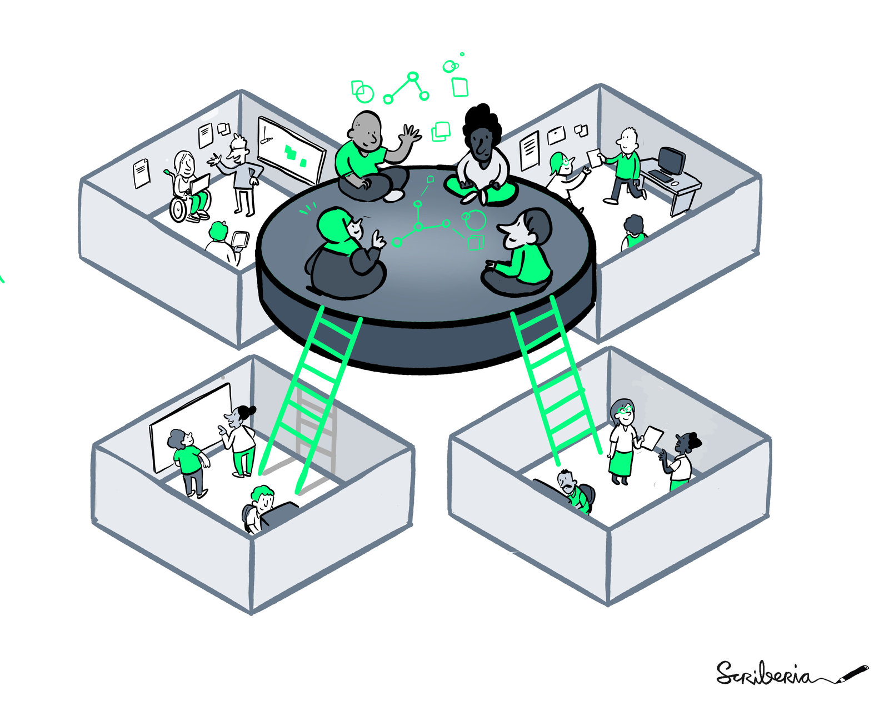
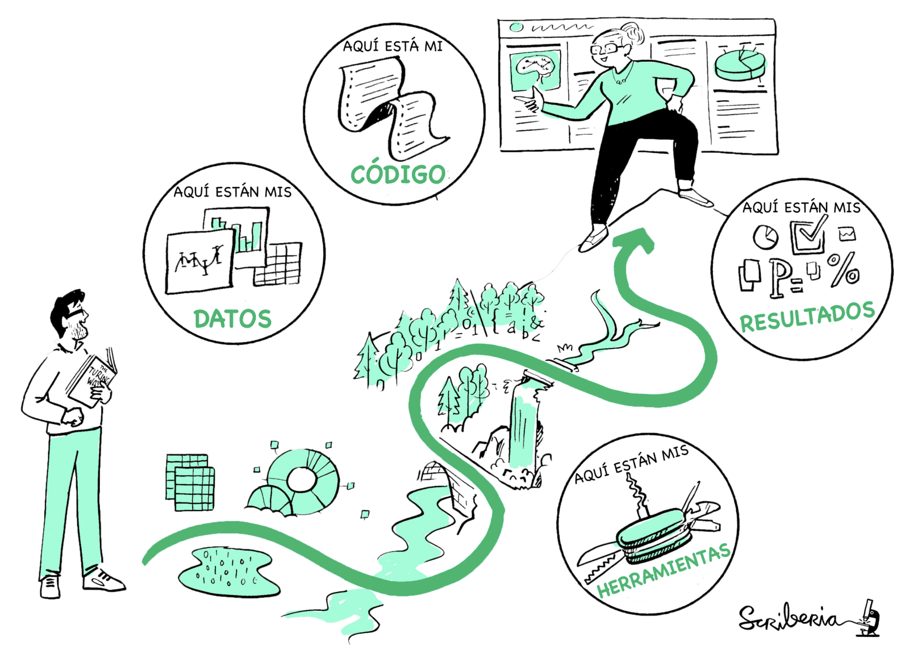
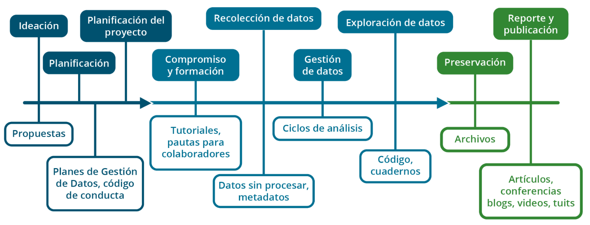
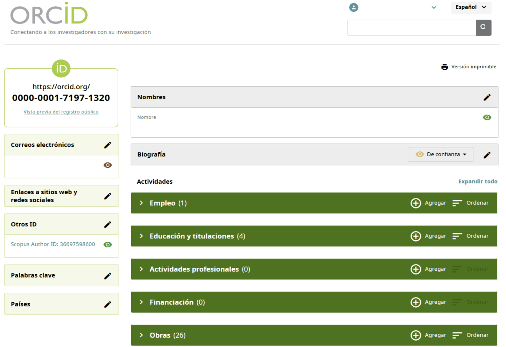

:::::::::::::::::::::::::::::::::::::::::::::::::::::::::::::::::::: instructor
## Antes de empezar:

- Bienvenida
- Este encuentro va a ser grabado y si bien nos encantaría que estén con las cámaras prendidas para poder interactuar de forma más fluida, si prefieren, pueden apagarlas. Nuestro equipo de apoyo va a iniciar la grabación ahora.
- Este material tiene una licencia CC-BY, lo que permite reusarla libremente, mencionando la fuente. 
- Todos los espacios de MetaDocencia se rigen por nuestras [Pautas de Convivencia](https://doi.org/10.5281/zenodo.12534195). En resumen, buscamos que este sea un espacio seguro, respetuoso e inclusivo, donde podamos intercambiar ideas con empatía, escuchar distintas perspectivas y tratarnos con amabilidad. Y, por supuesto, evitar cualquier tipo de acoso, destrato o comentarios que puedan incomodar a otras personas.
- Para participar: pide la palabra o usa el chat y silencialo al terminar de hablar
- Pide permiso antes de tomar registros de las personas presentes en este encuentro.

::::::::::::::::::::::::::::::::::::::::::::::::::::::::::::::::::::::::::::::::

:::::::::::::::::::::::::::::::::::::: discussion

## Presentación en el chat

Para conocernos un poco, cuéntanos tu campo de trabajo y comenta en pocas palabras por qué te sumaste a esta formación.  

Tiempo estimado: 3 minutos.

::::::::::::::::::::::::::::::::::::::::::::::::

:::::::::::::::::::::::::::::::::::::::::::::::::::::::::::::::::::: instructor

Durante estos encuentros van a ir apareciendo ejercicios que nos ayudan a evaluar cómo viene el curso y recuperar la atención de quienes estén un poco cansados, algunas van a ser espontaneas, o pedidos de respuestas por chat, como esta, otras van a ser encuestas de zoom que son muy dinámicas y rápidas y por último también van a suceder algunas actividades en salas de grupo que siempre son muy valoradas. 

En la sala de grupo de hoy vamos a estar conversando acerca de las preocupaciones a la hora de abrir la ciencia, Estas salas van a tener una duración de 10 minutos y es muy importante que tengan en cuenta que la participación en las salas depende de la interacción que pueda tener cada uno de ustedes. Si lo prefieren, nos pueden avisar si tienen algún inconveniente para activar sus micrófonos, a fin de propiciar la división de salas de la manera más dinámica posible. Puede fallar, les pedimos que nos tengan paciencia este primer encuentro porque somos muchas personas, haremos lo mejor posible porque pasen una linda experiencia de intercambio y lo iremos mejorando encuentro a encuentro. 

::::::::::::::::::::::::::::::::::::::::::::::::::::::::::::::::::::::::::::::::

# ¿Qué es la Ciencia Abierta?

## ¿Qué es la Ciencia Abierta?

> “El movimiento de Ciencia Abierta tiene como objetivo fomentar la difusión, el escrutinio y el reuso de los componentes de investigación para el bien de la ciencia y la sociedad”.
>
> — Leonelli, 2023

:::::::::::::::::::::::::::::::::::::::::::::::: instructor

Existen muchas definiciones de Ciencia Abierta, utilizadas por distintas organizaciones, pero todas comparten una idea central.

La Ciencia Abierta es un movimiento que tiene como objetivo fomentar la difusión, el escrutinio y el reuso de los componentes de investigación para el bien de la ciencia y la sociedad.

Incluye los principios y las prácticas que hacen que los productos y procesos de investigación estén disponibles para todas las personas por igual.
Por lo tanto, es una forma de pensar y hacer ciencia de manera inclusiva, diversa, equitativa y accesible.

::::::::::::::::::::::::::::::::::::::::::::::::::::::::::

## Beneficios de la Ciencia Abierta

Comenzar a aplicar prácticas de Ciencia Abierta, aunque sea de a poco, puede aportar diversos beneficios:

- Aumenta la visibilidad y el impacto.
- Fomenta mejores prácticas de investigación.
- Favorece la colaboración.
- Ayuda a detectar y corregir errores rápidamente.
- Democratiza el acceso al conocimiento y promueve la participación ciudadana.
- Aumenta la transparencia del trabajo y su reproducibilidad.

<!-- 🟨🟨🟨 FIGURA PENDIENTE: cargar `beneficios-ciencia-abierta.jpg` en `episodes/fig/` 🟨🟨🟨 -->

{alt='Personas colaboran alrededor de una estructura abierta y conectada que representa el intercambio de conocimientos y recursos.'}

*Fuente: The Turing Way Community & Scriberia (2022), [*Illustrations from The Turing Way*](https://doi.org/10.5281/zenodo.3332807), CC BY 4.0.*

:::::::::::::::::::::::::::::::::::::::::::::::: instructor

Una investigación publicada abiertamente tiene mayor visibilidad y potencial de impacto: es más fácil de encontrar, usar y citar.
También permite fomentar la colaboración y la participación en el proceso de investigación.

Por ejemplo, al documentar y publicar un plan de investigación al comienzo de un estudio, se puede obtener retroalimentación de colegas del área antes de que comience la recolección de datos.
Así podemos maximizar el uso de los recursos y evitar algunos sesgos desde el inicio del proceso.

Un buen Plan de Gestión de Datos y Software hace que nuestro proyecto sea más transparente y reproducible.
También nos ayudará a entender nuestro propio proceso en el futuro.
La documentación facilita la detección y corrección de errores, ya sea por nuestro equipo o por otras personas.

::::::::::::::::::::::::::::::::::::::::::::::::::::::::::

## Reproducibilidad

La reproducibilidad consiste en obtener los mismos resultados utilizando:

- Los mismos datos de entrada.
- El mismo código o los mismos pasos de análisis.

<!-- 🟨🟨🟨 FIGURA PENDIENTE: cargar `reproducibilidad.png` en `episodes/fig/` 🟨🟨🟨 -->

{alt='Una persona sigue un recorrido que conecta datos, código y resultados documentados para reproducir un análisis.'}

*Fuente: The Turing Way Community & Scriberia (2022), [*Illustrations from The Turing Way*](https://doi.org/10.5281/zenodo.3332807), CC BY 4.0.*

:::::::::::::::::::::::::::::::::::::::::::::::: instructor

La ciencia es más abierta cuando es transparente y reproducible, es decir, cuando otras personas pueden ver y verificar en detalle cómo se llevó a cabo la investigación.

Tradicionalmente, accedemos a una publicación que presenta el objetivo, la metodología y los resultados alcanzados, pero rara vez podemos reproducir dichos resultados a partir de la información disponible.

Muchas veces, los métodos se describen de forma informal o incompleta, hay poca precisión en los criterios utilizados para incluir o eliminar datos, o se presentan datos agrupados sin incluir las observaciones individuales.

Para que un proyecto sea reproducible, necesitamos hacer públicos productos como los datos sin procesar o intermedios, el software y el código de análisis, los materiales empleados y otros objetos de investigación que hayan influido en los resultados alcanzados.

::::::::::::::::::::::::::::::::::::::::::::::::::::::::::

## Proceso, productos y resultados de investigación

<!-- 🟨🟨🟨 FIGURA PENDIENTE: cargar `proceso-productos-resultados-investigacion.png` en `episodes/fig/` 🟨🟨🟨 -->

{alt='Línea de tiempo de un proyecto de investigación que comienza con la ideación, continúa con la planificación, la recolección y exploración de datos, y finaliza con el reporte y la publicación. En cada etapa se producen objetos que pueden compartirse, como propuestas, planes, materiales de formación, planes de gestión, datos, código, archivos y publicaciones.'}

*Fuente: NASA Open Science.*

:::::::::::::::::::::::::::::::::::::::::::::::: instructor

Podemos pensar en un proyecto de investigación como un proceso que abarca desde la ideación de una propuesta hasta la publicación de sus resultados.

En los diferentes momentos, las personas que investigamos producimos distintos objetos que potencialmente pueden compartirse en abierto.
Abrir estos objetos representa abrir gran parte del proceso de investigación y no solamente sus resultados finales.

Dentro de todo este proceso hay matices posibles, porque no existe una única manera de hacer Ciencia Abierta.
Pensarla en nuestros propios contextos ayuda a implementarla en la práctica.
Más adelante retomaremos este punto con mayor detalle.

::::::::::::::::::::::::::::::::::::::::::::::::::::::::::

:::::::::::::::::::::::::::::::::::::::::::::::: challenge

## Ejercicio 2: ¿cuándo abrir un proyecto?

¿Cuándo deberíamos empezar a pensar cómo abrir un proyecto?

Seleccioná la opción correcta:

- Solo al final, al publicar.
- Durante el análisis de datos.
- Antes de recolectar datos.
- Desde la planificación.
- No lo sé.

Respondé la encuesta de Zoom.

Tiempo estimado: 3 minutos.

:::::::::::::::::::::::: solution

La respuesta correcta es **desde la planificación**. 

Si la apertura se considera recién al final, puede resultar difícil compartir algunos productos por falta de consentimiento, documentación o acuerdos.

Pensar la apertura desde la planificación no significa que todo deba abrirse, sino decidir de antemano qué se abrirá, cómo, cuándo y bajo qué condiciones. Como indica el principio: tan abierto como sea posible y tan cerrado como sea necesario.

::::::::::::::::::::::::::::::::

::::::::::::::::::::::::::::::::::::::::::::::::::::::::::

## Barreras para las prácticas en Ciencia Abierta

Podemos reconocer tres tipos de barreras:

- Sociales.
- Institucionales.
- De infraestructura.

<!-- 🟨🟨🟨 FIGURA PENDIENTE: cargar `barreras-ciencia-abierta.jpg` en `episodes/fig/` 🟨🟨🟨 -->

{alt='Una persona intenta avanzar por un recorrido con obstáculos, desniveles y barreras, como representación de las dificultades que pueden surgir al practicar la Ciencia Abierta.'}

*Fuente: The Turing Way Community & Scriberia (2022), [*Illustrations from The Turing Way*](https://doi.org/10.5281/zenodo.3332807), CC BY 4.0.*

:::::::::::::::::::::::::::::::::::::::::::::::: instructor

Cuando hablamos de Ciencia Abierta, no hablamos solamente de herramientas o de publicar abiertamente.
También hablamos de condiciones concretas que facilitan o dificultan estas prácticas.

Exploraremos tres tipos de barreras que aparecen con frecuencia: las sociales, las institucionales y las de infraestructura.
Separarlas y entenderlas según nuestros propios contextos nos ayuda a reconocer mejor dónde se encuentran los desafíos y qué tipo de respuestas requieren.

::::::::::::::::::::::::::::::::::::::::::::::::::::::::::

### Barreras sociales

- La decisión de abrir el trabajo puede generar desacuerdos.
- La generación de acuerdos requiere tiempo y esfuerzo.
- Reglas claras para la interacción y el uso de los recursos.
- Pautas de convivencia y de uso de licencias.

:::::::::::::::::::::::::::::::::::::::::::::::: instructor

Las barreras sociales tienen que ver con cómo trabajamos con otras personas.
Abrir procesos, datos o materiales no siempre genera consenso automáticamente: muchas veces requiere conversaciones, acuerdos y tiempo.

Por eso, contar con reglas claras para la interacción, criterios compartidos y acuerdos sobre el uso de recursos y licencias puede facilitar la colaboración.

::::::::::::::::::::::::::::::::::::::::::::::::::::::::::

### Barreras institucionales

- Apoyo insuficiente de las instituciones.
- Falta de recursos, presupuesto y tiempo.
- Poco reconocimiento en evaluaciones.
- Identificar la factibilidad y el alcance posible, y alentar a otras personas a apoyar los esfuerzos.

:::::::::::::::::::::::::::::::::::::::::::::::: instructor

También hay barreras que dependen menos de las personas y más de las instituciones en las que trabajamos.
Muchas veces faltan tiempo, presupuesto, apoyo o reconocimiento para sostener prácticas de Ciencia Abierta.

En esos casos, puede ser útil identificar qué es viable en cada contexto, comenzar por objetivos alcanzables y sumar apoyos dentro de las instituciones para que esos esfuerzos no queden aislados.

::::::::::::::::::::::::::::::::::::::::::::::::::::::::::

### Barreras de infraestructura

- Escasez de recursos materiales.
- La mayoría de los repositorios y las herramientas fueron desarrollados en otras regiones.
- Falta de financiamiento.
- Apoyo de la comunidad mediante ideas o infraestructura compartida.
- Trabajo colaborativo.

:::::::::::::::::::::::::::::::::::::::::::::::: instructor

Por último, están las barreras de infraestructura, que en América Latina conocemos bien.

No siempre contamos con recursos materiales, financiamiento o herramientas diseñadas para nuestros contextos e idiomas.
Frente a eso, el trabajo colaborativo, las infraestructuras compartidas y el apoyo entre comunidades son formas concretas de sostener prácticas abiertas de manera más realista y situada.

::::::::::::::::::::::::::::::::::::::::::::::::::::::::::

## ¿Qué pasa si…?

- **Errores:** ¿Qué pasa si mi trabajo tiene errores?
- **Apropiación:** ¿Qué pasa si alguien usa mi trabajo, se queda con el crédito o no me cita?
- **Malinterpretación:** ¿Qué pasa si mi trabajo se malinterpreta o se usa fuera de contexto?
- **Datos sensibles:** ¿Qué pasa si mis datos son demasiado sensibles para compartirlos?

:::::::::::::::::::::::::::::::::::::::::::::::: instructor

Además de las barreras que acabamos de mencionar, suelen aparecer preocupaciones muy concretas al momento de abrir un trabajo.

¿Qué pasa si hay errores?
¿Qué pasa si alguien se apropia de lo que hice?
¿Qué pasa si se malinterpreta?
¿Qué pasa si hay datos sensibles involucrados?

Son preocupaciones razonables.
A continuación, analizaremos cada una con mayor detalle.

::::::::::::::::::::::::::::::::::::::::::::::::::::::::::

### Errores

**¿Y si abro mis materiales de investigación con errores?**

- Los errores son parte de la construcción de la ciencia.
- La evaluación por pares es un pilar del método científico.
- Mientras antes se conocen, antes se corrigen.
- ¡El error no es un fracaso!

:::::::::::::::::::::::::::::::::::::::::::::::: instructor

Las políticas de Ciencia Abierta apuntan a cambiar la percepción del error: dejar de considerarlo un fracaso y entenderlo como un paso en el proceso de descubrimiento que puede mejorarse con comentarios abiertos de la comunidad.

La revisión por pares es un pilar central de la construcción de la ciencia y un mecanismo mediante el cual otras personas ayudan a identificar y corregir errores.
Para que esto funcione, necesitamos ser más abiertos a encontrar, reconocer y corregir errores.

Abrir los errores también es una forma de construir ciencia.

::::::::::::::::::::::::::::::::::::::::::::::::::::::::::

### Malinterpretación

**¿Y si mis resultados son malinterpretados?**

- La apertura ofrece más contexto para interpretar mejor.
- Puede suceder con o sin Ciencia Abierta.
- Abrir el plan de investigación y la gestión de productos y resultados ayuda a una mejor interpretación.

:::::::::::::::::::::::::::::::::::::::::::::::: instructor

Históricamente, muchas publicaciones fueron malinterpretadas.
También sabemos que todo lo que contribuya a mejorar el contexto de una investigación favorece una mejor interpretación.

Los instrumentos de gestión de la apertura, como el Plan de Gestión de Ciencia Abierta, el Plan de Gestión de Datos o cualquier documentación complementaria de los productos intermedios o finales, ayudan a evitar estas malas interpretaciones.

:::::::::::::::::::::::: caution

Abrir genera prácticas que no siempre están previstas y que implican más trabajo del que suele realizarse.
Es importante planificar la investigación considerando el tiempo que implica.

::::::::::::::::::::::::::::

::::::::::::::::::::::::::::::::::::::::::::::::::::::::::

### Datos sensibles

**¿Y si no puedo abrir mis datos por la sensibilidad que tienen?**

- Tratar los datos para minimizar el riesgo.
- Los datos sensibles son aquellos que pueden causar discriminación o estigmatización.
- Desidentificar y anonimizar, de ser posible, como mecanismo de resguardo.
- Es mejor no abrir si el riesgo es muy alto y está justificado.

:::::::::::::::::::::::::::::::::::::::::::::::: instructor

Los datos sensibles incluyen aquellos que pueden causar discriminación o estigmatización, incluso de manera potencial.

Cuando investigamos utilizando datos personales y sensibles, es clave tratarlos para evitar que la información pueda asociarse con una persona; por ejemplo, mediante la desidentificación y, si fuera posible, la anonimización total.

Compartí el enlace a la *Guía práctica para la protección de datos personales en salud* para que quienes participan puedan ampliar la información después del encuentro.

Cuidar los datos sensibles, en algunos contextos, implica no abrirlos.
Un ejemplo es el trabajo con datos de salud de poblaciones muy pequeñas, en las que resulta fácil identificar a grupos con alguna vulnerabilidad o enfermedad poco común.

::::::::::::::::::::::::::::::::::::::::::::::::::::::::::

### Apropiación

**¿Y si abro mis materiales y se quedan con el crédito de mi trabajo?**

- Asegurar el crédito y facilitar la citación.
- Sucede con o sin Ciencia Abierta.
- Abrir pronto deja evidencia del trabajo en ese campo y ese tema.
- Mientras más abierto, y mejor abierto, más fácil de encontrar y de citar.
- ¡Podemos hacer muchas cosas para facilitar que nos citen!

:::::::::::::::::::::::::::::::::::::::::::::::: instructor

Antes de presentar esta última preocupación, consultá brevemente cómo va el grupo.

Las situaciones de apropiación ocurren independientemente de que los productos o resultados de investigación estén abiertos o no.
Sin embargo, cuando es evidente que se produce una apropiación del crédito, se pone en juego la reputación de quien utiliza los aportes sin reconocerlos debidamente.

Una forma de abordar estas prácticas poco éticas es procurar asegurar el crédito.
Abrir tempranamente, aun con errores, también permite dejar evidencia de que se está trabajando en un tema o campo determinado.
Deja constancia de los avances y de quiénes son sus autoras o autores.

Cuanto más abierto está un trabajo, más fácil es encontrarlo y citarlo, y más difícil es ocultar su origen o su autoría original.

::::::::::::::::::::::::::::::::::::::::::::::::::::::::::

## Intercambio en salas de grupo

### ¿Cómo vamos a trabajar?

En el siguiente ejercicio, dividiremos a quienes asisten en salas de grupo.

1. Cada grupo elige una persona para moderar la conversación sobre el tema propuesto, optimizar los tiempos y socializar la palabra.
2. Cada grupo elige una persona representante para sintetizar y compartir el intercambio en la sala principal.

:::::::::::::::::::::::::::::::::::::::::::::::: instructor

Mientras se preparan las salas, explicá que la idea principal de estos ejercicios, que se realizarán en todos los encuentros, es que todas las personas puedan participar de un intercambio amable, claro y provechoso.

Como probablemente habrá entre 8 y 10 salas, el equipo docente no podrá moderar cada una. Por eso, al comenzar, cada grupo deberá definir:

- Quién moderará la conversación.
- Quién tomará notas para el intercambio al finalizar el ejercicio.

Una vez definidos esos roles, deberán revisar la consigna y comenzar el intercambio.

Es importante que quien modera ayude a que circule la palabra, cuide los tiempos y propicie que todas las personas tengan la oportunidad de participar.

Para favorecer la participación, suele ser necesario escuchar con atención, retomar lo que otras personas dijeron, conectar los aportes y llamar a cada quien por su nombre cuando sea posible.

Como el tiempo es breve, conviene organizarlo de manera simple para que puedan conversar, registrar las ideas principales y llegar a una síntesis. 

Más allá de estas sugerencias, lo importante es que la sala sea un espacio amable, donde cada persona pueda participar desde su experiencia y donde el intercambio sea respetuoso y útil.

::::::::::::::::::::::::::::::::::::::::::::::::::::::::::

:::::::::::::::::::::::::::::::::::::::::::::::: challenge

## Ejercicio 3: Sala de grupos

**Duración: 10 minutos**

- ¿Qué preocupación te interpeló más?
- ¿Reconocés otras?
- ¿Qué puede hacerse para mitigarlas?

Elijan una persona representante por grupo para resumir el intercambio al finalizar el ejercicio.

::::::::::::::::::::::::::::::::::::::::::::::::::::::::::

## Recapitulando

- La Ciencia Abierta propicia la participación en la ciencia y esto aumenta la precisión y el impacto de los resultados.
- Aporta a la reproducibilidad, calidad y eficiencia de la ciencia.
- Existen desafíos y barreras —estructurales y sociales—, pero también hay esfuerzos y mecanismos para mitigarlos.

:::::::::::::::::::::::::::::::::::::::::::::::: instructor

Retomá las tres ideas principales de esta primera parte:

- La Ciencia Abierta propicia la participación en la ciencia y esto aumenta la precisión y el impacto de los resultados.
- Aporta a la reproducibilidad, calidad y eficiencia de la ciencia.
- Existen desafíos y barreras —estructurales y sociales—, pero también hay esfuerzos y mecanismos para mitigarlos.

Los entornos con pocos recursos tienen desafíos adicionales. Practicar la Ciencia Abierta teniendo en cuenta el contexto es el primer paso para sortearlos.

::::::::::::::::::::::::::::::::::::::::::::::::::::::::::

## Pausa

Volvemos en 10 minutos.

No te desconectes, pero sí alejate de las pantallas.

:::::::::::::::::::::::::::::::::::::::::::::::: instructor

### Música sugerida

- Nación Ekeko (Argentina) y Julieta Venegas (México) — *El Paraíso*.
- Álex Anwandter (Chile) — *Cordillera*.

::::::::::::::::::::::::::::::::::::::::::::::::::::::::::

## Principios FAIR
Los principios FAIR son principios guía para la información científica. Hacen posible que podamos encontrar, obtener, entender y usar correctamente datos, código y resultados.

| Sigla | Principio |
|---|---|
| **F** | Fácil de encontrar |
| **A** | Accesible |
| **I** | Interoperable |
| **R** | Reusable |

:::::::::::::::::::::::::::::::::::::::::::::::: instructor

Para trabajar desde un enfoque de Ciencia Abierta, los principios FAIR proporcionan un marco para gestionar y compartir productos abiertos: software, datos y resultados.

A continuación, presentá en detalle los elementos que componen estos principios.

::::::::::::::::::::::::::::::::::::::::::::::::::::::::::

### Fácil de encontrar

- Que tenga asignado un identificador único y persistente.

**Herramientas:** DOI, ORCID y DataCite Schema.

> **Identificador Digital Persistente (PID):** referencia de larga duración a un recurso digital, legible por computadora, que apunta de manera única a una entidad digital.

:::::::::::::::::::::::::::::::::::::::::::::::: instructor

Para poder acceder a los productos de una investigación —sean datos, código o resultados—, el primer paso es poder encontrarlos.

Para que un producto sea fácil de encontrar, debemos asignarle un identificador único y persistente: un código que permite referenciar un contenido de manera única e inmutable a lo largo del tiempo.

::::::::::::::::::::::::::::::::::::::::::::::::::::::::::

### ORCID

- Proporciona información válida sobre una persona.
- Vincula a las personas que investigan con los resultados de su investigación.
- Ayuda a evitar confusiones cuando la información sobre una persona que investiga cambia con el tiempo.

:::::::::::::::::::::::::::::::::::::::::::::::: instructor

ORCID —pronunciado *órkid*— significa *Open Researcher and Contributor Identifier*, que puede traducirse como «Identificador abierto de investigadores y colaboradores».

Es una herramienta libre que:

- Proporciona información válida sobre una persona.
- Vincula a quienes investigan con los resultados de su investigación.
- Ayuda a evitar confusiones cuando la información sobre una persona cambia con el tiempo.

Por ejemplo, una misma persona puede figurar como «N. Palópoli» o «Nicolás Palópoli», pero su ORCID siempre será el mismo.

::::::::::::::::::::::::::::::::::::::::::::::::::::::::::

<!-- 🟨🟨🟨 FIGURA PENDIENTE: cargar `ejemplo-perfil-orcid.png` en `episodes/fig/` 🟨🟨🟨 -->

{alt='Captura de pantalla de un perfil de ORCID identificado mediante un código numérico persistente. El perfil reúne información como empleo, educación, actividades profesionales, financiación y obras.'}

:::::::::::::::::::::::::::::::::::::::::::::::: instructor

La imagen muestra un ejemplo de un perfil de ORCID. Cada perfil se identifica mediante un código numérico y puede contener múltiples ítems en categorías como empleo y educación.

El identificador perdura en el tiempo y es independiente de la institución a la que pertenezcamos o del tipo de trabajo que hagamos.

Podemos compararlo con el número de identificación que cada persona tiene en su país. Al nacer, el registro nacional de las personas asigna un número que nos acompaña toda la vida y que tiene asociados datos inmutables —como quiénes son nuestros padres o dónde nacimos— y otros que pueden variar —como nuestro domicilio o estado civil—. El número, sin embargo, siempre es el mismo.

::::::::::::::::::::::::::::::::::::::::::::::::::::::::::

### DOI

- Se usa para identificar datos, software, artículos de revistas y otros tipos de medios.
- Al citar materiales con un DOI, quienes encuentran esa referencia pueden usarla para identificar la fuente original.

:::::::::::::::::::::::::::::::::::::::::::::::: instructor

Otro identificador es el DOI —*Digital Object Identifier* o «identificador de objetos digitales»—. Se usa para citar datos, software, artículos de revistas y otros tipos de contenidos, como presentaciones, publicaciones en blogs o videos.

Generar un DOI contribuye a la longevidad de un producto digital, porque permite crear una cita —por ejemplo, en un artículo científico— y evitar que esa referencia se pierda a lo largo del tiempo.

En los siguientes encuentros veremos cómo asignar un DOI a datos y código.

::::::::::::::::::::::::::::::::::::::::::::::::::::::::::

### Otros PID

- Handle.
- ISBN (*International Standard Book Number*).
- ISSN (*International Standard Serial Number*).

:::::::::::::::::::::::::::::::::::::::::::::::: instructor

Otros identificadores persistentes muy usados son:

- **Handle:** similar al DOI y muy frecuente en repositorios institucionales.
- **ISBN** (*International Standard Book Number*): identifica libros y publicaciones monográficas.
- **ISSN** (*International Standard Serial Number*): identifica revistas y publicaciones seriadas.

::::::::::::::::::::::::::::::::::::::::::::::::::::::::::

Para que un producto sea fácil de encontrar, debe:

- Tener asignado un identificador único y persistente.
- Estar descrito con metadatos claros.
- Estar registrado o indexado en bases de datos con capacidad de búsqueda.

**Herramientas:** DOI, ORCID y DataCite Schema.

:::::::::::::::::::::::::::::::::::::::::::::::: instructor

Además de asignarle un identificador, para que el producto que abrimos sea fácil de encontrar debemos:

- **Describir los datos de manera clara y ordenada.** Es importante incluir información básica que explique qué son, cómo se generaron y cómo pueden usarse. También debe indicarse el identificador único y persistente asociado para facilitar su referencia, localización y manejo. Estos serán sus metadatos, que veremos con más detalle en el próximo encuentro.
- **Registrar los datos y la información asociada en recursos adecuados.** Registrar o indexar datos y resultados en un recurso con capacidad de búsqueda implica almacenarlos y organizarlos en bases de datos o repositorios que permitan encontrarlos y acceder a ellos fácilmente.

::::::::::::::::::::::::::::::::::::::::::::::::::::::::::

### Accesible

Los datos, el código y los resultados deben ser:

- Fácilmente recuperables mediante su PID.
- Accesibles mediante un protocolo estándar abierto, gratuito y universal.
- Accesibles mediante un sistema que garantice la seguridad.
- Acompañados de información descriptiva —metadatos— disponible.

**Herramientas:**

- FTP (*File Transfer Protocol*).
- HTTP (*Hypertext Transfer Protocol*).

:::::::::::::::::::::::::::::::::::::::::::::::: instructor

Una vez que encontramos un recurso —datos, código o resultados—, debemos poder acceder a él.

Para que sea accesible:

- Los datos o resultados deben poder recuperarse fácilmente. Por ejemplo, el identificador debe llevar directamente al recurso, sin confusión ni ambigüedades.
- El acceso debe realizarse mediante un protocolo de comunicación estándar; es decir, mediante formas comunes y conocidas de acceder a la información en internet, como las que usamos todos los días al navegar por la web.

Estos protocolos deben ser:

- **Abiertos:** no propietarios ni cerrados.
- **Gratuitos:** cualquier persona debe poder usarlos sin pagar licencias.
- **Implementables universalmente:** deben funcionar en distintos sistemas, países y contextos.

Esto evita que el acceso dependa de programas especiales o de tecnologías difíciles de obtener.

En algunos casos, puede ser necesario controlar quién tiene acceso a los datos por motivos éticos o legales. Para eso, el sistema debe permitir un procedimiento de autenticación y autorización: una forma de verificar quién es la persona usuaria y definir a qué información puede acceder. Cuando no hay restricciones, lo ideal es que los datos y los resultados sean de acceso público.

Finalmente, para que un producto sea considerado accesible, la información que lo describe —qué es, quién lo generó, cuándo y cómo se accede— debe perdurar incluso cuando el producto original ya no esté disponible.

::::::::::::::::::::::::::::::::::::::::::::::::::::::::::

:::::::::::::::::::::::::::::::::::::::::::::::: challenge

## ¿Hasta aquí está todo bien?

¿Cómo se sienten ahora? ¿Cómo venimos?

Escribí en el chat el número de gatito que te representa ahora.

<!-- 🟨🟨🟨 FIGURA PENDIENTE: cargar `estado-gatitos.jpg` en `episodes/fig/` 🟨🟨🟨 -->

{alt='Cuadrícula de nueve fotografías numeradas del 1 al 9. Cada gato muestra una expresión diferente para que quienes participan elijan la que mejor representa cómo se sienten.'}

::::::::::::::::::::::::::::::::::::::::::::::::::::::::::

### Interoperable

Los datos deben:

- Usar lenguajes formales, accesibles y compartidos para la representación del conocimiento.
- Estar en un formato estandarizado.
- Usar vocabularios que sigan los principios FAIR.
- Incluir referencias calificadas a otros (meta)datos.

**Herramientas:** JSON Schema, OpenAIRE, Open Funder Registry y Open Definition.

:::::::::::::::::::::::::::::::::::::::::::::::: instructor

Para que la interoperabilidad sea posible, no alcanza con que los datos estén abiertos. También deben estar en formatos estandarizados y usar lenguajes comunes y vocabularios compartidos. Esto permite que distintos sistemas intercambien información entre sí.

Los productos de investigación deben poder integrarse con otros datos e interoperar con aplicaciones para su análisis, almacenamiento o procesamiento. Queremos que puedan utilizarse con herramientas distintas de las empleadas originalmente en nuestras investigaciones.

Los datos deben presentarse mediante lenguajes formales, accesibles y compartidos para la representación del conocimiento. También deben contener:

- Información en un formato estandarizado, que no dependa de una herramienta en particular y pueda integrarse con otros productos.
- Vocabularios que sigan los principios FAIR.
- Referencias calificadas a otros metadatos: por ejemplo, una publicación que apunta a un conjunto de datos, un conjunto de datos que apunta a un proyecto o un proyecto que apunta a una institución o a un financiador.

Las herramientas presentadas ayudan a resolver distintos problemas. No es necesario conocerlas en profundidad en este momento, sino comprender para qué sirven:

- **JSON Schema** ayuda a describir la estructura de los datos: qué campos tienen y qué tipo de información corresponde a cada uno. Esto permite que otras personas o programas sepan cómo leerlos correctamente.
- **OpenAIRE** y **Open Funder Registry** trabajan con información sobre investigación, financiamiento y resultados mediante identificadores y vocabularios comunes. Facilitan la conexión entre proyectos, publicaciones, datos y financiadores, incluso cuando provienen de países o instituciones diferentes.
- **Open Definition** ayuda a aclarar qué significa que algo sea abierto mediante definiciones compartidas y reconocidas internacionalmente.

::::::::::::::::::::::::::::::::::::::::::::::::::::::::::

### Reusable

Los productos de investigación deben:

- Estar descritos con atributos relevantes y precisos.
- Estar asociados a una procedencia detallada.
- Estar publicados con una licencia clara y accesible.
- Ajustarse a las normas comunitarias pertinentes.

**Herramientas:** Zenodo y DataCite Schema.

:::::::::::::::::::::::::::::::::::::::::::::::: instructor

El objetivo final de los principios FAIR es facilitar la reutilización de los productos de investigación.

Especialmente en contextos como el nuestro, reutilizar datos generados por colegas en el marco de sus líneas de investigación puede reducir costos y aumentar el impacto y el beneficio social de los recursos destinados a la investigación.

Para que estos productos puedan reutilizarse, deben:

- Incluir información relevante, como quién los produjo, cuándo y cómo. Su procedencia debe ser clara, ya que es fundamental para evaluar su calidad y sus posibles usos.
- Incluir información sobre las condiciones de uso; es decir, publicarse bajo una licencia clara y lo más abierta posible.
- Ajustarse a las normas comunitarias pertinentes.

**Zenodo** es un repositorio abierto para compartir productos de investigación. Permite publicar datos, código, artículos, presentaciones, pósteres y otros resultados para que otras personas puedan encontrarlos y reutilizarlos. Además, asigna un DOI y una licencia, y guía la carga de los atributos necesarios para que los productos sigan los principios FAIR.

**DataCite Schema** es una guía estándar que indica qué información mínima y recomendada conviene incluir al publicar datos de investigación. Ayuda a cumplir los principios FAIR. Repositorios como Zenodo utilizan esquemas de metadatos alineados con DataCite.

::::::::::::::::::::::::::::::::::::::::::::::::::::::::::

:::::::::::::::::::::::::::::::::::::::::::::::: challenge

## Ejercicio 4: Respondé la encuesta de Zoom

**Duración: 3 minutos**

¿A qué corresponden las siglas FAIR? Elegí todas las opciones correctas.

- Reproducible.
- Reusable.
- Fácil de encontrar.
- Interoperable.
- Intercalado.
- Accesible.
- Autorizable.

:::::::::::::::::::::::::::::::: solution

Las cuatro opciones correctas son:

- **Reusable.**
- **Fácil de encontrar.**
- **Interoperable.**
- **Accesible.**

::::::::::::::::::::::::::::::::::::::::::::

::::::::::::::::::::::::::::::::::::::::::::::::::::::::::
## Recapitulando

- Los principales productos de la Ciencia Abierta son los datos, el código o software y los resultados.
- Los principios FAIR son un conjunto de directrices diseñadas para mejorar la gestión de datos científicos y asegurar que sean:
  - Fáciles de encontrar.
  - Accesibles.
  - Interoperables.
  - Reusables.
- Las herramientas de Ciencia Abierta facilitan la transparencia en la investigación y respaldan prácticas escalables y responsables.

<!-- 🟨 ACTUALIZAR EN CADA EPISODIO: enlace o DOI de la presentación correspondiente. -->

:::::::::::::::::::::::::::::::::::::::::::::::: instructor

Retomá las tres ideas principales de esta segunda parte:

- Los principales productos de la Ciencia Abierta son los datos, el código, el software y los resultados.
- Los principios FAIR orientan la gestión de los productos de investigación para que sean fáciles de encontrar, accesibles, interoperables y reusables.
- Las herramientas de Ciencia Abierta facilitan la transparencia y respaldan prácticas responsables.

Las notas de la presentación también mencionan los planes de Ciencia Abierta como un mapa que orienta la incorporación de estos principios en cada etapa de una investigación.

::::::::::::::::::::::::::::::::::::::::::::::::::::::::::

## Ejemplos de Ciencia Abierta hecha en español

| Área | Ejemplos |
|---|---|
| **Acceso abierto a las publicaciones** | [SciELO —Biblioteca Científica Electrónica en Línea—](https://scielo.org/es) y [LA Referencia —Red Latinoamericana para la Ciencia Abierta—](https://www.lareferencia.info/es/). |
| **Datos científicos abiertos** | [Repositorio de Datos de Investigación del CONICET, Argentina](https://datosdeinvestigacion.conicet.gov.ar/) y [Redata —Repositorio de Datos Abiertos de Investigación, Uruguay—](https://www.anii.org.uy/noticias/321/redata-el-nuevo-repositorio-de-datos-abiertos-de-investigacion-de-anii/). |
| **Ciencia ciudadana** | Capítulos locales de iNaturalist, como [Naturalista, México](https://mexico.inaturalist.org/), y [CoAct Riachuelo —ciencia ciudadana social para la acción colectiva, Argentina—](https://farn.org.ar/coact-riachuelo-una-iniciativa-a-favor-de-la-justicia-ambiental-para-mas-de-6-millones-de-personas/). |

:::::::::::::::::::::::::::::::::::::::::::::::: instructor

### Orientaciones para facilitar

Presentá estos casos como ejemplos ilustrativos de la diversidad de propuestas, actores involucrados y productos que forman parte del movimiento de Ciencia Abierta.

::::::::::::::::::::::::::::::::::::::::::::::::::::::::::

## Lecturas útiles

- [NASA Open Science 101 — Módulo 1](https://github.com/MetaDocencia/IntroALaCienciaAbierta_NASAOpenScience101/blob/main/Module_1/M1_readme_es.md).
- [NASA Open Science 101 — Módulo 2](https://github.com/MetaDocencia/IntroALaCienciaAbierta_NASAOpenScience101/blob/main/Module_2/M2_readme_es.md).

> **¡Aviso!** Si encontrás errores o tenés sugerencias, te invitamos a publicarlos como un *issue* en GitHub. Dar una devolución abierta es una excelente manera de contribuir a un proyecto.

### Más lecturas útiles

- [Recomendación de la UNESCO sobre la Ciencia Abierta](https://unesdoc.unesco.org/ark:/48223/pf0000379949_spa).
- [El proyecto de Ciencia Abierta en un mundo desigual](https://revistas.uam.es/relacionesinternacionales/article/view/15331).
- [Ciencia Abierta en América Latina](https://forocilac.org/wp-content/uploads/2022/03/PolicyPapers-CienciaAbierta-ES-v2.pdf).
- [Evaluación responsable y Ciencia Abierta: agenda de reformas](https://revistas.unc.edu.ar/index.php/integracionyconocimiento/article/view/42029).
- [Tendencias recientes en las políticas científicas de Ciencia Abierta y Acceso Abierto en Iberoamérica](https://www.clacso.org/wp-content/uploads/2020/12/Ciencia-Abierta-1.pdf).

<!-- 🟨 ACTUALIZAR EN CADA EPISODIO: reemplazar estas lecturas por las correspondientes al tema. -->

## Próximos pasos

Antes de finalizar:

1. Completaremos la encuesta de valoración.
2. Realizaremos la evaluación para la certificación de NASA.
3. Revisaremos el tema del próximo encuentro.

### Crítica constructiva

Una crítica constructiva:

1. Es positiva.
2. Es específica.
3. Sugiere próximos pasos.

:::::::::::::::::::::::::::::::::::::::::::::::: instructor

### Orientaciones para facilitar

Antes de presentar la encuesta, recordá que una crítica constructiva debe ser positiva, específica y proponer un próximo paso.

La nota original utiliza una escena de Mafalda para contrastar una opinión general y negativa sobre la sopa con una devolución más constructiva: reconocer primero algo valioso y luego sugerir un cambio concreto, como reemplazar las verduras por fideos de letras.

::::::::::::::::::::::::::::::::::::::::::::::::::::::::::

:::::::::::::::::::::::::::::::::::::::::::::::: challenge

## Encuesta de valoración

Valoramos tu opinión. Completá nuestra encuesta anónima:

[Accedé a la encuesta de valoración](https://tinyurl.com/HCA-Encuesta1).

**Duración: 5 minutos.**

Cuando termines, avisanos por el chat.

::::::::::::::::::::::::::::::::::::::::::::::::::::::::::

<!-- 🟨 ACTUALIZAR EN CADA EPISODIO: enlace de la encuesta de valoración. -->

:::::::::::::::::::::::::::::::::::::::::::::::: instructor

### Orientaciones para facilitar

Invitá al grupo a practicar lo conversado mediante una devolución breve que ayude a mejorar la formación.

Aclarales que no necesitan dedicar mucho tiempo a la encuesta, pero que sus respuestas son fundamentales para aprender del proceso. Todas las sugerencias se leen y se tienen en cuenta: algunas permiten introducir cambios inmediatos y otras orientan mejoras a más largo plazo.

**Música sugerida:** Los Bosques (Uruguay), recomendación de Flo Grattarola (ALTaCA).

::::::::::::::::::::::::::::::::::::::::::::::::::::::::::

:::::::::::::::::::::::::::::::::::::::::::::::: challenge

## Certificación NASA: evaluación del módulo

Completá la evaluación correspondiente a este encuentro:

[Accedé a la evaluación del módulo](https://tinyurl.com/HCA-Eval1).

**Duración: 15 minutos.**

Si tenés dudas, podés consultar levantando la mano o escribiendo en el chat.

::::::::::::::::::::::::::::::::::::::::::::::::::::::::::

<!-- 🟨 ACTUALIZAR EN CADA EPISODIO: enlace de la evaluación correspondiente. -->

:::::::::::::::::::::::::::::::::::::::::::::::: instructor

Destiná entre 10 y 15 minutos a completar el formulario de 10 preguntas. Explicá que esta evaluación permite revisar los aprendizajes del encuentro y avanzar en la certificación de NASA Open Science 101.

**Música sugerida:** Buscabulla (Puerto Rico).

::::::::::::::::::::::::::::::::::::::::::::::::::::::::::

## Herramientas de Ciencia Abierta

El recorrido de la formación se organiza en cuatro encuentros:

| Encuentro | Tema |
|---|---|
| **1** | Qué, por qué y cómo de la Ciencia Abierta. |
| **2** | Cómo usar, crear y compartir datos abiertos. |
| **3** | Cómo usar, crear y compartir código abierto. |
| **4** | Cómo usar, crear y compartir resultados abiertos. |

En el próximo encuentro trabajaremos sobre **cómo usar, crear y compartir datos abiertos**.

<!-- 🟨 ACTUALIZAR EN CADA EPISODIO: indicar cuál es el próximo encuentro; en el episodio 4, reemplazar por un cierre del recorrido. -->

## ¡Muchas gracias!

Este encuentro fue posible gracias a **NASA Open Science** y **Code for Science & Society (CS&S)**.

**Referencia sugerida:** [https://doi.org/10.5281/zenodo.18890057](https://doi.org/10.5281/zenodo.18890057).

<!-- 🟨 ACTUALIZAR EN CADA EPISODIO: DOI de la presentación correspondiente. -->

Podés encontrar a MetaDocencia como **@metadocencia** en:

- [Instagram](https://www.instagram.com/metadocencia/).
- [LinkedIn](https://www.linkedin.com/company/metadocencia/).
- [GitHub](https://github.com/MetaDocencia).
- [YouTube](https://www.youtube.com/metadocencia).
- [X/Twitter](https://twitter.com/metadocencia).
- [Facebook](https://www.facebook.com/metadocencia).
- [Mastodon](https://floss.social/@MetaDocencia).
- [Bluesky](https://bsky.app/profile/metadocencia.org).
