# Resultados Abiertos

**Herramientas de Ciencia Abierta — Encuentro 4**

Jesica Formoso, Nicolás Palopoli, Irene Vazano, Laura Ación, Julián Buede y Paz Míguez

Este material se comparte bajo una licencia Creative Commons Atribución 4.0 Internacional (CC BY 4.0).

:::::::::::::::::::::::::::::::::::::::::::: instructor

Da la bienvenida al grupo.

Antes de comenzar, recuerda que el encuentro será grabado. Si bien nos gusta que las personas mantengan sus cámaras encendidas para poder interactuar de forma más fluida, quienes prefieran no aparecer en el video pueden apagarlas.

Indica que el equipo de apoyo iniciará la grabación.

::::::::::::::::::::::::::::::::::::::::::::::::::::::::::

## Antes de empezar

### Pautas para un espacio amable para todas las personas

- **Para participar:** pedí la palabra o usá el chat.
- **Micrófonos:** silenciá el micrófono cuando termines de hablar.
- Pedí permiso antes de tomar registros de otras personas durante el encuentro.

Consulta las [Pautas de Convivencia de MetaDocencia](https://doi.org/10.5281/zenodo.12534195).

:::::::::::::::::::::::::::::::::::::::::::: instructor

Recuerda que todos los espacios de MetaDocencia se rigen por nuestras Pautas de Convivencia. Comparte el enlace en el chat.

En resumen, buscamos que este sea un espacio seguro, respetuoso e inclusivo, donde podamos intercambiar ideas con empatía, escuchar distintas perspectivas y tratarnos con amabilidad. Debemos evitar cualquier tipo de acoso, destrato o comentario que pueda incomodar a otras personas.

Para ordenar la interacción, pide que quienes quieran participar levanten la mano virtual o escriban en el chat. Al terminar de hablar, deben volver a silenciar el micrófono para evitar sonidos de fondo.

::::::::::::::::::::::::::::::::::::::::::::::::::::::::::

## Nos presentamos

- **Jesica Formoso**  
  Coordinadora del área de Medición de Impacto

- **Nicolás Palopoli**  
  Codirector ejecutivo e integrante del Consejo Asesor

- **Irene Vazano**  
  Coordinadora del área de Infraestructura

- **Julián Buede**  
  Equipo de Comunicación

<!-- 🟨🟨🟨 FIGURA PENDIENTE: cargar `equipo-encuentro-4.png` en `episodes/fig/` 🟨🟨🟨 -->

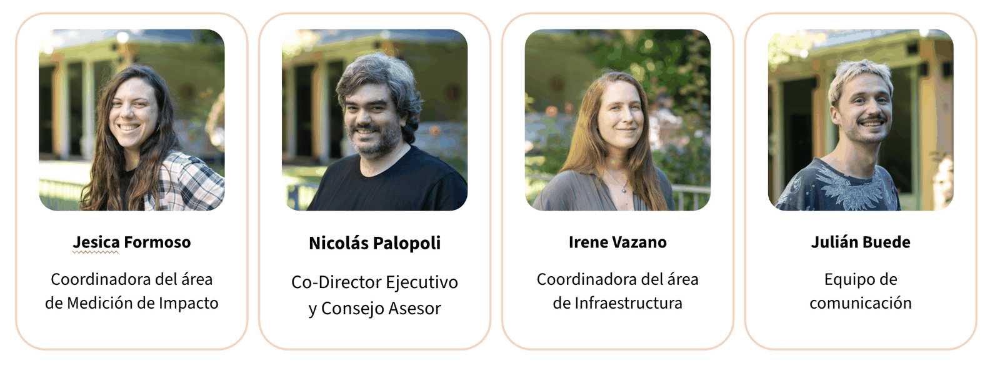{alt='Retratos de Jesica Formoso, Nicolás Palopoli, Irene Vazano y Julián Buede, acompañados por sus nombres y roles en MetaDocencia.'}

:::::::::::::::::::::::::::::::::::::::::::: instructor

Quienes guían el encuentro se presentan y mencionan a las personas que conforman el equipo de apoyo ese día.

::::::::::::::::::::::::::::::::::::::::::::::::::::::::::

## Herramientas de Ciencia Abierta

| Encuentro | Tema |
|---|---|
| **Encuentro 1** | Qué, por qué y cómo de la Ciencia Abierta |
| **Encuentro 2** | Cómo usar, crear y compartir Datos Abiertos |
| **Encuentro 3** | Cómo usar, crear y compartir Código Abierto |
| **Encuentro 4** | Cómo usar, crear y compartir Resultados Abiertos |

<!-- 🟨🟨🟨 FIGURA PENDIENTE: cargar `recorrido-herramientas-ciencia-abierta.png` en `episodes/fig/` 🟨🟨🟨 -->

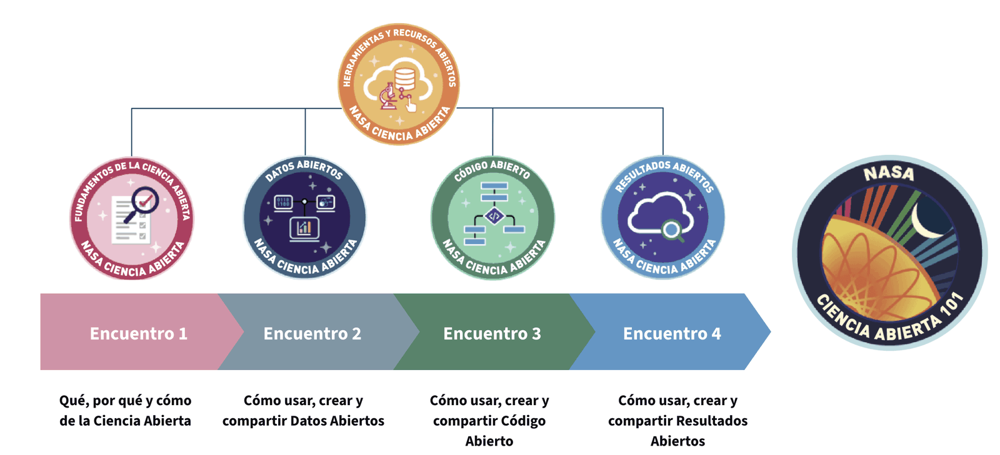{alt='Recorrido de cuatro encuentros: fundamentos de la Ciencia Abierta, Datos Abiertos, Código Abierto y Resultados Abiertos. El Encuentro 4 aparece destacado.'}

:::::::::::::::::::::::::::::::::::::::::::: instructor

En los encuentros anteriores vimos el qué, por qué y cómo de la Ciencia Abierta, además de algunas de las herramientas más utilizadas para ponerla en práctica. Profundizamos en cómo usar, crear y compartir Datos Abiertos y Código Abierto.

En este encuentro, el foco estará puesto en cómo usar, crear y compartir Resultados Abiertos que sigan los principios FAIR: que sean fáciles de encontrar, accesibles, interoperables y reutilizables.

Estos resultados no se limitan a las publicaciones científicas, sobre las que conversaremos en profundidad, sino que también incluyen muchos otros productos menos tradicionales.

::::::::::::::::::::::::::::::::::::::::::::::::::::::::::

## Resultados del proceso de investigación

:::::::::::::::::::::::::::::::::::::::::::: instructor

La descripción tradicional de un “resultado científico” cambió con el tiempo.

Cuando pensamos en resultados de investigación, muchas veces pensamos únicamente en la publicación final: un libro, un artículo académico o las actas de un congreso. Sin embargo, los resultados siempre fueron mucho más que la publicación final.

::::::::::::::::::::::::::::::::::::::::::::::::::::::::::

## Resultados de investigación

<!-- 🟨🟨🟨 FIGURA PENDIENTE: cargar `resultados-proceso-investigacion.png` en `episodes/fig/` 🟨🟨🟨 -->

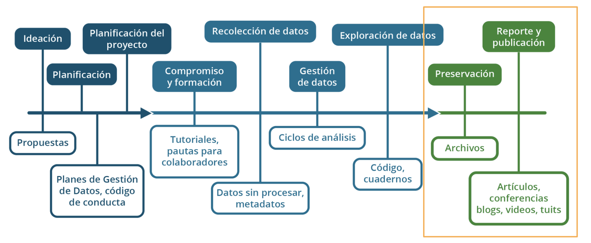{alt='Línea de tiempo del proceso de investigación. Incluye las etapas de ideación, planificación, recolección y exploración de datos, preservación, reporte y publicación. Debajo se muestran resultados como propuestas, planes de gestión, materiales de formación, datos sin procesar, metadatos, código, cuadernos, archivos, artículos, conferencias, blogs, videos y publicaciones en redes sociales.'}

*Fuente: NASA Open Science.*

:::::::::::::::::::::::::::::::::::::::::::: instructor

En los encuentros anteriores ya vimos varios de los resultados que pueden generarse durante el ciclo de investigación y publicarse de forma abierta. Entre ellos se encuentran los datos generados o recolectados y el código utilizado para analizarlos o automatizar procesos.

En este encuentro nos centraremos principalmente en los reportes o productos finales. Los más conocidos son los artículos académicos y las presentaciones en congresos o conferencias, pero no son los únicos.

::::::::::::::::::::::::::::::::::::::::::::::::::::::::::

## Resultados Abiertos

- Artículos científicos revisados por pares
- Comunicaciones en congresos y reuniones científicas
- Repositorios de proyectos
- Publicaciones en redes sociales, blogs y sitios web
- Preimpresiones o *preprints*

:::::::::::::::::::::::::::::::::::::::::::: instructor

Todo lo que nos ayude a comunicar de forma abierta los hallazgos de nuestro trabajo, tanto a la comunidad científica como al público general, puede considerarse un resultado.

Esto incluye los formatos tradicionales, como los artículos académicos, pero también publicaciones en blogs, videos, pódcast, contenidos para redes sociales y discusiones en foros.

Aunque este proceso no se da de manera equitativa en todas las disciplinas ni en todas las regiones, la comunidad científica está incorporando nuevas vías para comunicar sus resultados. Estas formas de difusión pueden favorecer nuevas colaboraciones, permitir que recibamos devoluciones útiles con mayor rapidez y dar más visibilidad al trabajo.

Además, las formas alternativas de comunicación suelen tener más posibilidades de alcanzar al público general y, de esta manera, aumentar el impacto de la investigación.

::::::::::::::::::::::::::::::::::::::::::::::::::::::::::

## Ejemplo de Resultados Abiertos en un artículo

<!-- 🟨🟨🟨 FIGURA PENDIENTE: cargar `articulo-resultados-abiertos-osf.png` en `episodes/fig/` 🟨🟨🟨 -->

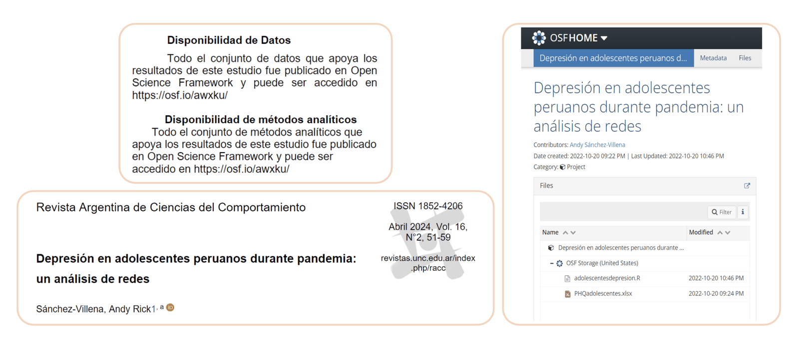{alt='Capturas del artículo “Depresión en adolescentes peruanos durante pandemia: un análisis de redes”, publicado en la Revista Argentina de Ciencias del Comportamiento. Se muestran sus declaraciones de disponibilidad de datos y métodos analíticos, además del proyecto asociado en Open Science Framework, que contiene una matriz de datos en formato XLSX y el código de análisis en R.'}

*Fuente: Sánchez-Villena, Andy Rick. “Depresión en adolescentes peruanos durante pandemia: un análisis de redes”. Revista Argentina de Ciencias del Comportamiento, volumen 16, número 2, 2024.*

:::::::::::::::::::::::::::::::::::::::::::: instructor

Aquí vemos un ejemplo de una publicación de la *Revista Argentina de Ciencias del Comportamiento* que, además del manuscrito, incluye otros productos para aumentar la reproducibilidad del estudio.

La revista solicita que las personas autoras hagan declaraciones sobre la disponibilidad abierta de los materiales, los datos y el código de análisis. Cuando estos elementos están almacenados en repositorios, pueden enlazarse desde el artículo.

En este caso, la persona autora incluyó un enlace a la matriz de datos —en formato Excel, aunque podría haberse utilizado otro formato— y al código empleado para analizarlos con el lenguaje R.

Ambos recursos están alojados en Open Science Framework (OSF), una plataforma sobre la que hablaremos más adelante.

::::::::::::::::::::::::::::::::::::::::::::::::::::::::::

:::::::::::::::::::::::::::::::::::::::::::: challenge

## Ejercicio 1: Respondé la encuesta de Zoom

**Duración: 3 minutos**

¿Participaste alguna vez en la elaboración de alguno de estos resultados?

**Seleccioná todas las opciones que correspondan:**

- Artículo de acceso abierto
- Presentación o póster en un congreso o conferencia
- Entrada en un blog
- Cuaderno computacional en GitHub
- Publicación en redes sociales
- Preimpresión o *preprint*

::::::::::::::::::::::::::::::::::::::::::::::::::::::::::

:::::::::::::::::::::::::::::::::::::::::::: instructor

Duración: 3 minutos.

El objetivo de esta pregunta es reconocer si las personas que integran la cohorte tuvieron experiencias vinculadas con la publicación abierta de resultados y, especialmente, con qué tipos de resultados trabajaron.

Cuando finalice la encuesta, puedes abrir un breve intercambio con preguntas como:

- ¿Habían pensado que una entrada de blog podía considerarse un Resultado Abierto?
- ¿Incluyeron enlaces a los datos o al código utilizado?
- ¿Alguna vez incorporaron un código QR en un póster para facilitar el acceso a materiales adicionales?

Puedes pedir que respondan mediante reacciones de Zoom.

::::::::::::::::::::::::::::::::::::::::::::::::::::::::::

## Formas de colaborar, roles y reconocimiento

- **Persona colaboradora:** cualquier persona que haya realizado alguna actividad que haga posible la investigación y la publicación o difusión de sus resultados.
- **Persona autora:** quien realiza una contribución sustancial a la concepción o el diseño del trabajo, o a la adquisición, el análisis o la interpretación de los datos para el trabajo publicado.

:::::::::::::::::::::::::::::::::::::::::::: instructor

Vamos a hablar de las formas de colaboración, los roles y el reconocimiento de las distintas contribuciones.

La colaboración es fundamental para la investigación científica. En la mayoría de los proyectos participan muchas personas, con diferentes roles y tipos de aportes. Reconocer esas contribuciones es una parte central de la Ciencia Abierta.

Podemos diferenciar entre el concepto de persona colaboradora, en un sentido amplio, y el de persona autora de los distintos productos del proyecto.

Cuando hablamos de colaboradoras y colaboradores, nos referimos a cualquier persona que haya realizado una actividad que hizo posible la investigación o la publicación y difusión de sus resultados. Esto puede incluir tareas que solemos relacionar directamente con la investigación, como recolectar o analizar datos, pero también otras funciones centrales:

- Establecer vínculos que faciliten el acceso a comunidades, instituciones o sitios de estudio.
- Brindar una capacitación.
- Asesorar sobre una herramienta o un método específico.
- Proporcionar apoyo logístico o administrativo.

En cambio, cuando hablamos de autoría, solemos referirnos a quienes realizaron una contribución sustancial al trabajo —por ejemplo, a la concepción o el diseño del estudio, o a la adquisición, el análisis o la interpretación de los datos—, participaron en la elaboración del producto que se comparte y se responsabilizan por su contenido.

En el marco de la Ciencia Abierta también aparece la idea de transparentar las contribuciones: reconocer de manera clara qué aportó cada persona al proyecto.

Para que esto funcione, es recomendable definir pautas y acuerdos sobre las formas de contribución desde el inicio. Los productos de investigación —como datos, protocolos, software o publicaciones— se generan durante todo el proceso. Establecer estos acuerdos ayuda a evitar confusiones o conflictos posteriores.

También es importante asegurarse de que todas las personas involucradas conozcan y acepten estas pautas antes de comenzar, para que las expectativas sean claras y el reconocimiento resulte justo y transparente.

:::::::::::::::::::::::::::::::::::::::::::::::::::::::::::

## Taxonomía CRediT

La taxonomía CRediT permite describir las contribuciones realizadas mediante 14 roles:

| | | |
|---|---|---|
| Conceptualización | Metodología | Validación |
| Curación de datos | Administración del proyecto | Visualización |
| Análisis formal | Recursos | Redacción del borrador original |
| Obtención de financiamiento | Software | Redacción, revisión y edición |
| Investigación | Supervisión | |

Más información: [Contributor Roles Taxonomy (CRediT)](https://credit.niso.org/)

:::::::::::::::::::::::::::::::::::::::::::: instructor

Uno de los problemas históricos de la ciencia es que el sistema tradicional de autoría se basa principalmente en el orden de los nombres, cuyo significado puede variar entre disciplinas.

Por ejemplo, en muchas disciplinas biomédicas y sociales, la primera persona de la lista suele ser quien realizó gran parte del trabajo experimental y redactó el manuscrito. La última suele ser quien dirigió el grupo, aportó la idea, obtuvo el financiamiento o supervisó el proyecto.

Las personas ubicadas en el medio quedan en una zona más difícil de interpretar. Este sistema no permite distinguir con claridad entre quien diseñó el estudio, consiguió el financiamiento, limpió los datos o desarrolló el código. Tampoco permite identificar fácilmente contribuciones equivalentes.

Actualmente, cada vez más revistas solicitan una descripción estandarizada de los roles de autoría. Una herramienta para hacerlo es la taxonomía CRediT —*Contributor Roles Taxonomy*—, que define 14 roles, desde la conceptualización del estudio hasta la revisión y edición del manuscrito.

Esta taxonomía permite visibilizar trabajos que muchas veces permanecen ocultos: la curación de datos, el desarrollo de software, la gestión del proyecto o la obtención de recursos. Esto es especialmente relevante para quienes realizan tareas técnicas o de apoyo y rara vez aparecen como autores o autoras principales.

Para compartir en el chat: [https://credit.niso.org/](https://credit.niso.org/)

:::::::::::::::::::::::::::::::::::::::::::::::::::::::::::

## ¿Cómo saber si un Resultado Abierto es confiable?

Podemos evaluar la calidad y confiabilidad:

- Del sitio o la plataforma donde está alojado.
- Del contenido del recurso.

:::::::::::::::::::::::::::::::::::::::::::: instructor

Hasta ahora hablamos principalmente de cómo producir y gestionar Resultados Abiertos. También debemos pensar qué sucede cuando utilizamos productos abiertos creados por otras personas.

Que un recurso sea abierto no significa necesariamente que sea confiable o de buena calidad. Si usamos datos, materiales o resultados provenientes de fuentes poco confiables como parte central de una investigación, nuestro propio trabajo también puede perder calidad.

Para evaluar un recurso abierto podemos observar dos dimensiones.

**El sitio o la plataforma donde está alojado:**

- ¿Pertenece a una universidad, un organismo gubernamental, una organización científica u otra institución reconocida?
- ¿Hay información clara sobre las personas autoras o responsables?
- ¿Es posible contactarlas?
- ¿Existen posibles sesgos o intereses que puedan influir en el contenido?

**El contenido del recurso:**

- ¿Está asociado con una publicación revisada por pares o con algún otro proceso de revisión?
- ¿Los datos primarios están disponibles?
- ¿El código y los métodos utilizados también están disponibles?
- ¿Las variables, los campos y los parámetros están definidos claramente?
- ¿Se explicitan los criterios utilizados para incluir o excluir información?
- ¿Las personas autoras tienen experiencia en esa disciplina?

También podemos preguntarnos si el trabajo es reproducible:

- ¿Es posible interactuar con los datos o replicar los resultados?
- ¿Otras personas pudieron reproducirlos?

Finalmente, debemos considerar el contexto:

- ¿Las personas autoras compartieron anteriormente otros resultados confiables?
- ¿Es un trabajo aislado o forma parte de una conversación científica más amplia?
- ¿La información continúa siendo relevante y actual?

Estas preguntas nos ayudan a utilizar recursos abiertos de manera crítica y responsable y a fortalecer la calidad de nuestra propia investigación.

:::::::::::::::::::::::::::::::::::::::::::::::::::::::::::

## Publicaciones de acceso abierto

Una publicación de acceso abierto puede ser leída por cualquier persona, de manera gratuita y sin restricciones de acceso.

<!-- 🟨🟨🟨 FIGURA PENDIENTE: cargar `simbolo-acceso-abierto.png` en `episodes/fig/` 🟨🟨🟨 -->

{alt='Candado abierto de color naranja acompañado por el texto Open Access.'}

:::::::::::::::::::::::::::::::::::::::::::: instructor

Ahora vamos a concentrarnos en las publicaciones científicas de acceso abierto.

Una publicación de acceso abierto es aquella que cualquier persona puede leer de forma gratuita y sin restricciones, sin necesidad de estar suscripta a una revista o de pertenecer a una institución que pague por el acceso.

Sin embargo, no todas las publicaciones llegan al acceso abierto por el mismo camino. Vamos a presentar tres vías principales.

:::::::::::::::::::::::::::::::::::::::::::::::::::::::::::

## Publicaciones de acceso abierto

### Vía dorada

Las personas autoras pagan el costo de publicación.

<!-- 🟨🟨🟨 FIGURA PENDIENTE: usar `simbolo-acceso-abierto.png` de `episodes/fig/` 🟨🟨🟨 -->

{alt='Candado abierto de color naranja acompañado por el texto Open Access.'}

:::::::::::::::::::::::::::::::::::::::::::: instructor

La primera es la vía dorada.

En este modelo, la persona autora paga directamente a la revista un cargo por procesamiento del artículo, conocido como APC por sus siglas en inglés. A cambio, la revista publica la versión final de forma permanente y permite que cualquier persona pueda acceder a ella gratuitamente.

Generalmente, las personas autoras conservan sus derechos mediante una licencia Creative Commons, como CC BY.

La crítica más frecuente a esta modalidad es su costo. Los cargos pueden alcanzar miles de dólares, lo que representa una barrera para quienes investigan en muchas regiones del mundo.

Algunas editoriales ofrecen descuentos o exenciones para determinados países y, en algunos casos, el organismo financiador permite cubrir el costo con los fondos del proyecto. De todos modos, sigue siendo una barrera adicional para publicar.

:::::::::::::::::::::::::::::::::::::::::::::::::::::::::::

## Publicaciones de acceso abierto

### Vía verde

- La versión oficial permanece bajo suscripción.
- Una copia del manuscrito se deposita gratuitamente en un repositorio abierto.

Para buscar repositorios: [Registry of Open Access Repositories (ROAR)](https://roar.eprints.org/)

<!-- 🟨🟨🟨 FIGURA PENDIENTE: usar `simbolo-acceso-abierto.png` de `episodes/fig/` 🟨🟨🟨 -->

{alt='Candado abierto de color naranja acompañado por el texto Open Access.'}

:::::::::::::::::::::::::::::::::::::::::::: instructor

La segunda es la vía verde.

En este caso, la persona autora publica su trabajo en una revista tradicional por suscripción, pero también deposita una versión del manuscrito en un repositorio institucional o temático abierto.

Generalmente, se comparte la versión aceptada del manuscrito, anterior a la maquetación final realizada por la editorial. De esta manera, existe una versión pública del trabajo, aunque la versión oficial de la revista no sea gratuita.

A veces se utiliza ResearchGate para compartir artículos. Sin embargo, esta plataforma funciona principalmente como una red social académica y no está diseñada como un repositorio institucional ni como una infraestructura de preservación permanente.

Para buscar artículos disponibles mediante la vía verde o encontrar repositorios donde depositar trabajos propios, podemos consultar el *Registry of Open Access Repositories* (ROAR).

También es importante revisar el acuerdo de publicación firmado con la revista. En muchas revistas por suscripción, las personas autoras ceden a la editorial algunos derechos, como el derecho de distribución de la versión publicada.

Por eso, normalmente no podemos compartir la versión final con la maquetación, los logotipos y el formato editorial. En cambio, puede permitirse el depósito de una versión previa a esa maquetación.

En algunos casos, la revista también establece un período de embargo durante el cual el manuscrito no puede hacerse público.

Para compartir en el chat: [https://roar.eprints.org/](https://roar.eprints.org/)

:::::::::::::::::::::::::::::::::::::::::::::::::::::::::::

## Publicaciones de acceso abierto

### Vía diamante

Es gratuita tanto para quien publica como para quien lee.

- [Directory of Open Access Journals (DOAJ)](https://doaj.org/)
- [SciELO](https://scielo.org/es/)

<!-- 🟨🟨🟨 FIGURA PENDIENTE: usar `simbolo-acceso-abierto.png` de `episodes/fig/` 🟨🟨🟨 -->

{alt='Candado abierto de color naranja acompañado por el texto Open Access.'}

:::::::::::::::::::::::::::::::::::::::::::: instructor

La tercera es la vía diamante, una modalidad especialmente alineada con los principios de la Ciencia Abierta.

En este caso, ni las personas lectoras pagan para acceder al artículo ni las personas autoras pagan para publicarlo. Estas revistas suelen sostenerse mediante infraestructura institucional, trabajo comunitario o financiamiento directo de instituciones y fundaciones. En la mayoría de los casos, las personas autoras también conservan sus derechos.

Muchas revistas de acceso abierto diamante pueden encontrarse en el *Directory of Open Access Journals* (DOAJ). En el caso de las revistas latinoamericanas, españolas y portuguesas, también podemos encontrarlas en SciELO.

SciELO es una red colaborativa de colecciones nacionales de revistas científicas de acceso abierto. Países como Argentina, México, Chile, Colombia, Ecuador y Uruguay gestionan sus propias colecciones. Este modelo aumenta la visibilidad de la producción científica regional sin depender exclusivamente de los circuitos editoriales internacionales.

Además de organizar contenidos, SciELO contribuye a construir comunidad alrededor de las revistas y promueve estándares de calidad editorial. De esta manera, fortalece la profesionalización y la sostenibilidad del acceso abierto diamante y constituye una infraestructura central para la Ciencia Abierta en nuestra región.

Para compartir en el chat:

- [https://doaj.org/](https://doaj.org/)
- [https://scielo.org/es/](https://scielo.org/es/)

:::::::::::::::::::::::::::::::::::::::::::::::::::::::::::

:::::::::::::::::::::::::::::::::::::::::::: challenge

## Ejercicio 2: Respondé la encuesta de Zoom

**Duración: 3 minutos**

Las publicaciones que no requieren pagar para leer ni para publicar un artículo siguen un modelo de:

**Elegí la mejor respuesta:**

- Vía dorada
- Vía verde
- Vía diamante

:::::::::::::::::::::::::::::::::::::::::::::::::::::::::::

:::::::::::::::::::::::::::::::::::::::::::: instructor

**Respuesta correcta:** vía diamante.

:::::::::::::::::::::::::::::::::::::::::::::::::::::::::::

## Revistas predatorias

- Realizan publicaciones con fines de lucro y con poco o ningún control de calidad.
- Se aprovechan de los modelos de acceso abierto para atraer a las personas autoras y cobrarles por publicar.

:::::::::::::::::::::::::::::::::::::::: instructor

Otro aspecto importante que debemos considerar al publicar es el problema de las revistas o editoriales predatorias.

Estas editoriales simulan publicar revistas científicas legítimas, pero su objetivo principal es cobrarles a las personas autoras sin ofrecer los estándares habituales de calidad académica.

En muchos casos no realizan una revisión por pares real o el proceso es meramente superficial. Cobran por brindar la apariencia de una publicación científica —un sitio web, un comité editorial y un supuesto proceso de evaluación—, pero sin garantizar la calidad, la revisión crítica ni la integridad científica que se espera de una revista académica.

Muchas de estas editoriales se aprovechan del modelo de acceso abierto, en el que puede ser habitual que las personas autoras paguen cargos de publicación. La diferencia es que, en las revistas legítimas, esos cargos financian procesos editoriales reales, como la revisión por pares, la edición y la preservación del artículo.

Entonces, ¿cómo podemos identificarlas?

::::::::::::::::::::::::::::::::::::::::::::::::::::::::::::::

## Revistas predatorias: señales de alerta

- Tienen un nombre parecido al de una revista prestigiosa.
- Envían correos electrónicos no solicitados pidiendo manuscritos.
- Utilizan invitaciones inexactas o genéricas.
- Abarcan temas excesivamente amplios o poco específicos.
- Prometen tiempos de publicación muy rápidos.
- Destacan supuestas indexaciones o factores de impacto.
- Publican una gran cantidad de números especiales.
- Presentan tasas de aceptación muy altas.

:::::::::::::::::::::::::::::::::::::::: instructor

Algunas señales de alerta frecuentes son:

- Nombres muy similares a los de revistas prestigiosas, que pueden generar confusión.
- Correos electrónicos no solicitados que invitan a enviar artículos y, en ocasiones, mencionan vagamente trabajos anteriores para parecer más creíbles.
- Mensajes genéricos o poco específicos, que no se relacionan claramente con nuestro campo de investigación.
- Ámbitos temáticos demasiado amplios; por ejemplo, revistas que dicen abarcar desde medicina e ingeniería hasta ciencias sociales.
- Promesas de publicación extremadamente rápida, que pueden indicar que el artículo no atravesará una revisión por pares real.
- Énfasis excesivo en supuestos índices de impacto o bases de datos que pueden ser falsos, poco reconocidos o no corresponder con la indexación real de la revista.
- Una cantidad inusual de números especiales publicados en poco tiempo.
- Tasas de aceptación extremadamente altas.

Ninguna de estas señales, por sí sola, confirma que una revista sea predatoria. Sin embargo, cuando aparecen varias juntas, conviene investigar con mayor profundidad antes de enviar un manuscrito.

::::::::::::::::::::::::::::::::::::::::::::::::::::::::::::::

## Preprints

Los preprints o preimpresiones son versiones tempranas de artículos que se comparten públicamente antes de su publicación en una revista científica.

- Promueven la transparencia, la difusión rápida del conocimiento y la colaboración.
- Permiten acelerar el ritmo de los descubrimientos científicos.
- Facilitan que las investigaciones sean accesibles para audiencias amplias.

Algunos servidores de preprints son:

- [arXiv](https://arxiv.org/)
- [bioRxiv](https://www.biorxiv.org/)
- [medRxiv](https://www.medrxiv.org/)
- [SSRN](https://www.ssrn.com/)
- [SciELO Preprints](https://preprints.scielo.org/index.php/scielo)

<!-- 🟨🟨🟨 FIGURA PENDIENTE: cargar `servidores-preprints.png` en `episodes/fig/` 🟨🟨🟨 -->

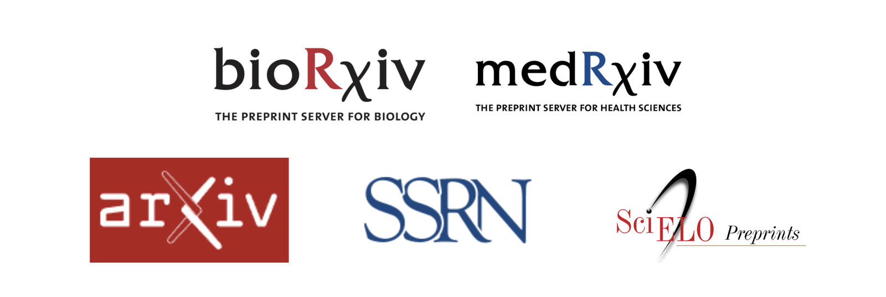{alt='Logotipos de bioRxiv, medRxiv, arXiv, SSRN y SciELO Preprints.'}

:::::::::::::::::::::::::::::::::::::::: instructor

¿Conocían los preprints?

Un preprint es una versión del manuscrito que las personas autoras hacen pública antes de que atraviese la revisión por pares. De esta manera, queda disponible de forma gratuita y prácticamente inmediata.

Los preprints se depositan en servidores o repositorios específicos. Uno de los más antiguos y conocidos es arXiv, utilizado principalmente en física, matemática y ciencias de la computación. En biomedicina se destacan bioRxiv y medRxiv, mientras que SSRN —*Social Science Research Network*— se utiliza especialmente en ciencias sociales.

También existen muchos otros servidores especializados según la disciplina.

Con una perspectiva fuertemente latinoamericana, contamos con SciELO Preprints. Fue lanzado en 2020 como parte del ecosistema SciELO para fortalecer la Ciencia Abierta en la región. A diferencia de algunos repositorios disciplinares, acepta trabajos de todas las áreas del conocimiento.

Para quienes ya publicaron en revistas, una forma sencilla de entenderlo es pensar en el manuscrito enviado a evaluación: el preprint es, básicamente, esa versión compartida abiertamente sin esperar a que termine el proceso editorial.

Para compartir en el chat:  
[https://preprints.scielo.org/index.php/scielo](https://preprints.scielo.org/index.php/scielo)

::::::::::::::::::::::::::::::::::::::::::::::::::::::::::::::

## Preprints: ventajas y desventajas

| Ventajas | Desventajas |
|---|---|
| Difusión más rápida de los resultados | El trabajo puede contener errores que todavía no fueron detectados |
| Disponibilidad de servidores gratuitos | En algunas disciplinas se perciben como trabajos de menor calidad |
| Posibilidad de recibir devoluciones de la comunidad | Algunas revistas no aceptan artículos compartidos previamente como preprints |

:::::::::::::::::::::::::::::::::::::::: instructor

La principal ventaja de compartir un preprint es la velocidad y el acceso: los resultados pueden llegar a la comunidad científica y al público general en cuestión de días, en lugar de demorar meses.

En el marco de la Ciencia Abierta, los preprints se consideran una herramienta importante porque democratizan el acceso al conocimiento y aceleran la conversación científica. Esto se hizo especialmente visible durante la pandemia de COVID-19, cuando una gran cantidad de hallazgos circuló primero por esta vía.

La contracara es que el trabajo todavía no cuenta con el aval formal de una revisión por pares. Por eso, requiere que quienes lo leen realicen su propia evaluación crítica.

Además, aunque la comunidad científica incorpora cada vez más esta práctica, todavía existen diferencias entre disciplinas. Algunas revistas no aceptan trabajos compartidos previamente como preprints y, en ciertos campos, todavía pueden percibirse como productos de menor calidad.

También están surgiendo modelos alternativos de evaluación. Por ejemplo, F1000Research publica los artículos después de un control inicial y realiza la revisión por pares de manera abierta luego de la publicación. Por su parte, PREreview facilita la revisión comunitaria y abierta de preprints.

Para compartir en el chat:

- [F1000Research](https://f1000research.com/)
- [PREreview](https://prereview.org/es-419)

::::::::::::::::::::::::::::::::::::::::::::::::::::::::::::::

## Antes de compartir un preprint

> 🚨 **¡Importante!**
>
> Si tenemos previsto publicar el artículo posteriormente en una revista, debemos comprobar:
>
> - La política de derechos de autor de la revista.
> - Qué versión del documento se permite depositar.
> - A partir de qué momento puede estar disponible públicamente.

<!-- 🟨🟨🟨 FIGURA PENDIENTE: usar `servidores-preprints.png` de `episodes/fig/` 🟨🟨🟨 -->

{alt='Logotipos de bioRxiv, medRxiv, arXiv, SSRN y SciELO Preprints.'}

:::::::::::::::::::::::::::::::::::::::: instructor

Los preprints son una herramienta valiosa para favorecer la circulación del conocimiento. Sin embargo, si tenemos la intención de publicar posteriormente el trabajo en una revista determinada, es muy importante revisar previamente:

- La política de derechos de autor de la revista.
- La versión del documento que se permite depositar.
- El momento a partir del cual el documento puede estar disponible públicamente.

Estas condiciones pueden variar entre revistas y editoriales. Por eso, debemos revisarlas antes de depositar el manuscrito.

::::::::::::::::::::::::::::::::::::::::::::::::::::::::::::::

## Para ir pensando

Después de la pausa realizaremos un ejercicio en salas de grupos.

Piensen en un estudio real o hipotético de su área y conversen sobre las siguientes preguntas:

- ¿Qué tipo de Resultado Abierto sería más viable para ese proyecto: un preprint, una publicación de acceso abierto, datos o código en un repositorio u otro producto?
- ¿Qué obstáculo concreto encuentran para aplicar alguna de estas prácticas?

:::::::::::::::::::::::::::::::::::::::: instructor

Anticipa que, después de la pausa, las personas participantes trabajarán en grupos sobre un estudio real o hipotético de su área.

Presenta las dos preguntas para que puedan comenzar a pensar en un posible ejemplo:

- ¿Qué tipo de Resultado Abierto sería más viable para ese proyecto?
- ¿Qué obstáculo concreto encuentran para aplicar alguna de estas prácticas?

::::::::::::::::::::::::::::::::::::::::::::::::::::::::::::::

## Pausa

**Volvemos en 10 minutos.**

No te desconectes, pero sí alejate de las pantallas.

:::::::::::::::::::::::::::::::::::::::: instructor

### Música

- Pedro Guerra — *Daniela*  
  Aporte de Silveria Alcantara.
- Gustavo Cerati — *Sulky*
- Los Besos — *Helados verdes*

::::::::::::::::::::::::::::::::::::::::::::::::::::::::::::::

## Registro de proyectos

Permite organizar y referenciar los distintos resultados de un proyecto.

- Crear y mantener actualizado el registro del proyecto.
- Preservar sus resultados.
- Incluir, para cada elemento, una descripción, la forma de citarlo y su identificador persistente.
- Organizar cada elemento como un componente del proyecto.

<!-- 🟨🟨🟨 FIGURA PENDIENTE: cargar `logo-osf.png` en `episodes/fig/` 🟨🟨🟨 -->

{alt='Logotipo de Open Science Framework, compuesto por círculos azules conectados y la sigla OSF.'}

:::::::::::::::::::::::::::::::::::::::: instructor

Una herramienta muy útil para poner en práctica la Ciencia Abierta son las plataformas que permiten registrar y gestionar proyectos de investigación.

Estas plataformas sirven para reunir y organizar los distintos resultados de un proyecto —como datos, código, materiales y preprints— y reconocer a las personas que colaboran en él.

Registrar un proyecto también permite preservar sus resultados y asignarles identificadores persistentes. De esta manera, cada elemento puede citarse y reutilizarse en diferentes contextos.

El registro puede ayudarnos, por ejemplo, a presentar un informe de rendición de fondos, solicitar financiamiento o mostrar en qué estamos trabajando. También puede abrir posibilidades para que otras personas o equipos conozcan el proyecto y se sumen a colaborar.

Un ejemplo de estas plataformas es Open Science Framework, también conocida como OSF. Esta plataforma permite crear y organizar un proyecto, vincular sus diferentes productos, asignar identificadores persistentes y controlar qué elementos serán públicos y cuáles permanecerán privados.

OSF es una plataforma gratuita mantenida por el Center for Open Science.

::::::::::::::::::::::::::::::::::::::::::::::::::::::::::

## Prerregistro

Consiste en documentar y hacer público el diseño de un estudio antes de comenzar la recolección de datos:

- Hipótesis o preguntas de investigación
- Variables
- Diseño
- Muestra
- Procedimiento
- Análisis de datos

<!-- 🟨🟨🟨 FIGURA PENDIENTE: usar `logo-osf.png` de `episodes/fig/` 🟨🟨🟨 -->

{alt='Logotipo de Open Science Framework, compuesto por círculos azules conectados y la sigla OSF.'}

:::::::::::::::::::::::::::::::::::::::: instructor

OSF también permite crear un prerregistro.

El prerregistro consiste en documentar qué vamos a estudiar, cómo realizaremos el estudio y qué resultados esperamos encontrar antes de comenzar a recolectar los datos.

Existen diferentes formatos de prerregistro, pero generalmente incluyen:

1. Las hipótesis o preguntas de investigación.
2. Las variables que se medirán y la manera en que se realizará esa medición.
3. El diseño del estudio; por ejemplo, si será experimental u observacional, si tendrá diferentes grupos o condiciones y cómo se asignarán las personas participantes.
4. La composición de la muestra: su tamaño previsto, los criterios de inclusión y exclusión y el procedimiento de reclutamiento.
5. La descripción paso a paso del procedimiento y de la recolección de datos.
6. Los análisis que se realizarán, incluyendo cómo se tratarán los datos faltantes o los valores extremos.

El objetivo del prerregistro es diferenciar con claridad aquello que se planificó antes de observar los datos de lo que se descubrió posteriormente.

Puedes abrir un breve intercambio con la siguiente pregunta:

> ¿Para qué imaginan que puede servir el prerregistro en el contexto de las buenas prácticas científicas?

Entre otras cosas, el prerregistro busca reducir la posibilidad de que quienes investigan modifiquen, consciente o inconscientemente, sus análisis después de observar los datos para obtener resultados que parezcan más significativos o interesantes.

También obliga a planificar con anticipación por qué y cómo se abordará la pregunta de investigación. Este proceso puede ayudar a identificar decisiones o problemas que podrían influir en el diseño del estudio.

::::::::::::::::::::::::::::::::::::::::::::::::::::::::::

## Gestores de referencias

Los gestores de referencias bibliográficas permiten:

- Registrar y organizar referencias.
- Generar automáticamente citas y bibliografías en diferentes estilos y formatos.
- Importar y almacenar metadatos de artículos.
- Registrar versiones e identificadores persistentes de datos y software.

Algunos ejemplos son:

- EndNote
- Zotero
- Mendeley

<!-- 🟨🟨🟨 FIGURA PENDIENTE: cargar `gestores-referencias.png` en `episodes/fig/` 🟨🟨🟨 -->

{alt='Logotipos de los gestores de referencias bibliográficas EndNote, Zotero y Mendeley.'}

:::::::::::::::::::::::::::::::::::::::: instructor

Otras herramientas que pueden resultar útiles dentro de un flujo de trabajo abierto son los gestores de referencias bibliográficas.

Quizás conozcan gestores como EndNote, Zotero o Mendeley. Si utilizan alguna otra herramienta, invita a que la compartan con el grupo.

Estos programas facilitan el registro y la organización de las referencias utilizadas durante una investigación. Además:

- Generan automáticamente citas y bibliografías en distintos estilos.
- Exportan referencias en formatos como BibTeX o RIS.
- Se integran con procesadores de texto como Word y Google Docs.
- Importan y almacenan los metadatos de los artículos.
- Permiten registrar versiones e identificadores persistentes de conjuntos de datos y software.

Actualmente, varios gestores también permiten realizar anotaciones sobre los documentos y descubrir bibliografía relacionada con el tema de investigación.

Nos centraremos en Zotero porque es una herramienta gratuita, libre y de código abierto, publicada bajo la licencia GPLv3.

::::::::::::::::::::::::::::::::::::::::::::::::::::::::::

## Zotero

<!-- 🟨🟨🟨 FIGURA PENDIENTE: cargar `interfaz-zotero.png` en `episodes/fig/` 🟨🟨🟨 -->

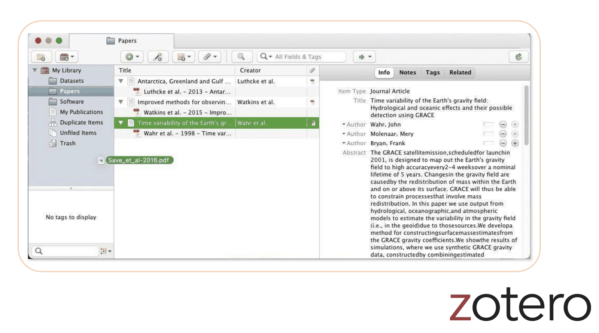{alt='Captura de la interfaz de Zotero. A la izquierda se observan las colecciones de una biblioteca; en el centro, una lista de referencias; y a la derecha, los metadatos de la referencia seleccionada.'}

:::::::::::::::::::::::::::::::::::::::: instructor

Zotero es una aplicación de código abierto que podemos descargar y utilizar gratuitamente.

Su interfaz permite organizar las referencias en bibliotecas y colecciones. También podemos importar los metadatos de un artículo en formato PDF arrastrando el archivo hacia la aplicación.

Una vez incorporado el documento, Zotero puede recuperar y almacenar información como:

- El título.
- Las personas autoras.
- El año de publicación.
- La revista.
- El DOI.
- Otros datos necesarios para construir la referencia bibliográfica.

::::::::::::::::::::::::::::::::::::::::::::::::::::::::::

## Zotero también permite

- Utilizar extensiones para Word y aplicaciones web.
- Crear bibliotecas compartidas y colaborativas.
- Integrarse con OSF.

<!-- 🟨🟨🟨 FIGURA PENDIENTE: cargar `logo-zotero.png` en `episodes/fig/` 🟨🟨🟨 -->

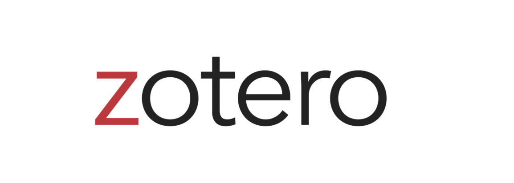{alt='Nombre Zotero escrito con una letra z de color rojo.'}

:::::::::::::::::::::::::::::::::::::::: instructor

Zotero también ofrece extensiones para Word, Google Docs y navegadores web.

Estas extensiones facilitan el registro de referencias, permiten importar metadatos directamente desde revistas, repositorios y otros sitios y ayudan a localizar versiones de acceso abierto cuando están disponibles.

Además, Zotero permite crear bibliotecas compartidas y colaborativas, lo que facilita la gestión de referencias en equipos de investigación.

Otra característica interesante es su integración con OSF. Podemos vincular una biblioteca de Zotero con un proyecto en OSF y compartirla públicamente como parte de los materiales abiertos de la investigación.

::::::::::::::::::::::::::::::::::::::::::::::::::::::::::

## Intercambio en salas de grupos

### ¿Cómo vamos a trabajar?

1. Cada grupo elige una persona para moderar la conversación, administrar el tiempo y distribuir la participación.

2. Cada grupo elige una persona representante para sintetizar el intercambio y compartirlo brevemente en la sala principal.

:::::::::::::::::::::::::::::::::::::::: instructor

Al igual que en los encuentros anteriores, realizaremos una actividad en salas de grupos.

Recuerda que cada grupo debe elegir:

- Una persona que modere la conversación, ayude a organizar el tiempo y procure que todas las personas tengan la oportunidad de participar.
- Una persona que represente al grupo y comparta brevemente en la sala principal los principales temas que surgieron durante el intercambio.

::::::::::::::::::::::::::::::::::::::::::::::::::::::::::

:::::::::::::::::::::::::::::::::::::::: challenge

## Ejercicio 3: Sala de grupos

**Duración: 10 minutos**

Piensen en un estudio real o hipotético de su área y conversen sobre las siguientes preguntas:

- ¿Qué tipo de Resultado Abierto sería más viable para ese proyecto: un preprint, una publicación de acceso abierto, datos o código en un repositorio u otro producto?
- ¿Qué obstáculo concreto encuentran para aplicar alguna de estas prácticas?

::::::::::::::::::::::::::::::::::::::::::::::::::::::::::

:::::::::::::::::::::::::::::::::::::::: instructor

Duración: 10 minutos.

Distribuye a las personas participantes en salas de grupos.

Antes de abrir las salas, recuerda que cada grupo debe designar a una persona moderadora y a una persona representante.

Cuando regresen a la sala principal, invita a cada representante a compartir brevemente:

- El tipo de Resultado Abierto que consideraron más viable.
- El principal obstáculo que identificaron.

::::::::::::::::::::::::::::::::::::::::::::::::::::::::::

## ¡Planificar para abrir!

Un Plan de Gestión de Datos y Ciencia Abierta puede incluir:

- Plan de gestión de datos.
- Plan de gestión de software.
- Plan de gestión de publicaciones.

Estos planes:

- Nos ayudan a pensar la apertura desde el inicio de la investigación.
- Son documentos vivos que pueden adaptarse ante situaciones emergentes.

:::::::::::::::::::::::::::::::::::: instructor

Volvamos a un tema que atraviesa todos los encuentros: la planificación.

Para abrir una investigación es necesario pensar la gestión de la apertura desde el comienzo. Podemos guiarnos por un principio importante:

> Tan abierto como sea posible, tan cerrado como sea necesario.

Un Plan de Gestión de Datos y Ciencia Abierta describe cómo se administrará y compartirá la información científica producida durante una investigación.

Puede incluir secciones específicas sobre:

- La gestión de los datos.
- La gestión del software.
- La publicación y comunicación de los resultados.

Si el proyecto genera otros productos —como muestras físicas, hardware, materiales educativos u otro tipo de resultados—, también podemos incorporarlos al plan.

Estos documentos ayudan a anticipar decisiones concretas:

- Qué resultados se compartirán.
- Cómo y dónde se almacenarán.
- Qué documentación necesitarán.
- Qué licencias se utilizarán.
- Quiénes podrán acceder a ellos.
- En qué momento se harán públicos.

Además, son documentos vivos: pueden revisarse y actualizarse cuando aparecen nuevas necesidades, limitaciones o situaciones imprevistas.

El plan también puede compartirse públicamente desde el inicio mediante una práctica que ya mencionamos: el prerregistro.

::::::::::::::::::::::::::::::::::::::::::::::::::::::::::

## Empezá por acá

- Definí cómo se organizará la colaboración y cómo se asignará la autoría.
- Publicá los datos y el software vinculados con la investigación en un repositorio, con licencia, metadatos e identificadores persistentes.
- Creá un repositorio centralizado para reunir los resultados del proyecto.
- Registrá con precisión la recolección y el análisis de los datos para facilitar la reproducibilidad.

:::::::::::::::::::::::::::::::::::: instructor

¿Con qué acciones concretas podemos comenzar a generar Resultados Abiertos?

Podemos empezar con cuatro elementos:

1. **Definir cómo se organizará la colaboración y la autoría.**  
   Es recomendable acordar desde el inicio cómo se reconocerán las distintas contribuciones y cómo se tomarán las decisiones sobre autoría.

2. **Publicar los datos o el software asociados con la investigación.**  
   Podemos almacenarlos en un repositorio como Zenodo, acompañados por una licencia, documentación y metadatos. El DOI correspondiente debe incluirse en los informes y publicaciones relacionados.

3. **Crear un repositorio centralizado.**  
   Podemos utilizar, por ejemplo, OSF o un repositorio de GitHub para reunir los diferentes productos del proyecto e incluir una lista de las personas colaboradoras.

4. **Documentar el proceso de recolección y análisis.**  
   Es importante registrar los métodos, las herramientas y las dependencias utilizadas para que otras personas puedan comprender el proceso y, cuando sea posible, reproducir los resultados.

No es necesario implementar todas estas prácticas al mismo tiempo. Podemos comenzar por aquellas que resulten más viables para nuestro proyecto.

::::::::::::::::::::::::::::::::::::::::::::::::::::::::::

## Documentar los resultados

### Datos

- ¿Cómo pueden utilizarse?
- ¿Cómo se recolectaron?
- ¿Tienen errores o limitaciones conocidas?
- ¿Están asociados con una publicación?

### Código

- ¿Cómo se instala y se utiliza?
- ¿Qué aporta cada nueva versión?
- ¿Qué hace cada parte del código?
- ¿Está asociado con una publicación?

:::::::::::::::::::::::::::::::::::: instructor

Detengámonos en la documentación, una herramienta central para que los resultados sean comprensibles, reutilizables y reproducibles.

Documentar significa describir cómo se produjo y cómo debe gestionarse o utilizarse un resultado. Esto beneficia tanto a quienes trabajan actualmente en el proyecto como a quienes quieran utilizar esos materiales en el futuro.

En términos generales, una buena documentación debería indicar:

- Cómo se obtuvo o generó el resultado.
- Cómo puede utilizarse.
- Si está asociado con una publicación.
- Si tiene problemas o limitaciones conocidas.
- Cómo fue utilizado previamente por otras personas.

La información necesaria puede variar según el tipo de producto.

Para un conjunto de datos, también debemos explicar cómo se recolectaron y procesaron los datos, qué representan las variables y si existen errores, sesgos o limitaciones conocidas.

Para el código, es importante describir:

- Cómo instalarlo y ejecutarlo.
- Qué hacen sus diferentes componentes.
- Qué dependencias necesita.
- Qué cambios incorpora cada versión.
- Cómo se relaciona con los datos y las publicaciones del proyecto.

También podemos incluir ejemplos breves de uso para facilitar que otras personas comiencen a trabajar con el recurso.

::::::::::::::::::::::::::::::::::::::::::::::::::::::::::

## Para una mayor reproducibilidad y colaboración

- Agregar un código de conducta (`CODE_OF_CONDUCT`).
- Definir pautas de autoría y contribución (`CONTRIBUTING`).
- Compartir la propuesta sin información confidencial.
- Construir una hoja de ruta preliminar con los objetivos.
- Crear una lista de los recursos requeridos por el proyecto.
- Compartir materiales de capacitación para quienes colaboran y contribuyen.

:::::::::::::::::::::::::::::::::::: instructor

Si buscamos que nuestros resultados sean más fáciles de reproducir y que el proyecto invite a la colaboración, podemos incorporar algunos recursos adicionales.

Un archivo de código de conducta —generalmente llamado `CODE_OF_CONDUCT`— establece pautas para la interacción dentro de la comunidad. Esto es especialmente importante en proyectos abiertos a los que pueden incorporarse personas que no formaban parte del equipo original.

También podemos definir pautas para colaborar mediante un archivo `CONTRIBUTING`. Allí podemos explicar:

- Qué tipo de contribuciones necesita el proyecto.
- Cómo pueden realizarse.
- Cómo serán revisadas.
- De qué manera se reconocerán las contribuciones y la autoría.

Es importante publicar los nombres de las personas colaboradoras solamente con su consentimiento.

También podemos compartir la propuesta del proyecto, siempre que eliminemos previamente cualquier información confidencial o sensible.

Una hoja de ruta ayuda a comunicar los objetivos y las próximas etapas. Por su parte, una lista de los recursos necesarios permite identificar con mayor claridad en qué tareas pueden participar otras personas.

Finalmente, los materiales de capacitación facilitan la incorporación de nuevas personas al proyecto y permiten que todo el equipo comparta criterios y formas de trabajo.

::::::::::::::::::::::::::::::::::::::::::::::::::::::::::

## Para una mayor reproducibilidad y colaboración

- Tableros o informes para comunicar los avances del proyecto.
- Manuales de uso y ejecutables que permitan probar el código.
- Documentación sobre el procesamiento de los datos.
- Tutoriales o videos breves que muestren el flujo de trabajo.
- Entradas de blog sobre la experiencia, sus desafíos y cómo fueron resueltos.

:::::::::::::::::::::::::::::::::::: instructor

También podemos utilizar tableros interactivos o informes de avance para mantener informado al equipo ampliado.

Si trabajamos con plataformas de control de versiones como GitHub, podemos solicitar devoluciones sobre los nuevos desarrollos antes de incorporarlos, favoreciendo la revisión colectiva.

Cuando el proyecto incluye software, es conveniente proporcionar manuales de uso y mecanismos que permitan probar el código de manera sencilla, sin necesidad de configurar todo el entorno desde cero.

Los tutoriales y videos breves son formas accesibles de mostrar el flujo de trabajo. Pueden resultar especialmente útiles cuando las personas colaboradoras se incorporan en diferentes etapas del proyecto.

Una entrada de blog sobre la experiencia, los desafíos encontrados y la manera en que fueron resueltos también constituye un Resultado Abierto valioso. Permite compartir conocimiento sobre el proceso de investigación, no solamente sobre sus hallazgos.

Estos productos también pueden preservarse en un repositorio y recibir un identificador persistente, como un DOI.

Por último, conviene vincular los artículos, datos, videos, entradas de blog y demás productos desde el repositorio central del proyecto. De esta manera, pueden comprenderse como partes de un mismo proceso y no quedan como recursos aislados.

::::::::::::::::::::::::::::::::::::::::::::::::::::::::::

## Límites de la apertura

Antes de abrir, debemos preguntarnos:

> ¿A quién podría perjudicar la publicación de esta información?

La apertura responsable requiere prestar especial atención a:

- Datos personales y sensibles.
- Datos ecológicamente sensibles.
- Cuestiones de seguridad.

:::::::::::::::::::::::::::::::::::: instructor

Volvamos al principio que mencionamos al comenzar este bloque:

> Tan abierto como sea posible, tan cerrado como sea necesario.

Abrir responsablemente implica no cruzar límites éticos o legales. Una pregunta que puede orientarnos es:

> ¿A quién podría perjudicar la publicación de esta información y qué alternativas podemos adoptar?

Debemos prestar especial atención a tres tipos de situaciones.

**Datos personales y sensibles**

Cuando trabajamos con información sobre personas, debemos respetar las leyes y los lineamientos aplicables en cada país.

Antes de compartir los datos, debemos evaluar si es posible ocultar la información personal y reducir el riesgo de reidentificación. Eliminar nombres o documentos de identidad no siempre es suficiente: una combinación de variables también puede permitir identificar a una persona.

Los datos sensibles requieren todavía más cuidado. Incluyen, por ejemplo, información sobre salud, origen étnico, creencias religiosas, opiniones políticas u otros datos cuyo conocimiento podría generar discriminación o poner en riesgo a una persona.

**Datos ecológicamente sensibles**

La ubicación de sitios de reproducción o de poblaciones de especies amenazadas puede facilitar actividades que las pongan en peligro. En estos casos puede ser necesario generalizar, ocultar o restringir la información geográfica.

**Cuestiones de seguridad**

También puede ser necesario limitar el acceso a información que ponga en riesgo la seguridad de personas, comunidades o instituciones. Algunas de estas decisiones dependen de marcos políticos y normativos y no son exclusivamente técnicas.

Desde una perspectiva regional, también debemos evaluar si la apertura indiscriminada puede favorecer prácticas extractivistas: por ejemplo, cuando datos producidos en una región son procesados y valorizados fuera de ella, sin participación ni reconocimiento de las comunidades o los equipos que los generaron.

En estos casos podemos considerar alternativas como:

- Establecer períodos de embargo.
- Compartir versiones agregadas de los datos.
- Definir condiciones de acceso y reutilización.
- Solicitar acuerdos de colaboración.
- Restringir temporalmente determinados componentes.

La apertura no consiste en publicar todo sin condiciones, sino en tomar decisiones responsables y justificadas.

::::::::::::::::::::::::::::::::::::::::::::::::::::::::::

## ¿Hasta aquí todo bien?

¿Cómo se sienten ahora?  
¿Cómo venimos?

Escriban en el chat el número del gatito que mejor representa cómo se sienten en este momento.

<!-- 🟨🟨🟨 FIGURA PENDIENTE: cargar `gatitos-estado-animo.jpg` en `episodes/fig/` 🟨🟨🟨 -->

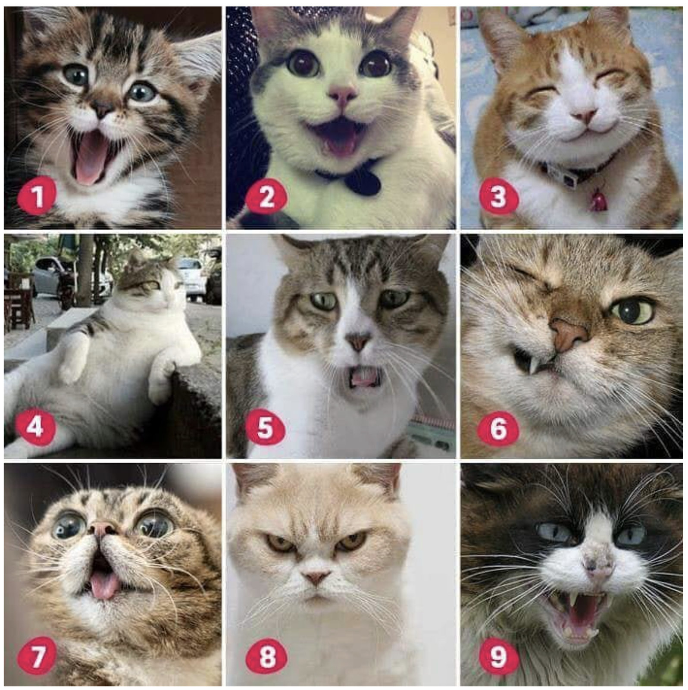{alt='Cuadrícula de nueve fotografías de gatos numerados del uno al nueve. Cada gato muestra una expresión o postura diferente para representar distintos estados de ánimo.'}

:::::::::::::::::::::::::::::::::::: instructor

Realiza una breve verificación del estado del grupo.

Invita a las personas participantes a escribir en el chat el número del gatito que mejor represente cómo se sienten en este momento.

Puedes leer algunas respuestas y preguntar si necesitan una aclaración antes de continuar.

::::::::::::::::::::::::::::::::::::::::::::::::::::::::::

## ¿Y si no puedo hacer todo?

> **¡Igual vale la pena!**

No poder implementar todas las prácticas no significa hacer mal la Ciencia Abierta.

Existen limitaciones de distinto tipo:

- **Recursos:** tiempo, dinero o personal.
- **Institucionales:** falta de apoyo o reconocimiento.

No todos los proyectos recorren el mismo camino hacia la Ciencia Abierta ni alcanzan las mismas instancias.

:::::::::::::::::::::::::::::::::::: instructor

Una pregunta frecuente y muy válida es:

> ¿Qué sucede si no puedo hacer todo?

No poder implementar todas las prácticas no significa hacer mal la Ciencia Abierta. No existe una única manera de abrir una investigación.

La apertura requiere tiempo, recursos económicos y trabajo de personas que no siempre están disponibles. Además, algunas instituciones todavía no ofrecen apoyo, infraestructura o reconocimiento para estas prácticas.

A lo largo de los encuentros presentamos estrategias, herramientas y diferentes niveles de apertura. No todos los ejemplos son perfectos ni pueden aplicarse de la misma manera en cualquier contexto.

Cada proyecto necesita construir su propio plan para definir:

- Qué puede abrirse.
- Cómo y cuándo hacerlo.
- Qué debe permanecer cerrado o tener acceso restringido.
- Qué limitaciones deben considerarse.
- Qué prácticas pueden implementarse de manera gradual.

Aunque no podamos hacerlo todo, sigue valiendo la pena comenzar con acciones posibles y ampliar las prácticas a medida que adquirimos experiencia y recursos.

Muchos de los cambios culturales e institucionales vinculados con la Ciencia Abierta son impulsados por personas interesadas en transformar sus propias prácticas y las de sus comunidades, como quienes participan en este curso.

::::::::::::::::::::::::::::::::::::::::::::::::::::::::::

## EPH con R

- **Encuesta Permanente de Hogares (EPH)** del Instituto Nacional de Estadística y Censos (INDEC).
- **Paquete `eph` de R:**
  - Permite procesar los datos de la EPH.
  - Facilita la replicación y el análisis independiente.
  - Permite estudiar categorías e indicadores no proporcionados en los informes oficiales.

Referencia: [https://doi.org/10.5281/zenodo.3462677](https://doi.org/10.5281/zenodo.3462677)

<!-- 🟨🟨🟨 FIGURA PENDIENTE: cargar `eph-con-r.png` en `episodes/fig/` 🟨🟨🟨 -->

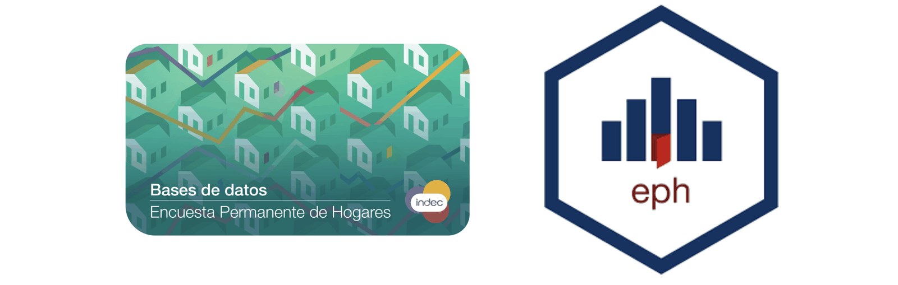{alt='Imagen de la base de datos de la Encuesta Permanente de Hogares del INDEC junto al logotipo del paquete eph de R.'}

:::::::::::::::::::::::::::::::::::: instructor

Veamos un ejemplo que reúne datos, código y resultados publicados. Este caso también permite observar la reproducibilidad, el trabajo comunitario, el uso ciudadano de la evidencia pública y su aplicación en políticas públicas.

En Argentina, el Instituto Nacional de Estadística y Censos —INDEC— es el organismo público de carácter técnico encargado de coordinar y producir estadísticas demográficas, económicas y sociales.

Entre otros productos, el INDEC realiza la Encuesta Permanente de Hogares —EPH—, un programa nacional de muestreo continuo que genera indicadores sociodemográficos y socioeconómicos sobre:

- Empleo, desocupación y precariedad laboral.
- Pobreza e indigencia.
- Ingresos.
- Educación y migraciones.
- Vivienda y condiciones de vida de los hogares.

A partir de esta encuesta se elaboran, entre otros resultados, las tasas oficiales de empleo, desocupación, subocupación y pobreza. Su difusión se complementa con tablas e información agregada.

Las bases de datos de la EPH son públicas y se encuentran disponibles bajo una licencia CC BY 4.0.

En 2020, un equipo de investigación externo al INDEC creó el paquete `eph` para el lenguaje de programación R.

Este paquete es de código abierto y permite procesar los datos de la EPH. De esta manera, otras personas pueden:

- Replicar los análisis publicados por el organismo.
- Obtener conclusiones independientes.
- Analizar categorías e indicadores que no aparecen en los informes oficiales.

Para compartir en el chat:  
[https://doi.org/10.5281/zenodo.3462677](https://doi.org/10.5281/zenodo.3462677)

::::::::::::::::::::::::::::::::::::::::::::::::::::::::::

## EPH con R

### Otros resultados abiertos

- Artículos científicos y tesis académicas que utilizaron el paquete y los datos para analizar problemáticas sociales.
- Difusión para la comunidad mediante Ecofemidata: indicadores, estadísticas e informes reproducibles sobre desigualdad de género.
- Insumos para el asesoramiento en políticas públicas.

<!-- 🟨🟨🟨 FIGURA PENDIENTE: usar `eph-con-r.png` de `episodes/fig/` 🟨🟨🟨 -->

{alt='Imagen de la base de datos de la Encuesta Permanente de Hogares del INDEC junto al logotipo del paquete eph de R.'}

:::::::::::::::::::::::::::::::::::: instructor

El paquete y los datos de la EPH dieron lugar a distintos tipos de Resultados Abiertos.

Por ejemplo, fueron utilizados en artículos científicos y tesis académicas dedicados a problemáticas sociales como:

- La evolución del vínculo entre la inserción laboral y el acceso al sistema de salud entre 2004 y 2020 (Pradier, 2021).
- La capacidad de reproducción de la fuerza de trabajo argentina entre 2016 y 2019 (Kennedy et al., 2023).
- Cuestiones metodológicas sobre la relación entre educación y salarios (Martínez Iriarte, 2022).
- La medición de la dimensionalidad del bienestar (Brau, 2021).

Para compartir en el chat:

- [Pradier, 2021](https://www.scielo.org.ar/pdf/et/n61/2545-7756-et-61-90.pdf)
- [Kennedy et al., 2023](https://www.scielo.org.ar/pdf/estec/v39n78/2525-1295-estec-39-79-1.pdf)
- [Martínez Iriarte, 2022](https://econpapers.repec.org/paper/sadypaper/5.htm)

Otro ejemplo es el trabajo de Ecofemidata, un equipo de la asociación civil Ecofeminita que produce indicadores, estadísticas e informes temáticos reproducibles sobre las desigualdades de género.

Entre otros recursos, Ecofemidata mantiene una aplicación que analiza el mercado de trabajo, los ingresos, el uso del tiempo y el trabajo doméstico.

Estos datos y análisis contribuyen a visibilizar las desigualdades de género. También se utilizan para elaborar materiales de difusión destinados a escuelas, medios y redes sociales, y como insumo para asesorar sobre políticas públicas en diferentes niveles de gobierno.

Para compartir en el chat:

Shokida, N. S., Domenech Burin, L., Pradier, C., Santellán, C., Espiñeira, L., Serpa, D., Fernández Erlauer, M., Lee, J., & Kozlowski, D. (2024). *Ecofeminita: Informes Ecofemidata*. Ecofeminita.  
[https://doi.org/10.5281/zenodo.13314398](https://doi.org/10.5281/zenodo.13314398)

::::::::::::::::::::::::::::::::::::::::::::::::::::::::::

:::::::::::::::::::::::::::::::::::: challenge

## Ejercicio 4: Respondé la encuesta de Zoom

**Duración: 3 minutos**

¿Cuáles de los siguientes son ejemplos de resultados de investigación abiertos?

**Señalá todas las opciones que correspondan:**

- Presentación de una conferencia.
- Publicación en un blog.
- Notas de reuniones internas del equipo.
- Cuaderno computacional en GitHub.
- Tutoriales y materiales para la capacitación de personas colaboradoras.

::::::::::::::::::::::::::::::::::::::::::::::::::::::::::

:::::::::::::::::::::::::::::::::::: instructor

Las respuestas correctas son:

- Presentación de una conferencia.
- Publicación en un blog.
- Cuaderno computacional en GitHub.
- Tutoriales y materiales para la capacitación de personas colaboradoras.

Las notas de reuniones internas del equipo no constituyen un Resultado Abierto mientras permanezcan restringidas al equipo.

::::::::::::::::::::::::::::::::::::::::::::::::::::::::::

## Ciencia Abierta e Inteligencia Artificial

Las herramientas de Inteligencia Artificial pueden agilizar diferentes tareas de los flujos de trabajo científico:

- **Búsqueda bibliográfica:** Semantic Scholar y Elicit.
- **Depuración y documentación de código:** GitHub Copilot y Claude.
- **Traducción de materiales y generación de resúmenes con lenguaje no técnico:** Google Translate, DeepL y ChatGPT.

:::::::::::::::::::::::::::::::::::: instructor

No queremos cerrar el curso sin abordar un tema que ya atraviesa nuestra vida cotidiana. La Inteligencia Artificial está transformando la forma en que se hace ciencia.

Más allá de sus aplicaciones en áreas específicas de investigación, existen herramientas de Inteligencia Artificial que pueden ayudarnos a agilizar diferentes partes de los flujos de trabajo científico. Por ejemplo, pueden facilitar la búsqueda y el descubrimiento de bibliografía, el análisis y la visualización de datos, la documentación del código y la comunicación de resultados.

Algunos ejemplos son:

- **Semantic Scholar y Elicit**, que pueden asistir en la búsqueda bibliográfica. Como vimos anteriormente, algunos gestores de referencias también incorporan funciones de Inteligencia Artificial para descubrir bibliografía relacionada.
- **GitHub Copilot y Claude**, que pueden utilizarse como apoyo para depurar, explicar y documentar código.
- **Google Translate y DeepL**, que permiten traducir textos con rapidez y pueden contribuir a aumentar la accesibilidad lingüística de algunos materiales.
- **ChatGPT y otras herramientas similares**, que pueden ayudar a generar resúmenes con lenguaje no técnico para comunicar los resultados científicos a públicos más amplios.

Estas herramientas pueden funcionar como apoyo, pero sus resultados siempre deben revisarse críticamente. No reemplazan el conocimiento especializado, la evaluación de las fuentes ni la responsabilidad de quienes realizan la investigación.

Puedes abrir un breve intercambio con la siguiente pregunta:

> ¿Conocen otras herramientas de Inteligencia Artificial que utilicen o que podrían resultar útiles en un flujo de trabajo científico?

Invita a compartir las respuestas en el chat.

::::::::::::::::::::::::::::::::::::::::::::::::::::::::::

## Ciencia Abierta e Inteligencia Artificial

- Las revistas científicas implementan cada vez más políticas y requisitos sobre el uso de Inteligencia Artificial.
- Su uso puede derivar en hallazgos de mala conducta académica o científica, como falsificación o plagio.
- No está permitida en muchas solicitudes de financiamiento o procesos de evaluación de propuestas.
- Su utilización durante la revisión por pares puede constituir una violación de la confidencialidad.

:::::::::::::::::::::::::::::::::::: instructor

Dicho todo esto, es importante reconocer que la Inteligencia Artificial todavía se encuentra en una etapa temprana de desarrollo y que su uso en la investigación científica plantea desafíos que no podemos ignorar.

Uno de ellos es el uso de herramientas de Inteligencia Artificial durante el proceso de escritura. Muchas revistas exigen que su utilización para la redacción, la creación de imágenes u otros elementos sea declarada. También pueden solicitar que se identifique la herramienta empleada y se explique de qué manera fue utilizada.

Al igual que sucede con cualquier otro material incluido en un artículo, los autores son plenamente responsables de verificar que el contenido sea correcto, original y adecuado. Una herramienta de Inteligencia Artificial no puede asumir responsabilidad por el trabajo ni figurar como autora.

Las herramientas de Inteligencia Artificial generativa también pueden:

- Producir información incorrecta o completamente inventada.
- Generar referencias bibliográficas inexistentes.
- Reproducir contenidos sin atribución.
- Utilizar materiales protegidos por derechos de autor o incompatibles con las licencias del proyecto.
- Incorporar sesgos presentes en sus datos de entrenamiento.
- Exponer información personal, sensible o confidencial.

Por estos motivos, el uso de materiales generados mediante Inteligencia Artificial puede derivar en hallazgos de mala conducta académica o científica si contienen fabricación, falsificación o plagio.

Las políticas varían entre revistas, instituciones y organismos financiadores. Antes de utilizar estas herramientas, debemos revisar las normas específicas aplicables y declarar su uso cuando corresponda.

Un ejemplo son los Institutos Nacionales de Salud de Estados Unidos (NIH), que prohíben a sus revisores científicos utilizar herramientas de Inteligencia Artificial generativa para analizar solicitudes de financiamiento o redactar evaluaciones. Introducir una propuesta en una herramienta externa puede constituir una violación de la confidencialidad, ya que no siempre es posible saber dónde se envían, almacenan, visualizan o reutilizan esos datos.

Como criterio general:

> No debemos ingresar información personal, sensible, inédita o confidencial en una herramienta de Inteligencia Artificial sin conocer sus condiciones de uso y las políticas aplicables.

Referencias para quien facilita:

- [Recomendaciones del ICMJE sobre el uso de Inteligencia Artificial en publicaciones científicas](https://www.icmje.org/recommendations/browse/artificial-intelligence/)
- [Política de los NIH sobre Inteligencia Artificial generativa y revisión por pares](https://grants.nih.gov/grants/guide/notice-files/NOT-OD-23-149.html)

::::::::::::::::::::::::::::::::::::::::::::::::::::::::::

## Recapitulando

- Los planes de gestión de datos, software y publicaciones ordenan la apertura desde el inicio y son documentos activos durante todo el proyecto.
- No existe una única manera de hacer Ciencia Abierta. Hay múltiples limitaciones y barreras para su implementación, pero podemos contribuir mediante diferentes prácticas para alcanzar la mayor apertura posible.
- Las herramientas de Inteligencia Artificial pueden ayudar en el proceso de apertura y agilizar los flujos de trabajo científicos, pero la comunidad científica apenas comienza a comprender cómo utilizarlas de forma ética y segura.

Podés descargar esta presentación aquí:  
[https://doi.org/10.5281/zenodo.18894630](https://doi.org/10.5281/zenodo.18894630)

:::::::::::::::::::::::::::::::::::: instructor

Recapitulemos las ideas principales de este último bloque.

Los planes de gestión permiten ordenar el desarrollo de un proyecto abierto desde el inicio. Pueden incluir la gestión de los datos, el software, las publicaciones y otros resultados de investigación. Además, son documentos vivos que pueden modificarse a medida que cambian las necesidades y las condiciones del proyecto.

No existe una única manera de hacer Ciencia Abierta. Hay limitaciones de recursos, infraestructura, tiempo, reconocimiento institucional y capacidades, además de restricciones éticas y legales. Aun así, vale la pena trabajar para alcanzar la mayor apertura posible mediante aquellas prácticas que resulten viables en cada contexto.

Por último, las herramientas de Inteligencia Artificial pueden contribuir al proceso de apertura y agilizar diferentes tareas. Sin embargo, todavía estamos construyendo una comprensión colectiva sobre cómo utilizarlas de manera ética, crítica, transparente y segura.

::::::::::::::::::::::::::::::::::::::::::::::::::::::::::

## Lecturas útiles

- [NASA OS101: Módulo 5](https://github.com/MetaDocencia/IntroALaCienciaAbierta_NASAOpenScience101/blob/main/Module_5/M5_readme_es.md)

> 🚨 **¡Aviso!**
>
> Si encontrás errores o tenés sugerencias, te invitamos a publicarlos como un *issue* en GitHub. Dar devoluciones abiertas es una excelente manera de contribuir a un proyecto.

:::::::::::::::::::::::::::::::::::: instructor

Comparte el enlace al Módulo 5 de NASA OS101, donde se presentan contenidos y recursos adicionales sobre Resultados Abiertos.

Recuerda que estos materiales se desarrollan de manera abierta y colaborativa. Si alguien encuentra un error, identifica información que debería actualizarse o tiene una propuesta para mejorar el contenido, puede registrarla mediante un *issue* en GitHub.

Esta devolución abierta permite documentar las sugerencias, conversar sobre posibles cambios y contribuir al mantenimiento colectivo del recurso.

Para compartir en el chat:  
[https://github.com/MetaDocencia/IntroALaCienciaAbierta_NASAOpenScience101/blob/main/Module_5/M5_readme_es.md](https://github.com/MetaDocencia/IntroALaCienciaAbierta_NASAOpenScience101/blob/main/Module_5/M5_readme_es.md)

::::::::::::::::::::::::::::::::::::::::::::::::::::::::::

## Próximos pasos

- Encuesta de valoración.
- Evaluación para la certificación.
- Cierre.

::::::::::::::::::::::::::::::::: instructor

Estamos llegando al final del encuentro. Antes de despedirnos, todavía nos quedan tres actividades:

1. Completar la encuesta de valoración.
2. Explicar la evaluación necesaria para obtener la certificación.
3. Compartir algunas indicaciones finales.

::::::::::::::::::::::::::::::::::::::::::::::::::::::::::

## ¡Foto grupal!

<!-- 🟨🟨🟨 FIGURA PENDIENTE: cargar `icono-camara.png` en `episodes/fig/` 🟨🟨🟨 -->

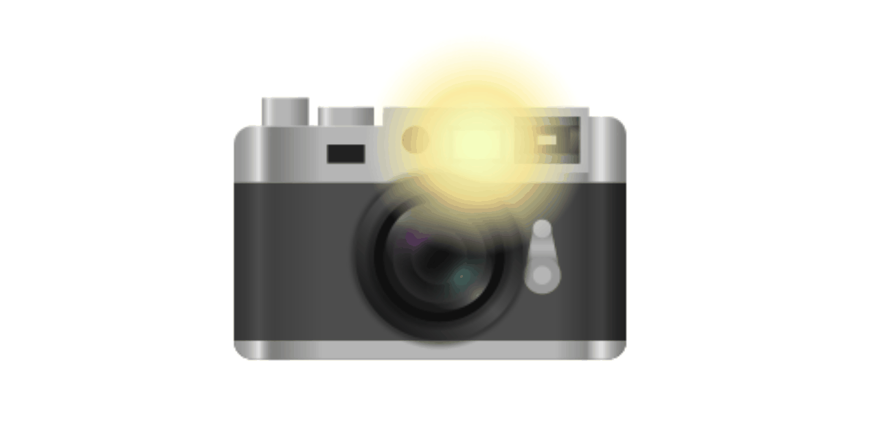{alt='Ícono de una cámara fotográfica que acompaña la invitación a participar de la foto grupal.'}

::::::::::::::::::::::::::::::::: instructor

### Orientaciones para facilitar

¡Oficialmente hemos llegado al final de la formación! Gracias por acompañarnos durante estos encuentros.

Antes de continuar con las últimas actividades, invita a quienes deseen aparecer en la foto grupal a encender sus cámaras.

Aclara que participar es completamente opcional. Si la fotografía será conservada o compartida, informa previamente con qué finalidad se utilizará.

También pueden mostrar una fotografía, una imagen, un cartel o un elemento representativo de su comunidad.

Da unos segundos para que todas las personas se preparen antes de tomar la fotografía.

::::::::::::::::::::::::::::::::::::::::::::::::::::::::::

## Crítica constructiva

Una crítica constructiva es:

1. **Positiva**
2. **Específica**
3. **Sugiere próximos pasos**

::::::::::::::::::::::::::::::::: instructor

Antes de presentar la encuesta, recuerda que las devoluciones resultan especialmente útiles cuando son constructivas.

Una crítica constructiva tiene tres características:

1. **Es positiva:** reconoce aquello que funcionó o que resultó valioso.
2. **Es específica:** identifica con claridad qué podría mejorarse.
3. **Sugiere próximos pasos:** propone una alternativa concreta.

Puedes utilizar el ejemplo de Mafalda y la sopa para mostrar la diferencia.

Decir simplemente que una sopa es desagradable expresa una opinión, pero no ofrece demasiada información para mejorarla. Una devolución constructiva podría reconocer primero el valor de los platos calientes en invierno y luego proponer un cambio específico, como incorporar fideos en lugar de verduras.

Invita a aplicar estas características al completar la encuesta de valoración.

::::::::::::::::::::::::::::::::::::::::::::::::::::::::::

::::::::::::::::::::::::::::::::: challenge

## Valoramos tu opinión

### Completa nuestra encuesta anónima

**Duración: 5 minutos**

[https://tinyurl.com/HCA-Encuesta4](https://tinyurl.com/HCA-Encuesta4)

Cuando termines, avísanos por el chat.

<!-- 🟨🟨🟨 FIGURA PENDIENTE: cargar `qr-encuesta-valoracion.png` en `episodes/fig/` 🟨🟨🟨 -->

{alt='Código QR que permite acceder a la encuesta anónima de valoración de la formación.'}

::::::::::::::::::::::::::::::::::::::::::::::::::::::::::

::::::::::::::::::::::::::::::::: instructor

Duración: 5 minutos.

Invita a las personas participantes a completar la encuesta anónima de valoración.

Explica que no es necesario elaborar respuestas extensas. Incluso una devolución breve puede ayudarnos a reconocer qué funcionó y qué aspectos podemos mejorar.

En MetaDocencia leemos todas las sugerencias. Algunas pueden traducirse en cambios inmediatos y otras requieren un proceso más largo, pero todas contribuyen al aprendizaje y a la mejora continua de nuestras formaciones.

Pide que avisen por el chat cuando hayan terminado.

Mientras completan la encuesta, puedes reproducir música:

- Luis Alberto Spinetta, *Era de tontos*.

::::::::::::::::::::::::::::::::::::::::::::::::::::::::::

## ¡Seguimos en contacto!

- ¿Te gustó esta formación? **¡Difúndela!**
- Seguimos en contacto por Slack, en el canal `#ciencia-abierta`.

::::::::::::::::::::::::::::::::: instructor

Invita a las personas participantes a difundir las próximas ediciones de Herramientas de Ciencia Abierta entre sus comunidades y redes.

También recuerda que pueden seguir participando en el espacio de Slack de MetaDocencia.

En el canal `#ciencia-abierta` pueden:

- Compartir experiencias y opiniones.
- Hacer consultas.
- Difundir oportunidades, recursos e invitaciones relevantes.
- Continuar las conversaciones iniciadas durante la formación.

Slack también permite mantenerse al tanto de nuevas convocatorias y formas de participar en las iniciativas de MetaDocencia.

::::::::::::::::::::::::::::::::::::::::::::::::::::::::::

## Red de Comunidades Amigas

<!-- 🟨🟨🟨 FIGURA PENDIENTE: cargar `red-comunidades-amigas.png` en `episodes/fig/` 🟨🟨🟨 -->

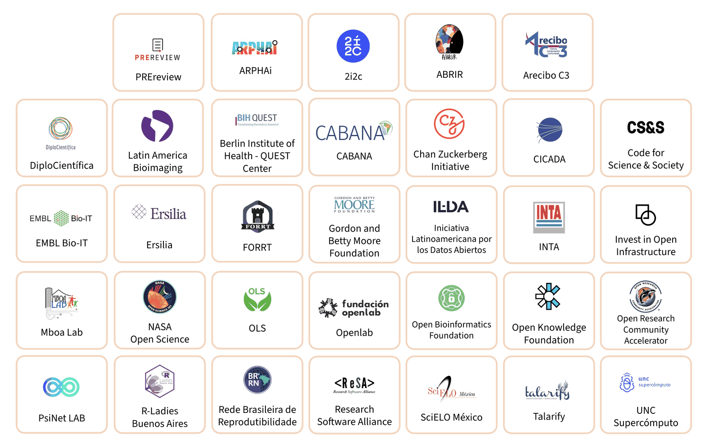{alt='Mosaico con los logotipos de comunidades aliadas y organizaciones que colaboran con MetaDocencia y apoyan sus iniciativas.'}

::::::::::::::::::::::::::::::::: instructor

Antes de cerrar, agradece a las más de treinta comunidades aliadas y organizaciones que acompañan a MetaDocencia y hacen posible esta formación y muchas otras iniciativas.

Esta red permite construir capacidades, compartir conocimientos y desarrollar recursos mediante la colaboración entre comunidades científicas y técnicas de distintos contextos.

Invita a conocer las organizaciones y comunidades que forman parte de la red en el sitio web de MetaDocencia.

Para compartir en el chat:

[Conoce la Red de Comunidades Amigas de MetaDocencia](https://metadocencia.org/)

::::::::::::::::::::::::::::::::::::::::::::::::::::::::::
